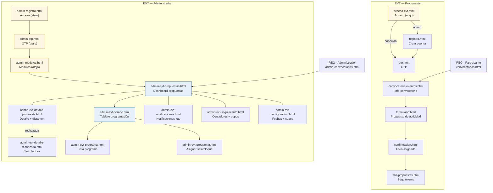

# Prototipo — EVT (Eventos)

HTML/CSS/JS estático demostrativo para el módulo de propuestas de actividades FILEY.
No guarda ni envía datos; los botones navegan entre pantallas para simular el recorrido.

## Estructura

```text
prototipo/EVT/
  selector-rol.html        ← selector de rol (atajo de prototipo; redirige a acceso-evt.html)
  styles.css               ← CSS único del dominio (extiende ../common/styles-base.css;
  │                            incluye shell del panel admin: sidebar, chips, modales,
  │                            calendario, rejilla de horario, tablero híbrido)
  app.js                   ← campos dinámicos del formulario de propuesta
  aplicantes/              ← flujo del proponente externo
    acceso-evt.html        ← acceso (atajo de prototipo; flujo real: REG/aplicantes/aplicantes-login.html)
    registro.html          ← crear cuenta (atajo de prototipo; flujo real: REG/aplicantes/)
    otp.html               ← código OTP (atajo de prototipo; flujo real: REG/aplicantes/)
    convocatoria-eventos.html ← info convocatoria — entrada real desde REG/aplicantes/convocatorias.html
    formulario.html        ← formulario de propuesta (campos dinámicos por tipo)
    confirmacion.html      ← confirmación con folio
    mis-propuestas.html    ← seguimiento de propuestas enviadas
  administradores/         ← panel del administrador
    admin-registro.html    ← acceso admin (atajo de prototipo; flujo real: REG/administradores/)
    admin-otp.html         ← código OTP admin (atajo de prototipo)
    admin-modulos.html     ← selección de módulo EVT (atajo de prototipo)
    admin-evt-propuestas.html     ← dashboard: tabla filtrable + tarjetas resumen
    admin-evt-detalle-propuesta.html ← detalle + dictamen (Aceptar / Solicitar cambios / Rechazar)
    admin-evt-detalle-rechazada.html ← detalle solo lectura — propuesta rechazada
    admin-evt-horario.html        ← tablero híbrido: riel + rejilla salas × bloques
    admin-evt-programa.html       ← lista del programa confirmado
    admin-evt-programar.html      ← formulario asignación sala + bloque(s)
    admin-evt-notificaciones.html ← resultados de selección en lote
    admin-evt-seguimiento.html    ← contadores por estado + cupos disponibles
    admin-evt-configuracion.html  ← fechas clave + cupos por categoría
```

## Cómo verlo

- **Proponente (flujo real):** abre `../../REG/aplicantes/aplicantes-login.html` y navega hasta
  la convocatoria de Eventos; o entra directo en `aplicantes/convocatoria-eventos.html`.
- **Proponente (atajo):** abre `aplicantes/acceso-evt.html`.
- **Administrador (flujo real):** llega desde `REG/administradores/admin-convocatorias.html`.
- **Administrador (atajo):** abre `administradores/admin-registro.html`.
- Navega con los botones o con la barra de prototipo superior.

## Diagrama de flujo



## Mapa de pantallas y flujo

Ver [mapas/EVT.md](../mapas/EVT.md)

## Decisiones de diseño

- **Datos comunes primero:** nombre/correo/teléfono se precargan de la cuenta; dependencia,
  cargo y ciudad/estado se capturan en el formulario antes de elegir el tipo de actividad,
  porque son comunes a todos los tipos.
- **Convocatorias cerradas visibles:** se atenúan con el estado "Convocatoria cerrada" pero
  no desaparecen.
- **Acceso admin por OTP** (misma mecánica que el aplicante — decisión de equipo;
  CU-REG-003 actualizado para usar OTP en lugar de contraseña).
- **Hipólito como admin general** (`modulo = *`): ve los 3 módulos (Eventos, Infantil/Juvenil,
  Stands) pero solo Eventos es navegable en esta maqueta. Los otros aparecen como
  "Próximamente".
- **Tablero de programación híbrido:** rejilla salas × bloques como lienzo principal + riel
  lateral "Por programar". Clic en lugar de arrastre (se difiere la física del arrastre;
  layout y flujo son los definitivos). El modal de asignación imita el diálogo "Nuevo evento"
  de Outlook. Incluye modal Programador para repetir una actividad en varias fechas.
- **Guardado implícito** en programación: cada cambio queda guardado sin botón explícito.
- **Dictamen con modales** dentro del detalle de propuesta (no página aparte).
- **Seguimiento** como sección propia en el sidebar (no inline en la lista).
- **CSS en styles.css único del dominio:** el panel admin comparte `EVT/styles.css` con
  las pantallas de aplicantes, cumpliendo la política de un solo CSS por dominio.

## Pendientes (fuera del alcance de esta maqueta)

- Re-dictamen: cambiar un dictamen ya emitido (CU-EVT-009 A3)
- Gestión de usuarios administrativos / superadmin (CU-REG-005)
- Panel de Talleres (Elvira) — reutilizará este mismo esqueleto parametrizado
