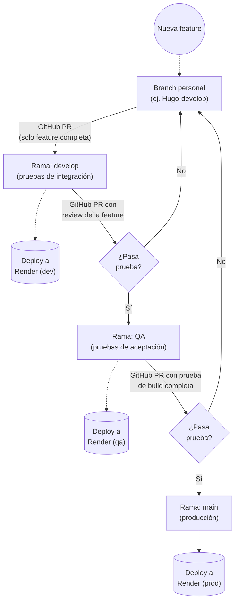

# Integración y Despliegue Continuo (CI/CD)

El sistema de CI/CD del proyecto FILEY sigue un flujo estructurado con tres entornos principales (Desarrollo, QA y Producción). Este proceso asegura que el código sea probado en cada etapa antes de llegar a los usuarios finales.

## Diagrama del Flujo de Trabajo

## Etapas y Responsabilidades

### 1. Desarrollo (Ramas Personales)
* Todo el trabajo nuevo comienza en una **rama personal** (por ejemplo, `Hugo-develop`). Para un equipo pequeño que necesita agilidad, se prefiere tener una rama activa por desarrollador en lugar de crear múltiples ramas por cada feature.
* Una vez que la feature está completa en su totalidad, se levanta un **Pull Request (PR)** hacia la rama `develop`.

### 2. Pruebas de Integración (Rama `develop`)
* Al integrar la feature, el código se despliega automáticamente en el entorno de desarrollo: **Render (dev)**.
* **Responsabilidad:** Uno de los desarrolladores es el encargado de realizar las pruebas de integración en este entorno.
* **Revisión:** 
  * Si la feature **no pasa** las pruebas, el código defectuoso se queda en la rama `develop`. El desarrollador debe solucionar el problema desde su **rama personal** y levantar un PR con la corrección para que el código corregido vuelva a pasar por este filtro.
  * Si la feature **pasa** las pruebas, se levanta un nuevo PR hacia la rama `QA`.

### 3. Pruebas de Aceptación (Rama `QA`)
* Al aprobarse el PR, el código llega a la rama `QA` y se despliega automáticamente en el entorno de pruebas: **Render (qa)**.
* **Responsabilidad:** El equipo de **QA** realiza las pruebas de aceptación para verificar que se cumplen correctamente todos los Casos de Uso.
* **Revisión:**
  * Si **no pasa** la prueba (ya sea por fallos en la build o bugs en los casos de uso), el código con error permanece en `QA`. El desarrollador debe arreglar el problema desde su **rama personal** y hacer que la corrección viaje nuevamente por las validaciones (PR a `develop`, y luego PR a `QA`).
  * Si **pasa** la prueba y la build es completamente estable, se levanta el PR final hacia la rama `main`.

### 4. Producción (Rama `main`)
* Una vez aprobado el PR final hacia `main`, el código se despliega directamente en el entorno en vivo: **Render (prod)**.
* **Nota importante:** Antes de llegar aquí, el equipo debe **definir el alcance de cada build** (es decir, documentar y tener claro qué casos de uso incluye cada versión específica de producción).
