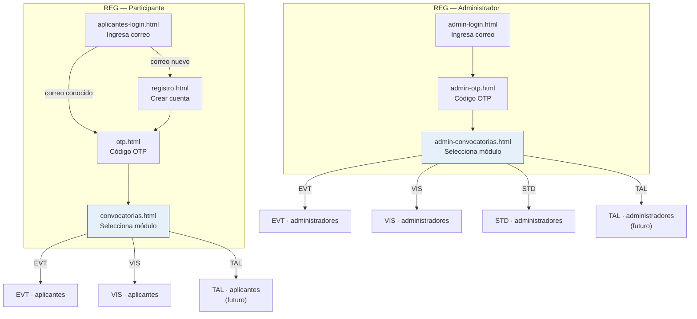

# Prototipo — REG (Acceso y módulos)

HTML/CSS estático demostrativo para el módulo de acceso compartido de FILEY.
REG no tiene dominio de contenido propio: su rol es autenticar al usuario (participante
o administrador) y dirigirlo al módulo correspondiente (EVT, VIS, TAL).

## Estructura

```text
prototipo/REG/
  styles.css               ← estilos del dominio (extiende ../common/styles-base.css)
  app.js                   ← interacciones de demostración
  aplicantes/              ← flujo del participante externo
    aplicantes-login.html  ← acceso (ingresa correo)
    registro.html          ← crear cuenta — solo primera vez
    otp.html               ← código OTP
    convocatorias.html     ← selección de módulo → sale a EVT / VIS / TAL
  administradores/         ← flujo del administrador general
    admin-login.html       ← acceso admin (ingresa correo)
    admin-otp.html         ← código OTP admin
    admin-convocatorias.html ← selección de módulo → sale a panel de cada dominio
```

## Cómo verlo

- **Participante:** abre `aplicantes/aplicantes-login.html`
- **Administrador:** abre `administradores/admin-login.html`
- Navega con los botones o con la barra de prototipo superior.

## Diagrama de flujo



## Mapa de pantallas y flujo

Ver [mapas/REG.md](../mapas/REG.md)

## Decisiones de diseño

- **OTP para ambos roles:** el acceso usa código de un solo uso enviado por correo
  (CU-REG-002 para participantes, CU-REG-003 para administradores). No hay contraseña.
- **Registro solo en primer acceso:** si el correo no está registrado, se pide nombre
  y teléfono antes del OTP. Las visitas siguientes saltan directo al OTP.
- **Convocatorias cerradas visibles:** se atenúan con el estado "Convocatoria cerrada"
  pero no desaparecen; el participante puede ver a qué aplicó antes.
- **Admin no se auto-registra:** su cuenta la provisiona el administrador general
  (CU-REG-005, fuera del alcance de esta maqueta).
- **Selección de módulo post-login admin:** el administrador ve los módulos disponibles
  (Eventos, Infantil/Juvenil, Stands, Visitas…) y elige el suyo. Solo los módulos
  maquetados son navegables.

## Notas de prototipo

### Tarjeta EVT — dos botones vs. uno en producción

En `aplicantes/convocatorias.html`, la tarjeta **Actividades FILEY (Eventos)** muestra dos botones:

- **Ver convocatoria** → `EVT/aplicantes/convocatoria-eventos.html`
- **Ver mis propuestas** → `EVT/aplicantes/mis-propuestas.html`

En producción debe ser **un solo botón dinámico** en la misma posición:

- Si el participante **no tiene ninguna propuesta** enviada para esta edición → texto `Ver convocatoria`
- Si el participante **tiene al menos una propuesta** → texto `Ver mis propuestas`

Ambos estados apuntan a rutas diferentes pero comparten la misma celda en la tarjeta.

### Tarjeta Talleres — estado "Próximamente"

El botón de la tarjeta **Actividades Infantiles / Juveniles** aparece en azul claro con el texto
"Próximamente" y no es clickeable. Esta convocatoria no tiene flujo maquetado en esta versión
del prototipo (el flujo TAL está pendiente).

## Pendientes (fuera del alcance de esta maqueta)

- Gestión de cuentas administrativas / superadmin (CU-REG-005)
- Pantalla de perfil del participante (editar nombre/teléfono)
