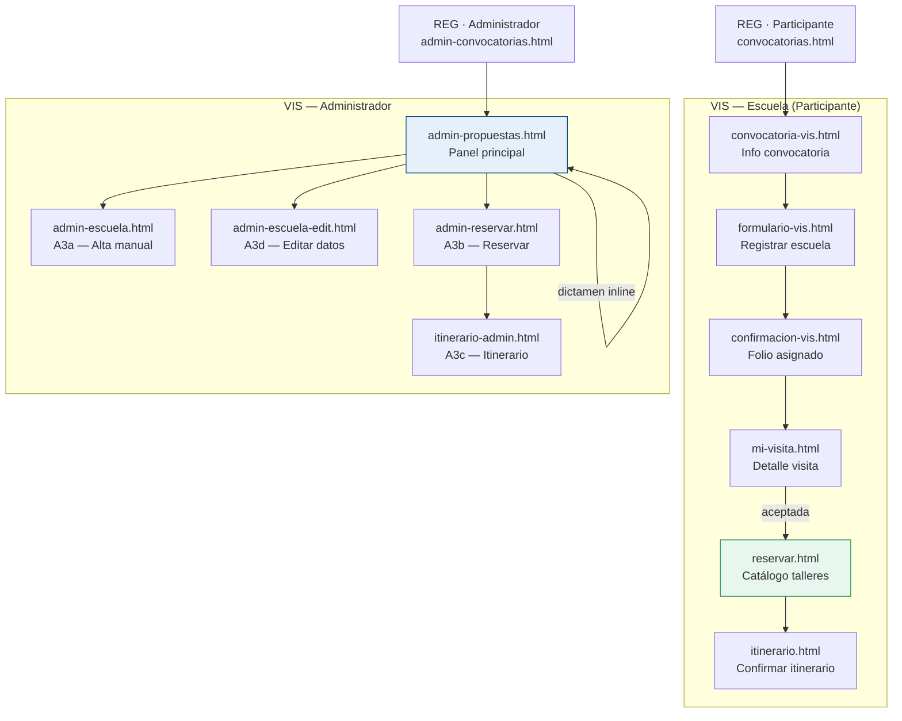

# Prototipo — VIS (Visitas Escolares)

HTML/CSS/JS demostrativo para el módulo de visitas escolares de FILEY.
Cubre el flujo completo: propuesta de la escuela → revisión administrativa → reserva
de talleres en el catálogo → itinerario confirmado.

> [!important] VIS usa un pseudo-backend (JSON + localStorage)
> A diferencia del resto del prototipo, VIS mantiene consistencia de datos entre pantallas:
> `app.js` lee/escribe vía `../common/db.js`, que carga la semilla desde
> `../common/db/VIS/semillas/` (3 escuelas + catálogo de talleres del 14-mar-2027) hacia
> `localStorage`. Como la semilla se carga con `fetch()`, **estas páginas deben servirse por
> HTTP**, no abrirse por `file://` (CORS). Para desarrollo: `scripts/preview-vis.sh`. En
> producción, GitHub Pages ya sirve por HTTP. Para reiniciar la demo a su estado de fábrica:
> abre cualquier página con `?reset=1` o ejecuta `FileyDB.reset()` en la consola.
> Solo **Benito Juárez García (VIS-2027-001)** es visible del lado escuela; las otras dos
> escuelas semilla existen para el panel de administrador. Ver
> [`docs/soporte/notas/VIS-pseudo-backend.md`](../../docs/soporte/notas/VIS-pseudo-backend.md).

## Estructura

```text
prototipo/VIS/
  styles.css               ← CSS único del dominio (extiende ../common/styles-base.css)
  app.js                   ← interacciones de demostración (feature-detect; sirve a todas las pantallas)
  talleres-preescolar.html ← evidencia de diseño A(2) — no es parte del flujo de usuario
  aplicantes/              ← flujo de la escuela solicitante
    convocatoria-vis.html  ← info convocatoria de visitas
    formulario-vis.html    ← registrar mi escuela (propuesta)
    confirmacion-vis.html  ← confirmación con folio asignado
    mi-visita.html         ← detalle de la visita + estado de dictamen
    reservar.html          ← catálogo de talleres
    itinerario.html        ← ver / confirmar itinerario
  administradores/         ← panel del administrador VIS
    admin-propuestas.html  ← panel principal: lista propuestas + dictamen expandible
    admin-escuela.html     ← registrar escuela manualmente (A3a)
    admin-escuela-edit.html ← editar datos / grupos de una escuela (A3d)
    admin-reservar.html    ← reservar talleres en nombre de la escuela (A3b)
    itinerario-admin.html  ← ver / confirmar itinerario — vista admin (A3c)
```

## Cómo verlo

- **Escuela (participante):** abre `../../REG/aplicantes/aplicantes-login.html` y navega hasta
  la convocatoria de Visitas Escolares; o entra directo en `aplicantes/convocatoria-vis.html`.
- **Administrador:** llega desde `REG/administradores/admin-convocatorias.html`, o entra
  directo en `administradores/admin-propuestas.html`.
- Navega con los botones o con la barra de prototipo superior.
- El acceso, OTP y selección de módulo viven únicamente en `REG` (no se duplican por dominio).

## Diagrama de flujo



## Mapa de pantallas y flujo

Ver [mapas/VIS.md](../mapas/VIS.md)

## Decisiones de diseño

- **Propuesta por escuela, no por persona:** el formulario captura datos de la institución
  (CCT, nivel educativo, sector, municipio) y hasta 3 grupos de 35 alumnos cada uno
  (máximo 105 alumnos por propuesta — RN-VIS-001).
- **Folio asignado por FILEY:** el sistema genera el folio al enviar; la escuela no lo elige.
- **Catálogo sin filtro de nivel:** `reservar.html` muestra todos los talleres disponibles
  sin filtrar por nivel educativo. Las píldoras de nivel en cada tarjeta de taller son
  meramente descriptivas; el aplicante elige según su criterio.
- **Un grupo no puede reservar dos talleres en el mismo bloque horario** (salvo actividades
  de acceso libre). Validación en tiempo real al confirmar el itinerario.
- **Dictamen admin sin pantalla aparte:** las acciones (Aceptar / Solicitar cambios /
  Rechazar) se operan desde el panel de propuestas mediante el detalle expandible de cada
  fila — no hay una ruta de navegación separada para el dictamen en esta maqueta.
- **Admin puede reservar en nombre de la escuela:** `admin-reservar.html` replica el catálogo
  del participante pero con topbar de administración.

## Brechas conocidas

- **Discrepancia de nivel educativo (gap C1+C4):** el formulario captura `Primaria` como
  una única opción, pero el catálogo distingue `Primaria alta` y `Primaria baja`. No existe
  un mapeo definido entre ambas. Documentado en el análisis de desalineación de CUs.

## No considerado para el scope inicial

Los siguientes CUs están documentados para trazabilidad y cálculo de esfuerzo de
implementación, pero quedan fuera del alcance de esta maqueta por decisión de diseño:

- **CU-VIS-002** — Pantalla de edición de propuesta por el aplicante
- **CU-VIS-006 / 007 / 008** — Flujo de dictamen completo con modales (Aceptar / Solicitar
  cambios / Rechazar) con campos de texto
- **CU-VIS-009** — Notificación al aplicante tras el dictamen

Ver análisis detallado en `docs/soporte/notas/analisis-de-desalineacion-con-CUs.md`.

## Pendientes (en scope, no implementados aún)

- Badge de estado de revisión en "Mi registro" (Pendiente / Aceptada / Solicitud de cambios / Rechazada)
