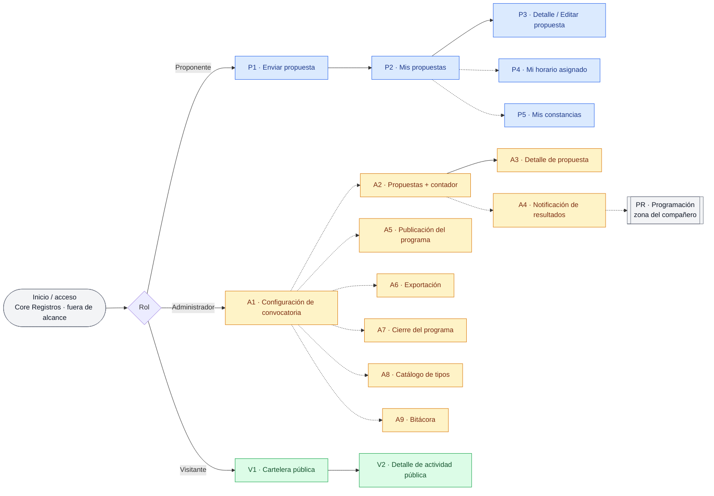

# Estructura de vistas — Eventos generales (convocatoria, revisión, confirmación y publicación)

> Propuesta de **arquitectura de ventanas** del componente de Eventos Generales (EVE),
> derivada del inventario de casos de uso (`CU-EVE Índice.md`) y del
> `Modelo de datos - Eventos.md`. Define qué pantallas existen, qué contiene cada una y
> qué casos de uso resuelve. No define maquetación visual ni componentes gráficos finales.

---

## 1. Propósito y alcance

Este documento organiza los **casos de uso vigentes** del dominio `EVE` en una estructura
navegable de tres áreas: el **Portal del Proponente** (aplicante), el **Panel del
Administrador** (Hipólito y su equipo) y la **Cartelera Pública** (visitantes sin sesión).

- Se asume **sesión ya iniciada** para Proponente y Administrador: la autenticación (OTP y
  contraseña) vive en el **Core Registros** (`CORES/REG`), **fuera del alcance** de EVE.
- La **Cartelera Pública** (visitante) **no requiere sesión**.
- Los casos de uso del actor **Sistema** (correos y procesos automáticos) **no tienen
  ventana**: se manifiestan como correos o como cambios de estado reflejados en las
  pantallas (ver §6).
- La sección **C · Programación** (CU-EVT-014 a 022) corresponde a **otro integrante del
  equipo**; aquí se referencia como un **bloque externo** para dar coherencia a la
  navegación, sin detallar sus vistas (ver §5, zona *PR*).

---

## 2. Convenciones

- **Actores:** Proponente (aplicante) · Administrador · Visitante · Sistema.
- **Prefijos de vista:** `P` = Proponente · `A` = Administrador · `V` = Visitante ·
  `PR` = Programación (zona del compañero, fuera de alcance).
- **Acceso condicionado:** una vista marcada así solo se habilita si se cumple su
  precondición (p. ej. *propuesta aceptada*, *programa publicado*, *fecha de constancias
  alcanzada*).
- **Vista-contenedor:** pantalla que aloja varias acciones (otros CU) sin navegar fuera de
  ella (p. ej. el detalle de propuesta del administrador).
- Cada vista referencia sus **CU involucrados** y las **entidades** del modelo que consume
  o modifica.

---

## 3. Mapa de navegación

> Las líneas punteadas del panel admin representan **navegación lateral** entre secciones
> (menú principal), no un flujo secuencial. `PR · Programación` es la zona del compañero
> que conecta la selección (A4) con la publicación (A5).

---

## 4. Portal del Proponente

> Acceso: requiere sesión iniciada (Core Registros). Algunas vistas se condicionan a un
> estado: `P4` solo si hay un horario notificado; `P5` solo a partir de `fecha_constancias`.

### P1 · Enviar propuesta
- **Objetivo:** capturar y enviar una propuesta de actividad; y, tras enviarla, poder
  iniciar otra sin recapturar los datos de contacto.
- **Contenido:** formulario con datos de contacto **precargados** (nombre, correo,
  teléfono) y datos de perfil (institución, cargo, ciudad/estado); selección de **tipo de
  actividad**; campos específicos del tipo elegido; declaración de constancia; carga de
  adjuntos (semblanzas, sinopsis y, en presentaciones, portada y fotografía). Al finalizar,
  ofrece **"Crear una nueva solicitud"** / **"Cerrar"**.
- **CU involucrados:** CU-EVT-002 (enviar propuesta), CU-EVT-003 (múltiples propuestas sin
  recapturar contacto).
- **Entidades:** Proponente, Propuesta, PropuestaAdjunto, TipoActividad.

### P2 · Mis propuestas
- **Objetivo:** dar seguimiento al estado de todas las propuestas enviadas en la edición.
- **Contenido:** lista con folio, tipo, título y estado (`pendiente` /
  `cambios_solicitados` / `aceptada` / `rechazada`). Punto de entrada al detalle y a las
  vistas P4 y P5.
- **CU involucrados:** CU-EVT-005 (consultar mis propuestas y su estado).
- **Entidades:** Propuesta.

### P3 · Detalle / Editar propuesta
- **Objetivo:** ver el detalle de una propuesta y, si se solicitaron cambios, corregirla y
  reenviarla.
- **Contenido:** datos enviados y adjuntos; según el estado: el **mensaje de cambios** del
  administrador (con acción *Editar y reenviar*), el **motivo de rechazo**, o la
  confirmación de aceptación. La edición reusa el formulario de P1.
- **CU involucrados:** CU-EVT-005 (detalle), CU-EVT-004 (editar y reenviar tras solicitud
  de cambios).
- **Entidades:** Propuesta, PropuestaAdjunto.

### P4 · Mi horario asignado *(condicionada)*
- **Objetivo:** responder a la notificación de sala y horario.
- **Contenido:** datos de la programación (actividad, sala/stand, fecha y bloque) y
  acciones **Confirmar asistencia**, **Indicar incomparecencia** y **Solicitar cambio**
  (dentro de la ventana; la negociación del cambio continúa por correo con el admin).
- **CU involucrados:** CU-EVT-023 (responder notificación de horario).
- **Reflejo de Sistema:** CU-EVT-022 (notificación de horario) llega como correo y aparece
  aquí.
- **Entidades:** ProgramacionActividad, ConfirmacionProponente, Actividad.

### P5 · Mis constancias *(condicionada)*
- **Objetivo:** descargar la constancia de participación tras la feria.
- **Contenido:** lista de actividades elegibles (confirmadas y con constancia solicitada);
  acción de descarga por actividad. Habilitada solo a partir de `fecha_constancias`.
- **CU involucrados:** CU-EVT-027 (descargar constancia).
- **Entidades:** Actividad, Propuesta (`requiere_constancia`), ParametrosConvocatoria
  (`fecha_constancias`).

---

## 5. Panel del Administrador

Secciones de navegación lateral, con patrón **lista → detalle** donde aplica.

### A1 · Configuración de convocatoria
- **Objetivo:** abrir/reabrir la convocatoria y definir fechas clave y cupos.
- **Contenido:** formulario con 6 fechas clave (apertura, cierre, notificación, ajustes,
  asignación, constancias) y 4 cupos por categoría; doble verificación al editar con
  propuestas ya recibidas o al reabrir una convocatoria cerrada.
- **CU involucrados:** CU-EVT-001.
- **Entidades:** ParametrosConvocatoria, EdicionFeria.

### A2 · Propuestas (lista + contador)
- **Objetivo:** revisar las propuestas recibidas y vigilar los cupos.
- **Contenido:** lista filtrable por tipo, estado y categoría; **contador en tiempo real**
  embebido (recibidas por estado y espacios disponibles por categoría, con aviso de *cupo
  alcanzado*).
- **CU involucrados:** CU-EVT-006 (lista), CU-EVT-011 (contador).
- **Entidades:** Propuesta, ParametrosConvocatoria (cupos).

### A3 · Detalle de propuesta *(vista-contenedor)*
- **Objetivo:** revisar una propuesta y emitir su dictamen.
- **Contenido:** datos del proponente, datos de la actividad y adjuntos; concentra las
  acciones sin salir de la vista:
  - **Dictaminar**: Aceptar (2ª pantalla, clasifica `literaria`/`academica`, crea
    Actividad en `sin_horario`), Solicitar cambios (mensaje obligatorio, notifica de
    inmediato) o Rechazar (motivo obligatorio) — CU-EVT-008. Incluye **re-dictamen** con
    doble verificación.
  - **Marcar recepción del ejemplar físico** (presentaciones de libro/revista) —
    CU-EVT-013.
  - **Ver bitácora** de la actividad asociada — CU-EVT-034 (segunda ruta de acceso).
- **CU involucrados:** CU-EVT-007 (detalle), CU-EVT-008, CU-EVT-013.
- **Entidades:** Propuesta, PropuestaAdjunto, Proponente, Actividad, BitacoraEVE.

### A4 · Notificación de resultados (lote)
- **Objetivo:** comunicar en un solo lote las aceptadas y rechazadas.
- **Contenido:** lista de propuestas pendientes de notificar (`resultado_notificado =
  false`) con selección individual o **"Incluir todas"**; marca de **actualización** para
  dictámenes que cambiaron tras una notificación previa; envío múltiple por edición.
- **CU involucrados:** CU-EVT-012.
- **Efectos de Sistema asociados:** envío de correos y registro de `NotificacionLote`.
- **Entidades:** Propuesta, NotificacionLote.

### PR · Programación *(zona del compañero — fuera de alcance)*
- **Objetivo:** armar el programa, asignar salas/horarios y notificar al proponente.
- **CU involucrados:** CU-EVT-014 a 022 (responsabilidad de otro integrante del equipo).
- **Nota:** se incluye solo para enlazar la selección (A4) con la publicación (A5). Sus
  vistas se definen en su propio documento.

### A5 · Publicación del programa
- **Objetivo:** publicar una versión del programa de forma incremental.
- **Contenido:** selección de versión a publicar; resumen de actividades programadas vs.
  sin horario; opción de mostrar actividades informativas; confirmación.
- **CU involucrados:** CU-EVT-028.
- **Entidades:** ProgramaMaestro, Actividad, ProgramacionActividad.

### A6 · Exportación
- **Objetivo:** exportar el programa a un archivo de trabajo.
- **Contenido:** alcance (completo o filtrado por categoría/sección/tipo/día/sala) y
  formato (Excel / Word / PDF). Desde aquí —o desde el detalle de una actividad— se genera
  la **ficha PDF individual** (CU-EVT-030).
- **CU involucrados:** CU-EVT-029 (exportar), CU-EVT-030 (ficha PDF).
- **Entidades:** Actividad, ProgramacionActividad.

### A7 · Cierre del programa
- **Objetivo:** cerrar definitivamente el programa y gestionar cambios excepcionales.
- **Contenido:** acción **Cerrar definitivamente** (motivo obligatorio + doble
  verificación) y **Reabrir** (doble verificación); acceso a **cambio de horario
  excepcional** fuera de ventana (motivo + registro en bitácora), disponible incluso con el
  programa cerrado.
- **CU involucrados:** CU-EVT-026 (cerrar/reabrir), CU-EVT-025 (cambio excepcional).
- **Entidades:** ParametrosConvocatoria (`programa_archivado`…), ProgramacionActividad,
  BitacoraEVE.

### A8 · Catálogo de tipos de actividad
- **Objetivo:** administrar el catálogo de tipos.
- **Contenido:** lista de tipos con su origen, duración por defecto, requisitos y estado;
  acciones agregar / editar / activar-desactivar (la desactivación conserva el histórico).
- **CU involucrados:** CU-EVT-033.
- **Entidades:** TipoActividad.

### A9 · Bitácora
- **Objetivo:** auditar los cambios excepcionales.
- **Contenido:** vista global y por actividad de los registros de `BitacoraEVE` (acción,
  detalle de → a, motivo, persona, fecha); filtros por fecha, acción, entidad o persona.
- **CU involucrados:** CU-EVT-034.
- **Entidades:** BitacoraEVE.

---

## 6. Cartelera Pública (visitante, sin sesión)

### V1 · Cartelera pública
- **Objetivo:** consultar las actividades publicadas y filtrarlas.
- **Contenido:** listado de actividades de la versión publicada (título, tipo, fecha, sala,
  horario), filtrable por categoría/sección/día y búsqueda; sección informativa para
  actividades sin horario fijo. Acción de **ficha PDF** por actividad (CU-EVT-030).
- **CU involucrados:** CU-EVT-031, CU-EVT-030.
- **Entidades:** ProgramaMaestro (publicado), Actividad, ProgramacionActividad.

### V2 · Detalle de actividad pública
- **Objetivo:** ver el detalle de una actividad de la cartelera.
- **Contenido:** título, tipo, organiza, público, sinopsis, fecha, sala y horario;
  participantes y moderador; en presentaciones de libro/revista, datos de la publicación,
  autores, editorial y portada.
- **CU involucrados:** CU-EVT-032.
- **Entidades:** Actividad, Propuesta (datos de publicación).

---

## 7. Casos de uso de Sistema (sin vista)

Procesos automáticos/temporizados o disparados desde una vista; se reflejan como correos o
cambios de estado.

| CU | Proceso | Dónde se refleja |
|----|---------|------------------|
| CU-EVT-008 (parte) | Notificar solicitud de cambios al proponente (inmediata) | Correo · estado en P2/P3 |
| CU-EVT-012 | Enviar el lote de resultados (aceptadas/rechazadas) | Correo · estado en P2/P3 |
| CU-EVT-022 | Notificar sala y horario *(zona del compañero)* | Correo · vista P4 |
| CU-EVT-030 | Generar la ficha PDF | Descarga desde A6 / V1 |

> El **servicio de correo** aún no está definido (tema abierto); en el mockup se representa
> como "notificación enviada".

---

## 8. Trazabilidad vista ↔ caso de uso

| Vista | CU |
|-------|----|
| P1 · Enviar propuesta | CU-EVT-002, CU-EVT-003 |
| P2 · Mis propuestas | CU-EVT-005 |
| P3 · Detalle / Editar propuesta | CU-EVT-005, CU-EVT-004 |
| P4 · Mi horario asignado | CU-EVT-023 |
| P5 · Mis constancias | CU-EVT-027 |
| A1 · Configuración de convocatoria | CU-EVT-001 |
| A2 · Propuestas + contador | CU-EVT-006, CU-EVT-011 |
| A3 · Detalle de propuesta | CU-EVT-007, CU-EVT-008, CU-EVT-013 |
| A4 · Notificación de resultados | CU-EVT-012 |
| A5 · Publicación del programa | CU-EVT-028 |
| A6 · Exportación | CU-EVT-029, CU-EVT-030 |
| A7 · Cierre del programa | CU-EVT-026, CU-EVT-025 |
| A8 · Catálogo de tipos | CU-EVT-033 |
| A9 · Bitácora | CU-EVT-034 |
| V1 · Cartelera pública | CU-EVT-031, CU-EVT-030 |
| V2 · Detalle de actividad pública | CU-EVT-032 |
| *(sin vista — Sistema)* | CU-EVT-012, CU-EVT-022, parte de CU-EVT-008 |
| *(zona del compañero — Programación)* | CU-EVT-014 a 022 |

Cobertura de **mi alcance (A, B, D, E = 22 CU vigentes)**: todos quedan mapeados a una
vista. La zona **C · Programación (9 CU)** se referencia como bloque externo.

---

## 9. Temas abiertos

- **E0 / autenticación:** la ruta de acceso y el control de sesión viven en el Core
  Registros; confirmar cómo se enlaza el ingreso a cada portal.
- **Servicio de correo:** sin definir; afecta a CU-EVT-008 (solicitud de cambios),
  CU-EVT-012 (lote) y CU-EVT-022 (horario).
- **Frontera con Programación (PR):** confirmar con el compañero qué datos expone su zona a
  A5 (publicación) y a P4 (horario del proponente) para no duplicar vistas.
- **Ficha PDF (CU-EVT-030):** definir si se ofrece tanto en la cartelera pública (V1) como
  en el panel admin (A6), o solo en una.

---

## Artefactos relacionados

- `CU-EVE Índice.md` — inventario de casos de uso.
- `Modelo de datos - Eventos.md` — entidades y atributos.
- `Proceso de alto nivel - Eventos.md` — flujo de punta a punta.
