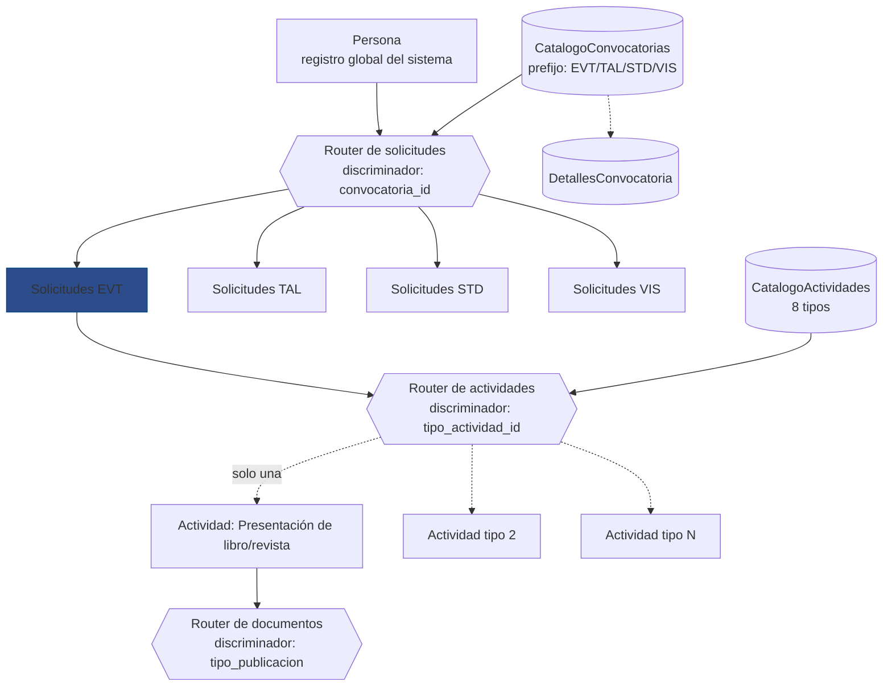
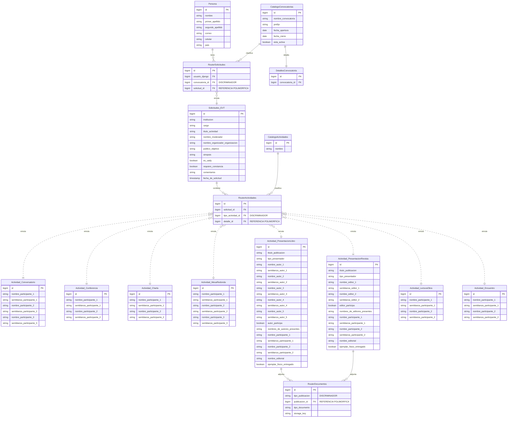
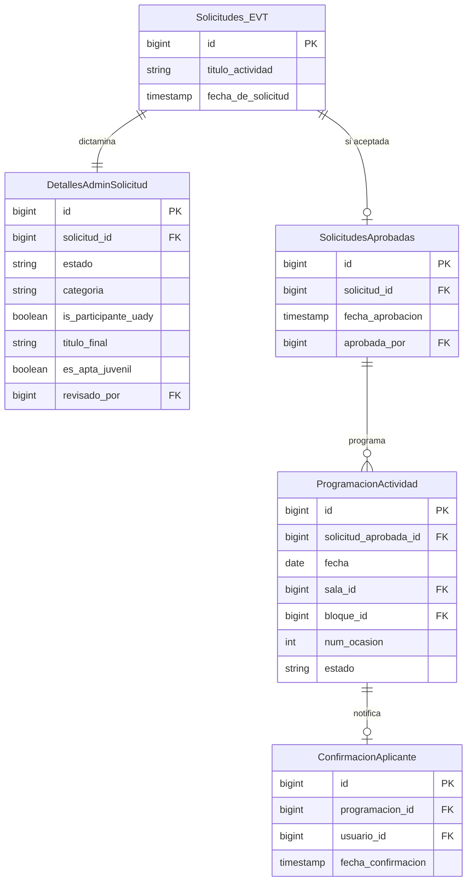

# Modelo de datos — Eventos generales (EVT)

Modelo conceptual del dominio de Eventos Generales: qué información almacena el sistema
para registrar, dictaminar y programar las actividades del programa de FILEY.

El desarrollo se divide en **dos etapas**, y el modelo está organizado igual:

1. **Captura** (§2) — el aplicante llena y envía su solicitud. Se implementa primero, para
   contar con una base de datos poblada sobre la cual construir lo demás.
2. **Administración y programación** (§3) — el administrador dictamina las solicitudes
   (aceptar, rechazar o solicitar cambios) y programa las aceptadas.

La separación no es solo cronológica: **cada tabla pertenece a una sola etapa según quién la
escribe**. Las de §2 las escribe el aplicante; las de §3, únicamente el administrador. Ningún
dato queda en ambos lados.

---

## 1. Arquitectura y patrón de enrutamiento

### Entidades principales

| Entidad | Propósito |
| --- | --- |
| Persona (`REG`) | La persona registrada en el sistema. Existe con independencia de cualquier convocatoria y se reutiliza en todas. |
| Solicitud (EVT) | Una solicitud concreta enviada por una persona a esta convocatoria. Contiene los datos comunes a cualquier tipo de actividad. |
| Actividad específica (EVT) | Los datos propios del tipo de actividad elegido. Existen ocho variantes, una por tipo. |

### Elementos de asociación y enrutamiento

Tres tablas intermedias resuelven las relaciones. Ninguna guarda datos de negocio: solo
conectan entidades y, cuando hace falta, indican **a qué tabla** apunta la conexión. Dos
catálogos las alimentan: en vez de guardar el discriminador como un string suelto, el router
lo obtiene por FK a una tabla configurable.

| Tabla | Propósito |
| --- | --- |
| Router de solicitudes | Relaciona a la persona con las solicitudes que ha creado. Su discriminador, `convocatoria_id`, es una FK a `CatalogoConvocatorias` (§2.2); la fila referida trae el `prefijo` (`EVT`, `TAL`, `STD` o `VIS`) con el que se resuelve a qué tabla pertenece la solicitud. Es único para todo el sistema: sirve a los cuatro dominios. |
| Router de actividades | Relaciona una solicitud con su actividad específica. Su discriminador, `tipo_actividad_id`, es una FK a `CatalogoActividades` (§2.5); la fila referida trae el `nombre` con el que se resuelve cuál de las ocho tablas la contiene. |
| Router de documentos | Relaciona los documentos adjuntos con la publicación que los requiere. Conecta directamente con `Actividad_PresentacionLibro` y `Actividad_PresentacionRevista` —las únicas actividades que llevan archivos adjuntos—; su discriminador, `tipo_publicacion`, sigue siendo un string literal porque no hay un catálogo detrás. Permite uno o varios documentos por publicación y guarda la ubicación del archivo. |

Visualmente:

### Referencias polimórficas

Los tres routers comparten un mecanismo: guardan un **discriminador** que nombra la tabla
destino y un **identificador** de la fila dentro de esa tabla. El discriminador vive **en la
fila del router**, no en el catálogo: en `RouterSolicitudes` y `RouterActividades` ya no es un
string suelto, sino una FK (`convocatoria_id`, `tipo_actividad_id`) hacia una tabla de catálogo.
El catálogo referido no es el discriminador —es el que la aplicación consulta, ya siguió la FK,
para resolver a qué tabla apunta—, a través de un campo propio de esa fila: `prefijo` en
`CatalogoConvocatorias`, `nombre` en `CatalogoActividades`. Agregar una convocatoria o un tipo
de actividad es entonces dar de alta una fila de catálogo, no tocar un `enum` en código.

| Router | Discriminador (en el router) | Se resuelve con | Identificador | Destinos posibles |
| --- | --- | --- | --- | --- |
| `RouterSolicitudes` | `convocatoria_id` (FK) | `CatalogoConvocatorias.prefijo` | `solicitud_id` | `Solicitudes_EVT`, `Solicitudes_TAL`, `Solicitudes_STD`, `Solicitudes_VIS` |
| `RouterActividades` | `tipo_actividad_id` (FK) | `CatalogoActividades.nombre` | `detalle_id` | Las ocho tablas `Actividad_*` |
| `RouterDocumentos` | `tipo_publicacion` (string) | — no hay catálogo, el valor ya es literal | `publicacion_id` | `Actividad_PresentacionLibro`, `Actividad_PresentacionRevista` |

Como el identificador puede apuntar a tablas distintas según el discriminador, **no es una
clave foránea con restricción**: la base de datos no puede validarlo. La integridad depende de
la capa de aplicación, y conviene resguardarla con pruebas o con el mecanismo de relaciones
genéricas que ofrezca el ORM. A cambio, el patrón permite agregar convocatorias o tipos de
actividad sin modificar las tablas existentes.

> `CatalogoConvocatorias.prefijo` no aparece en la lista de atributos que definió el pedido
> original —solo `nombre_convocatoria`, las fechas y `esta_activa`—; se añade aquí porque el
> router necesita resolver a `EVT`/`TAL`/`STD`/`VIS` desde algún campo estable, y
> `nombre_convocatoria` es texto editable por el administrador (pensado para mostrarse, no para
> enrutar). Se nombra `prefijo` y no `dominio` porque `EVT`/`TAL`/`STD`/`VIS` ya funciona como
> prefijo literal en el resto del sistema —nombres de tabla (`Solicitudes_EVT`,
> `Actividad_*`), IDs de caso de uso (`CU-EVT-*`), tags (`dom/evt`)—, mientras que "dominio" es
> el término de arquitectura que ya usa este documento para el concepto, no el nombre de un
> campo. Revisar si esta inferencia es correcta.

---

## 2. Etapa 1 — Captura de solicitudes

### 2.1 Persona

Entidad del core de Registros (`REG`); se referencia aquí, no se define. Su detalle completo
—incluido el acceso por código de un solo uso— está en
[`REG/Modelo de datos - Registros.md`](<../REG/Modelo%20de%20datos%20-%20Registros.md>).

Guarda la identidad y el **país de procedencia**, que son datos de perfil: se capturan una vez
y se reutilizan en cualquier convocatoria de cualquier feria. La institución y el cargo, en
cambio, se capturan por solicitud (§2.4), porque una misma persona puede aplicar representando
a instituciones distintas.

Al no existir copia de la procedencia dentro de la solicitud, el modelo refleja siempre el
valor vigente del perfil, no el que tenía la persona al enviar.

> [!warning] Cambio 2026-08-25 — `EVT` deja de definir atributos de `Persona`
> Este documento describía una procedencia de **tres** campos (`pais`, `estado_pais`, `ciudad`)
> sobre una entidad que no le pertenece, y que en `REG` no tenía ninguno de los tres. `pais`
> sube ahora a [`REG`](<../REG/Modelo de datos - Registros.md>) §2.1, que es su único dueño; el
> nombre pasa además a tres campos (`nombre`, `primer_apellido`, `segundo_apellido`).
>
> **`estado_pais` y `ciudad` quedan sin dueño y sin decidir**: no están en `REG` y ya no se
> definen aquí. Hasta que se resuelva, el formulario del prototipo pide un "Ciudad / Estado"
> que ninguna tabla guarda. Ver `REG` §5.

### 2.2 CatalogoConvocatorias

Catálogo del que cuelgan todas las convocatorias del sistema —una por dominio (`EVT`, `TAL`,
`STD`, `VIS`), y potencialmente varias por dominio si en el futuro conviven ediciones—. Es la
tabla que referencia `RouterSolicitudes.convocatoria_id` (§2.3): el discriminador vive en esa
FK del router, no aquí; esta tabla es la que la aplicación consulta, una vez seguida la FK, para
saber a qué dominio pertenece la solicitud y si la convocatoria sigue aceptando envíos.

| Atributo | Descripción |
| --- | --- |
| id | Identificador único. |
| nombre_convocatoria | Nombre visible de la convocatoria (p. ej. "Convocatoria FILEY 2027 — Eventos generales"). Editable por el administrador; no participa en el enrutamiento. |
| prefijo | `EVT`, `TAL`, `STD` o `VIS`. El campo que resuelve a qué tabla de solicitudes apunta `RouterSolicitudes.solicitud_id` una vez seguida la FK (§1). No forma parte del pedido original de campos; se agrega porque el enrutamiento necesita un valor estable, distinto del nombre editable. Se llama `prefijo` y no `dominio` porque así es como `EVT`/`TAL`/`STD`/`VIS` ya se usa en el resto del sistema (nombres de tabla, IDs de caso de uso, tags) — "dominio" queda para el concepto de arquitectura, no para el nombre del campo. |
| fecha_apertura | Fecha en que la convocatoria empieza a aceptar solicitudes. |
| fecha_cierre | Fecha en que deja de aceptarlas. |
| esta_activa | Permite pausar la convocatoria en una emergencia sin tocar `fecha_cierre`: con `esta_activa = false`, aunque la fecha actual esté dentro del rango, no se aceptan envíos. |

Los parámetros que no son comunes a cualquier convocatoria —cupos, prefijo de folio, fechas de
notificación, etc.— no viven aquí: cada dominio los define en su propia tabla de detalle
(`detalles` en el diagrama de §1), enlazada uno a uno por `convocatoria_id`. Para `EVT` esa
tabla es `DetallesConvocatoria` (§3.6); el diagrama de esta etapa la muestra como referencia
mínima —su definición completa vive en la etapa 2, porque es el administrador quien la escribe.

### 2.3 RouterSolicitudes

Único vínculo entre una persona y sus solicitudes: `Solicitudes_EVT` no tiene clave foránea
hacia `Persona`. Sin una fila aquí, la solicitud no tiene dueño conocido, por lo que su
creación es obligatoria al enviar.

| Atributo | Descripción |
| --- | --- |
| id | Identificador único. |
| usuario_django | FK → Persona. Conserva el nombre `usuario_django` porque referencia la tabla de usuarios del framework. |
| convocatoria_id | Discriminador. FK → CatalogoConvocatorias (§2.2); su campo `prefijo` determina a qué tabla apunta `solicitud_id`. |
| solicitud_id | Referencia polimórfica a la solicitud, en la tabla que indique `CatalogoConvocatorias.prefijo` (§1). |

### 2.4 Solicitudes_EVT

Los datos que el aplicante captura y que son **comunes a los ocho tipos de actividad**. Lo que
varía entre tipos vive en las tablas `Actividad_*` (§2.7); lo que decide el administrador vive
en la etapa 2 (§3).

| Atributo | Descripción |
| --- | --- |
| id | Identificador único, `bigint`. Es la base del folio: el folio visible **no se almacena**, se compone como `{prefijo_folio}-{id}` con el prefijo de `DetallesConvocatoria` (§3.6). |
| institucion | Dependencia o institución que representa. Obligatorio. |
| cargo | Cargo dentro de esa institución. Opcional. |
| titulo_actividad | Título de la actividad tal como lo propone el aplicante. Si el administrador lo modifica tras la revisión, el valor definitivo queda en `DetallesAdminSolicitud.titulo_final` (§3.1). |
| nombre_moderador | Moderador de la actividad. Opcional, uno como máximo. |
| nombre_organizador_organizacion | Persona u organización que organiza. Obligatorio. |
| publico_objetivo | Público al que va dirigida. Lista de valores separados sobre el conjunto cerrado `publico_general`, `academico`, `estudiantil`, `infantil`, `familias`; al menos uno. Al no estar normalizado, filtrar por público exige recorrer el texto. |
| sinopsis | Sinopsis de la actividad, capturada como texto. Antes era un PDF adjunto marcado por `tiene_sinopsis`; ahora el aplicante escribe el contenido directamente y no hay archivo que administrar. |
| es_uady | Indica si el aplicante se declara parte de la UADY. Es la autodeclaración en la captura; el administrador la valida (o la corrige) en `DetallesAdminSolicitud.is_participante_uady` (§3.1), que es el valor que consume el cupo. |
| requiere_constancia | Indica si el aplicante solicita constancia de participación. Precondición de CU-EVT-005 (descargar constancia); antes no existía en el modelo (§5). |
| comentarios | Observaciones libres del aplicante. Opcional. |
| fecha_de_solicitud | Marca de tiempo del momento en que la solicitud se envía y se guarda. |

Las semblanzas ya no viven aquí como un booleano único: son un campo de texto por cada
participante, y por eso se definen junto a cada `nombre_participante_*` en las tablas
`Actividad_*` (§2.7) —una persona, una semblanza—.

### 2.5 CatalogoActividades

Catálogo de los ocho tipos de actividad. Antes `RouterActividades.tipo_actividad` guardaba el
valor de texto directamente; ahora ese campo es una FK hacia aquí, y esta tabla es la que la
aplicación consulta, una vez seguida la FK, para saber a qué tabla `Actividad_*` corresponde.

| Atributo | Descripción |
| --- | --- |
| id | Identificador único. |
| nombre | `conversatorio`, `conferencia`, `charla`, `mesa_redonda`, `presentacion_libro`, `presentacion_revista`, `lectura_obra` o `encuentro`. El campo que resuelve a qué tabla `Actividad_*` apunta `RouterActividades.detalle_id` una vez seguida la FK (§1). |

Ocho filas fijas, una por tipo. Mover el valor a una tabla no cambia el conjunto cerrado de
tipos —siguen siendo ocho—, pero permite listarlos, ordenarlos o describirlos para la interfaz
sin tocar código.

### 2.6 RouterActividades

Conecta la solicitud con su actividad específica y determina de qué tipo es. Una fila por
solicitud.

| Atributo | Descripción |
| --- | --- |
| id | Identificador único. |
| solicitud_id | FK → Solicitudes_EVT. |
| tipo_actividad_id | Discriminador. FK → CatalogoActividades (§2.5); su campo `nombre` determina a qué tabla `Actividad_*` apunta `detalle_id`. |
| detalle_id | Referencia polimórfica a la fila de la tabla `Actividad_*` que corresponda (§1). |

### 2.7 Tablas `Actividad_*`

Ocho tablas, una por tipo de actividad. Contienen únicamente lo que distingue a ese tipo: los
campos que comparten los ocho ya viven en `Solicitudes_EVT` (§2.4).

Hoy varios tipos coinciden en su estructura —Conversatorio y Mesa redonda por un lado;
Conferencia, Charla, Lectura de obra y Encuentro por otro—, pero se mantienen separados a
propósito. Cada tipo corresponde a un formulario distinto, y tener su propia tabla permite que
evolucione sin arrastrar a los demás; agruparlos por coincidencia actual cerraría esa puerta.

Cada nombre de participante va acompañado de su propia `semblanza_*`: un campo de texto libre,
capturado por el aplicante junto con el nombre. Ya no hay un booleano `tiene_semblanza` a nivel
de solicitud ni un archivo PDF adjunto —la semblanza es contenido, no un anexo—.

#### Actividad_Conversatorio · Actividad_MesaRedonda

| Atributo | Descripción |
| --- | --- |
| id | Identificador único. |
| nombre_participante_1 … 3 | Nombres de los participantes. Obligatorio el primero; hasta tres. |
| semblanza_participante_1 … 3 | Semblanza de cada participante, en el mismo orden. |

#### Actividad_Conferencia · Actividad_Charla · Actividad_LecturaObra · Actividad_Encuentro

| Atributo | Descripción |
| --- | --- |
| id | Identificador único. |
| nombre_participante_1 … 2 | Nombre de quien imparte. Obligatorio el primero; hasta dos. |
| semblanza_participante_1 … 2 | Semblanza de cada participante, en el mismo orden. |

#### Actividad_PresentacionLibro

| Atributo | Descripción |
| --- | --- |
| id | Identificador único. |
| titulo_publicacion | Título del libro. Obligatorio. |
| tipo_presentador | Rol del proponente respecto a la publicación: `autor`, `editor`, `antologador`, `compilador` o `coordinador`. |
| nombre_autor_1 … 5 | Nombres tal como aparecen en la portada. Obligatorio el primero; hasta cinco. |
| semblanza_autor_1 … 5 | Semblanza de cada autor, en el mismo orden. |
| autor_participa | Indica si el autor estará presente en la actividad. |
| nombres_de_autores_presentes | Nombres de quienes sí asistirán, cuando no todos los autores participan. |
| nombre_participante_1 … 2 | Presentadores. Opcional, hasta dos. |
| semblanza_participante_1 … 2 | Semblanza de cada presentador, en el mismo orden. |
| nombre_editorial | Editorial. Obligatorio; si la publicación es independiente, se anota así. |
| ejemplar_fisico_entregado | Indica si FILEY recibió el ejemplar físico que exige este tipo de actividad. Lo marca el administrador, pero reside aquí por ser un dato inherente a la publicación. |

Las fotografías del autor y de la portada dejaron de tener un booleano `tiene_foto_*` en esta
tabla: hoy se consultan directamente en `RouterDocumentos` (§2.8), que conecta con esta tabla
sin pasar por `Solicitudes_EVT`.

#### Actividad_PresentacionRevista

| Atributo | Descripción |
| --- | --- |
| id | Identificador único. |
| titulo_publicacion | Título de la revista. Obligatorio. |
| tipo_presentador | Rol del proponente respecto a la publicación. Mismo conjunto de valores que en `Actividad_PresentacionLibro`. |
| nombre_editor_1 … 2 | Nombres de los editores. Obligatorio el primero; hasta dos. |
| semblanza_editor_1 … 2 | Semblanza de cada editor, en el mismo orden. |
| editor_participa | Indica si el editor estará presente en la actividad. |
| nombres_de_editores_presentes | Nombres de quienes sí asistirán, cuando no todos los editores participan. |
| nombre_participante_1 … 2 | Presentadores. Opcional, hasta dos. |
| semblanza_participante_1 … 2 | Semblanza de cada presentador, en el mismo orden. |
| nombre_editorial | Editorial responsable de la revista. |
| ejemplar_fisico_entregado | Indica si FILEY recibió el ejemplar físico. Ver la nota equivalente en `Actividad_PresentacionLibro`. |

La portada de la revista sigue la misma lógica que en `Actividad_PresentacionLibro`: sin
booleano de caché, se consulta en `RouterDocumentos` (§2.8).

### 2.8 RouterDocumentos

Registro de los archivos que acompañan a una **publicación**, no a la solicitud en general.
Antes conectaba con `Solicitudes_EVT`; hoy conecta directamente con las dos únicas actividades
que llevan adjuntos —`Actividad_PresentacionLibro` y `Actividad_PresentacionRevista`—, porque
semblanza y sinopsis dejaron de ser archivos (§2.4, §2.7) y lo único que queda por adjuntar son
las fotografías propias de esas dos publicaciones. Sigue el mismo patrón polimórfico que
`RouterSolicitudes` y `RouterActividades` (§1): una fila por documento, de modo que una
publicación puede tener tantos como requiera sin columnas fijas.

| Atributo | Descripción |
| --- | --- |
| id | Identificador único. |
| tipo_publicacion | Discriminador: `libro` o `revista`. Determina a qué tabla apunta `publicacion_id`. |
| publicacion_id | Referencia polimórfica a `Actividad_PresentacionLibro` o `Actividad_PresentacionRevista`, según `tipo_publicacion`. |
| tipo_documento | Qué documento es: fotografía del autor (solo `libro`) o portada de la publicación. |
| storage_key | Ubicación del archivo almacenado. El formato —clave de almacenamiento, ruta o URL— está por definir. |

---

## 3. Etapa 2 — Administración y programación

Esta etapa agrupa los datos que **solo el administrador escribe**. Al aceptarse una solicitud
se crea una fila en `SolicitudesAprobadas`; únicamente lo registrado ahí puede programarse, y a
partir de ese punto entran las funciones del dominio `PRG`.

### 3.1 DetallesAdminSolicitud

El estado de la solicitud, su dictamen y los valores definitivos que fija el administrador.
La fila se crea al enviarse la solicitud, con `estado = pendiente` y el resto de los campos en
nulo; por eso la relación con `Solicitudes_EVT` es uno a uno obligatoria. Crearla desde el
inicio permite consultar las solicitudes pendientes sin interpretar la ausencia de una fila.

| Atributo | Descripción |
| --- | --- |
| id | Identificador único. |
| solicitud_id | FK → Solicitudes_EVT. |
| estado | `pendiente`, `cambios_solicitados`, `aceptada`, `rechazada` o `cancelada`. `cancelada` solo aplica después de `aceptada`. |
| categoria | `literaria` o `academica`. La asigna el administrador durante el dictamen. |
| is_participante_uady | Indica si el participante pertenece a la UADY. **Lo determina el administrador, no el aplicante**, por lo que vive en esta etapa y no en la solicitud. Parte de `Solicitudes_EVT.es_uady` (§2.4) como autodeclaración, pero es este campo —no aquel— el que decide junto con `categoria` qué cupo consume (§3.6); el administrador puede confirmarlo o corregirlo. |
| titulo_final | Título definitivo de la actividad si el administrador lo modifica; nulo significa que vale `Solicitudes_EVT.titulo_actividad`. |
| organizador_final | Organizador definitivo; nulo significa que vale `Solicitudes_EVT.nombre_organizador_organizacion`. |
| es_apta_juvenil | Marca la actividad como apta para el catálogo escolar y juvenil de `VIS`. |
| en_cartelera_informal | Indica que la actividad aparece solo en cartelera informativa, sin horario fijo comprometido. |
| fecha_revision | Fecha en que el administrador emitió el dictamen. |
| revisado_por | FK → Persona (administrador). |
| motivo_rechazo | Motivo registrado cuando `estado = rechazada`. |
| mensaje_cambios_solicitados | Indicación de qué debe corregir el aplicante. Obligatorio cuando `estado = cambios_solicitados`. |
| resultado_notificado | Indica si el resultado vigente ya se comunicó al aplicante en un lote (§3.5). |
| fecha_resultado_notificado | Fecha del último envío de resultado; nulo si nunca se ha notificado. |

Esta tabla ocupa el lugar de lo que sería una entidad "Actividad" independiente. No existe tal
entidad porque duplicaría el estado de la solicitud y obligaría a mantener ambos sincronizados.
Los estados de avance que esa entidad habría guardado son **derivados** y no se almacenan:

- Sin horario: no hay filas en `ProgramacionActividad` (§3.3).
- Programada: hay al menos una.
- Confirmada: sus programaciones tienen confirmación del aplicante (§3.4).

`PRG` y `TAL` sí modelan una entidad `Actividad` propia; queda pendiente homologar cómo
referencian desde ahí lo que en `EVT` es una solicitud aprobada.

### 3.2 SolicitudesAprobadas

Registro de las solicitudes que pasaron el dictamen. **Existir aquí equivale a estar
aprobada**, y `ProgramacionActividad` referencia esta tabla y no `Solicitudes_EVT`: así la
regla "solo se programa lo aprobado" queda garantizada por una clave foránea real, en lugar de
depender de que la aplicación consulte el estado.

| Atributo | Descripción |
| --- | --- |
| id | Identificador único. |
| solicitud_id | FK → Solicitudes_EVT. |
| fecha_aprobacion | Marca de tiempo de la aprobación. |
| aprobada_por | FK → Persona (administrador que aceptó). |

Si una solicitud aprobada se cancela, **se eliminan sus filas de `ProgramacionActividad`** para
liberar la sala y el bloque, pero **la fila de esta tabla se conserva** como constancia de que
llegó a estar aprobada.

### 3.3 ProgramacionActividad

Una fila por cada **ocasión concreta** en que una actividad ocupa una fecha, una sala y uno o
más bloques de horario. Una misma actividad puede tener varias: repetirse el mismo día en
bloques distintos, o en días diferentes. La combinación de `fecha` y `bloque_id` es lo que
distingue una ocasión de otra.

| Atributo | Descripción |
| --- | --- |
| id | Identificador único. |
| solicitud_aprobada_id | FK → SolicitudesAprobadas (§3.2). |
| fecha | Día de esta ocasión. |
| sala_id | FK → Sala (`SAL`). |
| stand_id | FK → Stand (`STD`); nulo si la actividad ocurre en una sala del catálogo. |
| bloque_id | FK → BloqueHorario (`PRG`). Bloque en que inicia. |
| bloques_extra | Bloques consecutivos adicionales, cuando la actividad dura más de uno. |
| num_ocasion | Número de esta ocasión dentro de la misma actividad: 1, 2, 3… |
| motivo_repeticion | Razón de la repetición: disponibilidad amplia del ponente, llenar un hueco del programa, etc. Nulo en la primera ocasión. |
| programa_maestro_id | FK → ProgramaMaestro (`PRG`). Versión del programa a la que pertenece. |
| estado | `tentativa`, `notificada`, `confirmada_por_aplicante` o `cerrada`. Corresponde a **esta ocasión**, no a la actividad completa. |

No pueden existir dos filas con la misma combinación de `sala_id`, `fecha` y `bloque_id`: un
bloque no admite dos actividades simultáneas.

### 3.4 ConfirmacionAplicante

Acuse de que el aplicante recibió y confirmó un horario. Como una actividad puede programarse
varias veces, existe una confirmación por cada ocasión notificada.

| Atributo | Descripción |
| --- | --- |
| id | Identificador único. |
| programacion_id | FK → ProgramacionActividad. |
| usuario_id | FK → Persona. |
| fecha_notificacion | Fecha en que se envió la notificación del horario. |
| fecha_confirmacion | Fecha en que el aplicante confirmó; nulo mientras no responda. |
| solicito_cambio | Indica si el aplicante solicitó un cambio dentro de la ventana permitida. |
| detalle_cambio | Qué cambio solicitó, cuando aplica. |

### 3.5 NotificacionLote

Los resultados no se comunican solicitud por solicitud, sino en un envío masivo al terminar la
revisión.

| Atributo | Descripción |
| --- | --- |
| id | Identificador único. |
| tipo | `seleccion` para el resultado del dictamen, `horario` para la asignación de sala y hora. |
| fecha_envio | Fecha del envío masivo. |
| enviado_por | FK → Persona (administrador). |
| total_enviadas | Número de notificaciones que incluyó el lote. |
| estado | `enviada` o `fallida_parcial`. |

### 3.6 DetallesConvocatoria

Es la tabla `detalles` que cuelga de `CatalogoConvocatorias` (§2.2) para el dominio `EVT`: los
parámetros comunes a cualquier convocatoria (nombre, fechas de apertura/cierre, `esta_activa`)
ya viven en el catálogo; lo que es específico de `EVT` —cupos, duración, prefijo de folio, y el
resto del calendario posterior al cierre— vive aquí. Relación uno a uno con la fila de
`CatalogoConvocatorias` cuyo `prefijo = EVT`.

Antes se llamaba `ParametrosConvocatoria` y era una tabla de una sola fila para toda la base de
datos, bajo la premisa de que cada edición de la feria vive en su propia instancia. Esa premisa
no cambia dentro de `EVT` —sigue habiendo una sola fila vigente aquí—, pero ahora es una fila
**por convocatoria** en vez de una fila fija de sistema, enlazada explícitamente por FK en lugar
de asumida.

| Atributo | Descripción |
| --- | --- |
| id | Identificador único. |
| convocatoria_id | FK → CatalogoConvocatorias (§2.2), fila con `prefijo = EVT`. |
| prefijo_folio | Prefijo con el que se compone el folio visible de una solicitud (§2.4). Constante por convocatoria, modificable en el módulo; no se edita desde una pantalla de administración. |
| duracion_maxima_actividad | Duración máxima por actividad. Cincuenta minutos en la edición 2027. |
| fecha_notificacion_seleccion | Fecha en que se enviará el lote con los resultados del dictamen. |
| fecha_cierre_ajustes_aplicante | Fecha límite para que el aplicante solicite cambios de horario. |
| fecha_asignacion_horario | Fecha a partir de la cual los aplicantes ven su sala y hora asignadas. |
| fecha_constancias | Fecha a partir de la cual pueden descargarse las constancias. |
| cupo_literario_uady | Número máximo de actividades literarias de la UADY. |
| cupo_literario_externo | Número máximo de actividades literarias externas. |
| cupo_academico_uady | Número máximo de actividades académicas de la UADY. |
| cupo_academico_externo | Número máximo de actividades académicas externas. |
| programa_archivado | Indica si el programa se cerró definitivamente. |
| fecha_archivado | Fecha y hora del cierre definitivo. |
| archivado_por | FK → Persona (administrador que ejecutó el cierre). |
| motivo_archivado | Motivo registrado al archivar. Obligatorio. |

Los cuatro cupos se consumen **al aceptar una solicitud**, en la etapa de administración. El
administrador asigna `categoria` e `is_participante_uady` (§3.1) y la combinación de ambos
determina cuál de los cuatro contadores se decrementa: una solicitud literaria marcada como
UADY resta uno a `cupo_literario_uady`, una académica no marcada resta uno a
`cupo_academico_externo`, y así con el resto.

### 3.7 BitacoraEVT

Auditoría de las acciones excepcionales del administrador: cambios de horario fuera de la
ventana normal, ediciones manuales del programa y similares.

| Atributo | Descripción |
| --- | --- |
| id | Identificador único. |
| usuario_id | FK → Persona (quién ejecutó la acción). |
| accion | Acción realizada. |
| entidad_tipo | Entidad afectada: `DetallesAdminSolicitud`, `ProgramacionActividad`, etc. |
| entidad_id | Identificador de la fila afectada. |
| detalle | Descripción del cambio, del valor anterior al nuevo. |
| motivo | Razón registrada por el administrador. |
| fecha | Marca de tiempo. |

---

## 4. Relaciones principales

### Etapa 1 — captura

- **CatalogoConvocatorias** 1—N **RouterSolicitudes**. Cada solicitud enruta a través de una convocatoria vigente.
- **Persona** (`REG`) 1—N **RouterSolicitudes** 1—1 **Solicitudes_EVT**. Único camino entre una persona y sus solicitudes.
- **CatalogoActividades** 1—N **RouterActividades**. Cada fila de enrutamiento clasifica contra un tipo del catálogo.
- **Solicitudes_EVT** 1—1 **RouterActividades** →(polimórfica) **Actividad_\***. Una de las ocho, según `tipo_actividad_id`.
- **Actividad_PresentacionLibro** 1—N **RouterDocumentos** y **Actividad_PresentacionRevista** 1—N **RouterDocumentos** (polimórfica). Las únicas dos actividades con adjuntos.

### Etapa 2 — administración y programación

- **CatalogoConvocatorias** 1—1 **DetallesConvocatoria**. Los parámetros específicos de la convocatoria `EVT`.
- **Solicitudes_EVT** 1—1 **DetallesAdminSolicitud**. Se crea al enviarse la solicitud.
- **Solicitudes_EVT** 0/1—1 **SolicitudesAprobadas**. Solo si el dictamen fue `aceptada`.
- **SolicitudesAprobadas** 1—N **ProgramacionActividad**. Más de una cuando la actividad se repite.
- **ProgramacionActividad** 1—1 **ConfirmacionAplicante**. Una por cada ocasión notificada.
- **ProgramacionActividad** N—1 **Sala** (`SAL`) o N—1 **Stand** (`STD`).
- **ProgramacionActividad** N—1 **BloqueHorario** (`PRG`) y N—1 **ProgramaMaestro** (`PRG`).

---

## 5. Trazabilidad: entidad → caso de uso

Los casos de uso con número mayor a 012 corresponden a alcance previsto que aún no se redactó
como archivo; se listan como referencia, no como requisitos vigentes.

| Entidad | Casos de uso |
| --- | --- |
| CatalogoConvocatorias | CU-EVT-001, CU-EVT-002, CU-EVT-005, CU-EVT-011, CU-EVT-026 |
| RouterSolicitudes | CU-REG-001, CU-EVT-002 |
| Solicitudes_EVT · CatalogoActividades · RouterActividades · Actividad_* | CU-EVT-002, CU-EVT-003, CU-EVT-004, CU-EVT-006, CU-EVT-007, CU-EVT-008, CU-EVT-012 |
| RouterDocumentos | CU-EVT-002, CU-EVT-004 |
| DetallesAdminSolicitud | CU-EVT-003, CU-EVT-007 a CU-EVT-011, CU-EVT-012 |
| SolicitudesAprobadas | CU-EVT-009; CU-PRG-001 a CU-PRG-004 |
| ProgramacionActividad | CU-EVT-006, CU-EVT-014 a CU-EVT-017, CU-EVT-019, CU-EVT-020, CU-EVT-022 |
| ConfirmacionAplicante | CU-EVT-005, CU-EVT-022, CU-EVT-023 |
| NotificacionLote | CU-EVT-010, CU-EVT-022 |
| DetallesConvocatoria | CU-EVT-001, CU-EVT-005, CU-EVT-011, CU-EVT-026 |
| BitacoraEVT | CU-EVT-025, CU-EVT-026, CU-EVT-034 |

Cobertura de los doce casos de uso vigentes: todos quedan cubiertos por al menos una entidad.
**CU-EVT-005 (descargar constancia)** exigía como precondición que la actividad tuviera
`requiere_constancia = true`, campo que antes no existía en el modelo —solo estaba
`DetallesConvocatoria.fecha_constancias`, que define desde cuándo se descargan las constancias,
pero nada registraba quién las había solicitado—. Esa brecha queda cerrada con
`Solicitudes_EVT.requiere_constancia` (§2.4).
