# Proceso de alto nivel — Eventos generales (EVE)

Diagrama del flujo de punta a punta: desde que **abre la convocatoria** hasta que el programa queda **definitivo y publicado**, incluyendo la rama de notificación en lote, la asignación de horario y la confirmación del proponente.

El color de cada nodo indica quién interviene: Proponente, Administrador (Hipólito), Sistema y estados finales.

```mermaid
%% Proceso de alto nivel: Eventos Generales (EVE) — FILEY
flowchart TD
    A([Admin abre convocatoria\ny configura fechas clave]) --> B[/Convocatoria pública activa/]
    B --> C([Proponente envía propuesta\ncon datos y adjuntos])
    C --> D[Propuesta en estado PENDIENTE]
    D --> E{¿Convocatoria\naún abierta?}
    E -->|Sí| C2([Proponente puede enviar\nmás propuestas])
    C2 --> D
    E -->|No, venció la fecha| F[Sistema cierra convocatoria]

    F --> G[Hipólito revisa propuestas\nde forma continua, semana a semana]
    G --> H{Decisión por propuesta}
    H -->|Rechazada con motivo| I[Propuesta RECHAZADA]
    H -->|En negociación\nautores/editoriales| J[Propuesta EN NEGOCIACIÓN\nsin fecha límite estricta]
    J --> H
    H -->|Aceptada| K[Propuesta ACEPTADA\nActividad creada SIN horario]

    K --> L[Hipólito arma el programa\nde forma iterativa\nvarias versiones en borrador]
    I --> L

    L --> M{¿Listo para notificar\nresultados?}
    M -->|No, sigue ajustando| L
    M -->|Sí| N[Sistema envía NotificacionLote\naceptadas y rechazadas en un solo envío]
    N --> O[/Sistema registra constancia\nde que la notificación fue enviada/]

    O --> P[Hipólito asigna sala\nfecha y bloque a cada actividad aceptada\nusando vista de calendario]
    P --> Q{¿Actividad multi-sesión\no duración no estándar?}
    Q -->|Sí| R[Se crean múltiples\nProgramacionActividad / SesionActividad]
    Q -->|No| S[ProgramacionActividad confirmada]
    R --> S

    S --> T[Sistema notifica al proponente\nsu sala y horario asignados]
    T --> U{¿Proponente responde\ndentro de la ventana?}
    U -->|Confirma disponibilidad| V[ConfirmacionProponente registrada\nActividad → CONFIRMADA]
    U -->|Solicita cambio| W[Admin evalúa el cambio]
    W -->|Acepta el cambio| P
    W -->|Rechaza, mantiene horario| V
    U -->|No responde antes del cierre| V2[Admin decide:\nmantener o cancelar]

    V --> X{¿Cambio excepcional\nfuera de ventana?}
    X -->|Sí, caso especial| Y[Admin hace ajuste\ncon registro en BitacoraEVE\nmotivo + quién lo autorizó]
    Y --> X2[Actividad ajustada]
    X -->|No| Z

    V2 --> Z
    X2 --> Z[Hipólito cierra el programa\nversión DEFINITIVA\nbloquea cambios]
    Z --> AA[Sistema exporta programa\na Excel / Word / PDF]
    AA --> AB([Hipólito hace pulida final manual\ny lo entrega a su editor para diseño])
    Z --> AC[Programa publicado\npara visitantes en cartelera pública]
    Z --> AD[/Proponentes pueden descargar\nconstancia de participación\na partir de la fecha configurada/]

    classDef proponente fill:#dbeafe,stroke:#2563eb,color:#1e3a8a;
    classDef admin fill:#fef3c7,stroke:#d97706,color:#7c2d12;
    classDef sistema fill:#dcfce7,stroke:#16a34a,color:#14532d;
    classDef fin fill:#f3f4f6,stroke:#6b7280,color:#111827;

    class C,C2,J,U proponente;
    class A,G,H,L,M,P,Q,W,V2,X,Y,Z,AB admin;
    class B,D,E,F,K,N,O,R,S,T,V,X2,AA,AC,AD sistema;
    class I fin;
```

---

## Notas del proceso

### Diferencia clave con STD

En STD el pago confirma la reserva automáticamente (lógica de negocio clara). En EVE la aceptación y la asignación de horario son **dos pasos separados e independientes**: Hipólito puede aceptar una propuesta sin comprometer todavía una sala y un horario, lo que le da margen para mover piezas antes de publicar. Esto requiere el estado `sin_horario` en la Actividad.

### Notificación en lote

Hipólito **no** notifica propuesta a propuesta. Espera a tener su revisión lista y envía **un solo lote** con todos los resultados. El sistema debe registrar la fecha y el estado de ese lote para que Hipólito pueda deslindarse de quien diga que no recibió la notificación.

### Ciclo iterativo del programa

El coordinador puede ensamblar y rearmar el programa varias veces (primera, segunda, tercera revisión) sin publicar ni disparar notificaciones en cada ajuste. Solo cuando considera la versión lista la marca como `publicado`.

### Artefactos relacionados

- `Modelo de datos - Eventos.md` — entidades y datos que el sistema almacena.
- `CU-EVE Índice.md` — inventario de casos de uso por módulo.
- `CORES/Definicion de Cores.md` — entidades compartidas (EdicionFeria, Sala, BloqueHorario, Persona).
