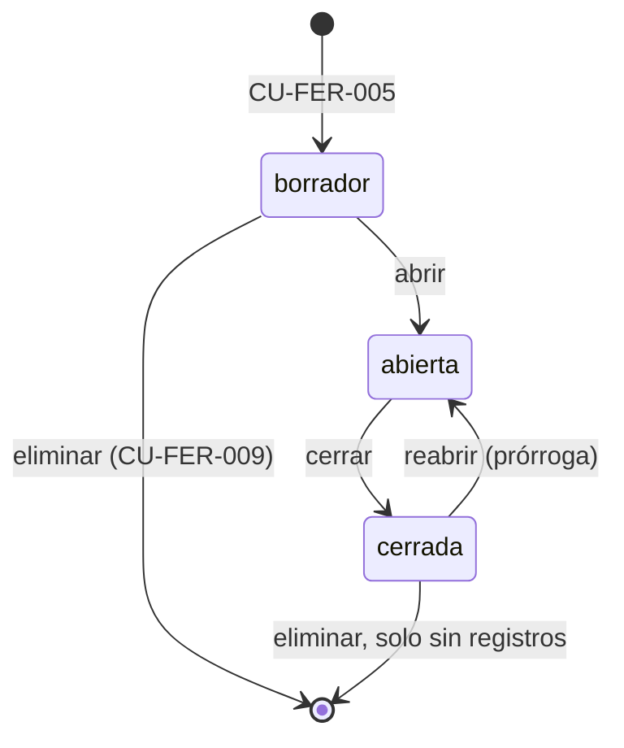

# CU-FER-008 Abrir y cerrar una convocatoria

> [!important] Este es el caso de uso que de verdad hace algo
> Los otros cuatro del CRUD manipulan una fila. Este es el que **abre y cierra la puerta**: es lo
> único que decide si `EVT`, `STD` y `VIS` admiten registros. Por eso es un acto explícito y
> separado del alta y de la edición, y no un efecto colateral de una fecha.

## Objetivo

Permitir al dueño de la feria poner una convocatoria en operación y retirarla de operación, de forma
deliberada y en un solo acto reversible.

## Alcance

Core Ferias — panel de la feria. Cambia únicamente `Convocatoria.estado`. No toca fechas, ni
nombre, ni configuración del módulo.

## Actores

### Actor principal

- **Dueño de la feria** (fila en `AdminFeria` con `es_dueño = verdadero` para esta feria).

> [!important] Solo el dueño, no cualquier administrador
> Las convocatorias no son contenido corriente de la feria: definen **qué puertas están abiertas
> y hasta cuándo**, y de ellas cuelga el expediente entero de cada módulo. Por eso su
> administración queda reservada al dueño, junto con la de los accesos.
>
> Esto **enmienda** a [ADR-0004](<../../adr/0004-acceso-administrativo-por-feria.md>), que decía
> que lo único reservado al dueño era dar de alta y retirar administradores. Cualquier
> administrador **sí** puede consultar el catálogo (CU-FER-006) — sin eso no podría operar su
> propio módulo — y sigue pudiendo operar todo lo que cuelga de una convocatoria: dictaminar,
> revisar solicitudes, validar abonos.

## Disparador

Llega la fecha de lanzamiento y hay que abrir; o cierra el plazo y hay que dejar de recibir.

## Precondiciones

- El actor tiene sesión activa **y es dueño de la feria** en la que opera.
- La feria no está `archivada`.

## Postcondiciones

### En éxito — al abrir

- `estado` pasa a `abierta`.
- El formulario público del módulo correspondiente **empieza a admitir registros**.
- La convocatoria aparece en el catálogo del participante (CU-FER-006).
- Queda una entrada `convocatoria_abierta` (o `convocatoria_reabierta`) en `BitacoraFER`.

### En éxito — al cerrar

- `estado` pasa a `cerrada`.
- El formulario público **deja de admitir registros nuevos**.
- **Nada de lo ya recibido cambia.** Las solicitudes en curso siguen su proceso: dictamen,
  reserva, pago. Cerrar la convocatoria cierra la entrada, no el trámite.
- La convocatoria sigue visible en el catálogo del participante, marcada como cerrada
  (CU-FER-006 A3).
- Queda una entrada `convocatoria_cerrada` en `BitacoraFER`.

### En fallo

- El estado no cambia.

## Estados y transiciones

**No existe la vuelta a `borrador`.** Una convocatoria que ya se abrió fue pública: quien la vio
la vio, y devolverla a borrador fingiría que no ocurrió. Para dejar de recibir está `cerrada`,
que es reversible sin mentir sobre lo que pasó.

## Flujo principal — abrir

1. Desde el catálogo (CU-FER-006), el dueño elige "Abrir convocatoria" en una en
   `borrador`.
2. El sistema **comprueba que la configuración del módulo esté completa** (ver E1).
3. El sistema pide confirmación, advirtiendo de que a partir de ese momento la convocatoria es
   pública y admite registros.
4. El dueño confirma.
5. El sistema cambia el estado a `abierta` y lo refleja en el catálogo.

## Flujo principal — cerrar

1. Desde el catálogo, el dueño elige "Cerrar convocatoria" en una `abierta`.
2. El sistema pide confirmación, indicando **cuántos registros lleva recibidos** y aclarando que
   los trámites en curso continúan.
3. El dueño confirma.
4. El sistema cambia el estado a `cerrada`.

## Flujos alternos

### A1. Reabrir una convocatoria cerrada (prórroga)

1. El dueño elige "Reabrir" en una convocatoria `cerrada`.
2. El sistema advierte de que las **fechas anunciadas no se modifican solas**: si la prórroga
   debe comunicarse, hay que editar la fecha de cierre aparte (CU-FER-007).
3. El dueño confirma y el estado vuelve a `abierta`.

> [!note] Reabrir y editar la fecha son dos actos a propósito
> Podrían fundirse en uno —"prorrogar hasta tal día"— pero entonces reabrir por dos horas para
> que entre un rezagado obligaría a mover la fecha pública. Separados, cada uno hace una cosa.
> Si se decide fundirlos, es un cambio de este caso de uso, no de la pantalla.

### A2. Cerrar una convocatoria sin ningún registro

1. En el paso 2 del cierre, el conteo es cero.
2. El sistema lo dice y ofrece, además de cerrar, **eliminarla** (CU-FER-009): una convocatoria
   que no recibió nada probablemente no debía existir.

## Flujos de excepción

### E1. La configuración del módulo está incompleta

1. En el paso 2 de la apertura, el módulo correspondiente no tiene su configuración lista — el
   caso claro es `STD` sin `costo_m2` o sin instrucciones de pago.
2. El sistema **rechaza la apertura**, dice qué falta y enlaza a la pantalla del módulo donde se
   completa (CU-STD-034 para stands).
3. La convocatoria permanece en `borrador`.

> [!important] Es la razón de ser del estado `borrador`
> Abrir una convocatoria de stands sin precio publica un formulario que cobra cero. La
> comprobación tiene que estar aquí, en el único punto por el que se pasa para abrir, y no
> repartida por cada formulario público.

### E2. La convocatoria ya está en el estado pedido

1. La petición de abrir o cerrar llega dos veces (doble clic, o un reenvío).
2. La operación es **idempotente**: el sistema no falla, informa de que ya estaba en ese estado y
   refresca el catálogo.

### E3. Se intenta volver a `borrador`

1. Una petición pide pasar de `abierta` o `cerrada` a `borrador`.
2. El sistema la rechaza en el servidor y explica que esa transición no existe.

### E4. La feria está archivada

1. El sistema rechaza el cambio de estado.

### E5. Quien lo intenta no es el dueño de la feria

1. Un administrador de la feria —con acceso legítimo al contenido— intenta abrir o cerrar una convocatoria.
2. El sistema **rechaza la operación en el servidor**, no solo ocultando el botón.
3. El sistema explica que las convocatorias las administra el dueño de la feria, e indica quién
   es.

## Datos relevantes

### Entradas

- Convocatoria y transición pedida (abrir / cerrar / reabrir)

### Salidas

- `Convocatoria.estado` actualizado

> [!note] El cambio de estado queda en la bitácora
> Abrir, cerrar y reabrir dejan entrada en `BitacoraFER` con quién y cuándo. Una prórroga que se
> discuta después tiene respuesta.

> [!warning] Pero nadie **avisa** de que la convocatoria abrió o cerró
> Este caso de uso cambia un estado; **no envía ningún correo**. Si la feria quiere anunciar la
> apertura a una lista de interesados, o avisar a quien dejó una solicitud a medias de que quedan
> dos días, eso no existe todavía en ningún dominio. Ver el índice de `FER`.
