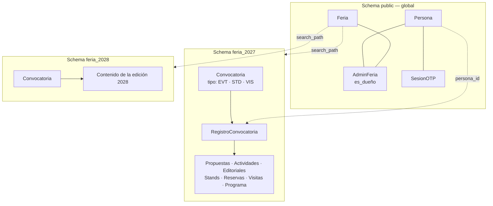

# Modelo de datos — Ferias (FER)

> Modelo conceptual del core `FER`: el registro de las ediciones de la feria (`Feria`) y de
> quién puede administrar cada una (`AdminFeria`). Es, junto con `REG`, una de las dos capas
> globales del sistema: **todo lo demás vive dentro de una feria.**

<!-- -->

> [!success] Construido el 2026-08-25 — `Feria`, `AdminFeria` y `Convocatoria` existen como código
> Están en `filey/apps/ferias/` (capa `public`) y `filey/apps/convocatorias/` (capa por feria).
> El alta de una feria se hace desde `/django-admin/` (CU-FER-001). Lo que **no** existe todavía:
> `RegistroConvocatoria`, `BitacoraFER` y el CRUD de convocatorias (CU-FER-005…009).
>
> Tres cosas del código que este documento no predecía, y conviene saber antes de leerlo:

<!-- -->

> [!warning] `FER` son **dos apps de Django**, no una
> Este modelo dice —con razón— que `FER` es el primer módulo con tablas en las dos capas.
> `django-tenants` separa **por app, no por modelo**: una app listada a la vez en `SHARED_APPS`
> y en `TENANT_APPS` duplicaría *todas* sus tablas en *todos* los schemas, y tendríamos una
> copia de `Feria` dentro de cada feria. Por eso el dominio se parte en `apps/ferias` (global)
> y `apps/convocatorias` (por feria). Conceptualmente sigue siendo un solo dominio.

<!-- -->

> [!warning] En el código el atributo se llama `es_dueno`, sin eñe
> Este documento escribe `es_dueño` y así se queda: es el nombre conceptual. El código usa
> `es_dueno` porque ningún identificador del repositorio lleva eñe, y una columna con eñe
> arrastra fricción de codificación en cada herramienta que toque la base. Misma decisión que
> `contrasena`.

<!-- -->

> [!warning] Existe una fila `Feria` que **no es una feria**
> `TenantSubfolderMiddleware` resuelve toda ruta que no empiece por `/f/` buscando el tenant
> con `schema_name = "public"`, y responde 404 si no lo encuentra: sin esa fila, la pantalla de
> acceso y `/django-admin/` dejan de responder. La crea la migración `ferias/0002`, se llama
> `(sistema)` y no tiene fila `Domain`, así que no es navegable.
>
> **`Feria.objects` no puede excluirla** —la librería la busca ahí—, así que existe
> `Feria.reales` y **todo listado usa `reales`**. Es el error más fácil de cometer en este
> modelo, y se manifiesta como una feria de más en la pantalla de alguien.
>
> Por lo mismo, `Feria.slug` y `Domain.domain` guardan el mismo valor: el primero es del modelo
> de dominio, el segundo es cómo la librería resuelve el segmento de URL. Solo los escribe
> `servicios/altas.py`, y hay una prueba de que no divergen.

<!-- -->

> [!important] Este modelo se apoya en dos decisiones de arquitectura, no al revés
> [ADR-0003](<../../adr/0003-una-feria-por-schema.md>) decide que cada feria vive en su propio
> schema de PostgreSQL; [ADR-0004](<../../adr/0004-acceso-administrativo-por-feria.md>) decide
> que el acceso administrativo se otorga por feria y que cada feria tiene un dueño. Si algo de
> aquí contradice a esos ADR, mandan ellos.

---

## 1. Las dos capas del sistema

La distinción que organiza todo el modelo:

| Capa | Dónde vive | Qué contiene |
| --- | --- | --- |
| **Global** | Schema `public` | `Persona` y `SesionOTP` (de `REG`), `Feria` y `AdminFeria` (de `FER`). Una sola copia para todo el sistema. |
| **Por feria** | Schema `feria_<slug>` | Todo el contenido: convocatorias, propuestas, actividades, stands, reservas, visitas, programa y salas (`EVT`, `TAL`, `STD`, `VIS`, `PRG`, `SAL`). Una copia por edición. |

> [!important] Una cuenta no pertenece a una feria
> `Persona` es global y su correo es único en todo el sistema. Quien expuso en FILEY 2026 y
> propone una actividad en FILEY 2027 es **la misma cuenta**, con el mismo correo y el mismo
> acceso por OTP. Lo que se separa por feria es el contenido, nunca la identidad. Ver
> [`Modelo de datos - Registros`](<../REG/Modelo de datos - Registros.md>) §5.

<!-- -->

> [!note] Ninguna tabla de dominio guarda `feria_id`
> No hace falta: la feria no es una columna, es **el schema en el que la conexión está
> mirando**. Una consulta de `EVT` no puede alcanzar las propuestas de otra edición porque esas
> filas no están en su schema. Es la garantía que ADR-0003 compra, y por eso `feria_id` no debe
> aparecer en ningún modelo de dominio nuevo.

---

## 2. Resumen de entidades

| Entidad | Capa | Propósito |
| --- | --- | --- |
| Feria | `public` | Una edición de la feria (FILEY 2027, FILEY 2028…), y el schema donde vive su contenido. |
| AdminFeria | `public` | Quién administra una feria, y cuál de ellos es su dueño. |
| Convocatoria | schema de la feria | Un llamado abierto dentro de una feria: eventos, venta de stands o visitas escolares. |
| RegistroConvocatoria | schema de la feria | Que una persona se inscribió a una convocatoria. Es el punto del que cuelga el expediente de cada módulo. |
| BitacoraFER | schema de la feria | Rastro de las acciones sensibles sobre la feria y sus convocatorias. |

> [!important] `FER` es el primer módulo con tablas en **las dos** capas
> `Feria` y `AdminFeria` son globales porque responden preguntas que cruzan ediciones
> ("¿qué ferias administra esta persona?"). `Convocatoria` y `RegistroConvocatoria`, en cambio,
> **son contenido de una feria**: sus fechas, sus cupos y quién se inscribió cambian en cada
> edición y no deben poder mezclarse entre ellas. Por eso viven en el schema de la feria y
> **no llevan `feria_id`**, igual que el resto del contenido
> ([ADR-0003](<../../adr/0003-una-feria-por-schema.md>)).
>
> El costo de esta decisión está en §6: preguntar "¿qué convocatorias hay abiertas ahora mismo
> en todo el sistema?" exige recorrer schemas.

---

## 3. Detalle de entidades y atributos

### 3.1 Feria

> El registro de una edición. Vive en `public`. Crear una fila aquí **no es solo insertar un
> registro**: lleva aparejado crear su schema y aplicarle las migraciones (CU-FER-001).

| Atributo | Descripción |
| --- | --- |
| id | Identificador único. |
| nombre | Nombre visible de la edición (p. ej. "FILEY 2027"). |
| edicion | Número ordinal de la edición (p. ej. XIV). Va aquí y no en un dominio porque cualquiera que imprima el nombre completo de la feria lo necesita: la ficha PDF de `EVT`, las constancias, el programa publicado. |
| slug | Identificador corto, estable y sin acentos (p. ej. `2027`). **Es el prefijo de la URL** (`/f/2027/…`) y determina el nombre del schema (`feria_2027`). No cambia nunca una vez creada la feria: cambiarlo rompería los enlaces ya compartidos y dejaría el schema huérfano. |
| estado | `en_preparacion` / `activa` / `archivada`. Ver la nota de abajo. |
| sede | Recinto donde ocurre la edición (p. ej. Centro de Convenciones Yucatán Siglo XXI). Es de la feria entera: `PRG`, `SAL` y `STD` la necesitan por igual. **No** es el salón concreto donde se monta cada cosa — eso lo decide cada dominio. |
| fecha_inicio | Fecha de arranque de la edición (informativa). |
| fecha_fin | Fecha de cierre de la edición (informativa). |
| creada_en | Alta del registro. |

> [!note] `edicion` y `sede` vienen del `Evento` de `STD`
> `STD` modelaba su propia entidad `Evento` (id, nombre, edición, fechas, sede, salón) para
> representar la edición de la feria. Al extraerla, sus dos atributos que no existían aquí
> —`edicion` y `sede`— se incorporan a `Feria`. El `salon` se quedó en `STD`: es dónde se monta
> el showfloor, no dónde ocurre la feria. Ver
> [`STD/Modelo de datos - Stands`](<../STD/Modelo de datos - Stands.md>) §2.b.

> [!note] Qué significa cada `estado` — y qué no
> `en_preparacion`: existe y sus administradores pueden entrar, pero no se publica a
> participantes. `activa`: en operación normal. `archivada`: edición terminada; se consulta
> pero no se modifica. El estado gobierna **la feria como contenedor**, no sus convocatorias:
> que una feria esté `activa` no dice nada sobre si la convocatoria de eventos está abierta —
> eso lo dicen los parámetros de convocatoria de cada dominio, dentro del schema de la feria.

### 3.2 AdminFeria

> Quién puede entrar al panel de una feria (`CU-FER-003`). Vive en `public`, porque relaciona
> una entidad global (`Persona`) con otra global (`Feria`). Es la tabla que el middleware
> consulta antes de dejar entrar a cualquier pantalla administrativa de una feria.

| Atributo | Descripción |
| --- | --- |
| id | Identificador único. |
| feria_id | FK → Feria. |
| persona_id | FK → Persona (`REG`). |
| es_dueño | Booleano. **Exactamente uno por feria** lo tiene en verdadero. El dueño es el único que puede dar de alta o retirar administradores de esa feria. |
| creado_en | Fecha del alta del acceso. |
| creado_por | FK → Persona: quién concedió este acceso. En el caso del dueño, queda nulo — lo designó el operador de la plataforma al crear la feria, desde fuera de cualquier feria. |

**Restricciones:**

- Único por (`feria_id`, `persona_id`): una persona no puede tener dos accesos a la misma feria.
- Como máximo una fila con `es_dueño = verdadero` por `feria_id`.
- Toda feria tiene al menos una fila, y es la de su dueño: una feria sin dueño no se puede
  crear (CU-FER-001) y no debe poder quedarse sin él (ver §6).

> [!important] Tener acceso a una feria habilita **casi todo el contenido de esa feria**
> No hay permiso por módulo ni nivel de solo lectura: un administrador de una feria puede
> dictaminar, programar, operar stands y visitas, y todo lo que cuelga de una convocatoria.
> Reservado al dueño queda **dar de alta y retirar administradores** (CU-FER-003, CU-FER-004)
> **y administrar las convocatorias mismas** (CU-FER-005, 007, 008, 009) — esto último es una
> enmienda del 2026-08-25 a [ADR-0004](<../../adr/0004-acceso-administrativo-por-feria.md>),
> registrada en el propio ADR. Consultar el catálogo sí queda abierto a cualquiera (CU-FER-006).

<!-- -->

> [!warning] `RolPermiso` queda derogado
> El modelo anterior —`RolPermiso(persona, modulo, nivel)`, con `modulo = *` para el
> "administrador general"— lo sustituye esta tabla. Está construido en
> `filey/apps/registros/models.py` y hay que retirarlo, junto con el decorador
> `requiere_modulo`. Mientras la migración no se ejecute, el código y este documento no
> coinciden; manda este documento.

### 3.3 Convocatoria

> Un llamado abierto dentro de una feria. Una feria tiene varias: la de eventos, la de venta de
> stands, la de visitas escolares. Vive **en el schema de la feria**.

| Atributo | Descripción |
| --- | --- |
| id | Identificador único. |
| tipo | `EVT` (actividades) / `STD` (venta de stands) / `VIS` (visitas escolares). Determina **qué módulo** gobierna el expediente de quien se registra (§3.4). |
| nombre | Nombre visible (p. ej. "Convocatoria de actividades FILEY 2027"). |
| estado | `borrador` / `abierta` / `cerrada`. Es lo que decide si el formulario público admite registros. |
| fecha_apertura | Desde cuándo se admiten registros. |
| fecha_cierre | Hasta cuándo. |
| creada_en | Alta del registro. |

**Restricciones:**

- Ninguna sobre `tipo`. **Una feria puede tener varias convocatorias del mismo tipo**
  (decisión 2026-08-25): dos convocatorias de actividades con públicos distintos, o una de stands
  general y otra para un pabellón concreto.

> [!warning] Que haya varias del mismo tipo obliga a cada módulo a saber en cuál está
> Antes se asumía una convocatoria por tipo, y de ahí colgaban dos atajos que **ya no valen**:
>
> | Atajo que se cae | Qué hay que hacer en su lugar |
> | --- | --- |
> | `ConfiguracionSistema` de `STD` era "una tabla de una sola fila". | Es **una fila por convocatoria de stands**. Sigue funcionando porque cuelga de `convocatoria_id`, pero ninguna consulta puede volver a asumir que hay exactamente una. |
> | "La solicitud de esta persona en esta feria" era una sola cosa. | Es una **por convocatoria**: la misma editorial puede aplicar a dos convocatorias de stands de la misma feria y tener dos solicitudes, dos reservas y dos saldos. |
>
> El precio de la flexibilidad se paga aquí: cualquier pantalla o servicio de módulo que hoy diga
> "la convocatoria" tiene que decir **cuál**.

> [!important] Cómo sabe una convocatoria a qué feria pertenece — **no lo sabe, y no le hace falta**
> Es la pregunta que más se repite sobre este modelo, así que en concreto:
>
> ```
> GET /f/2027/convocatorias
>        │
>        ├─ middleware: slug "2027" → Feria(id=7, slug="2027")
>        │              SET search_path = feria_2027, public
>        │
>        └─ vista:      SELECT * FROM convocatoria       ← sin WHERE feria_id
>                       ↳ PostgreSQL resuelve "convocatoria" como
>                         "feria_2027.convocatoria" por el search_path
> ```
>
> La fila de `Convocatoria` **no contiene nada** que diga "2027". Lo que la ata a esa feria es
> *en qué schema está guardada*. Una consulta desde `/f/2028/…` no puede verla, no porque el
> filtro esté bien escrito, sino porque esa tabla no está en su camino de búsqueda.
>
> **Lo que esto compra:** es imposible escribir el bug de mezclar ediciones. No hay `WHERE` que
> olvidar. **Lo que cuesta:** no se puede hacer `JOIN` entre ferias, ni contestar "todas las
> convocatorias abiertas del sistema" con una consulta (§6).
>
> Si en algún momento se quisiera un `feria_id` explícito en su lugar, eso **no es un ajuste de
> este modelo**: es reemplazar [ADR-0003](<../../adr/0003-una-feria-por-schema.md>), y afecta a
> todas las tablas de todos los dominios, no solo a esta.

<!-- -->

> [!important] Y el permiso sí cruza la frontera
> Hay una excepción a "la feria no es una columna", y conviene tenerla presente al implementar:
> **la comprobación de permiso**. "¿Es dueño de esta feria?" se responde con `AdminFeria`, que
> vive en `public` y sí lleva `feria_id`. Así que el middleware del `search_path` no puede
> limitarse a fijar el schema: tiene que saber **qué `Feria.id`** corresponde al schema que acaba
> de fijar, y pasárselo a la comprobación de permiso. Traducir `slug → Feria.id → search_path` es
> una sola operación, y el `id` que sale de ahí es el que usan CU-FER-005 a CU-FER-009.
>
> Si el middleware fijara el schema sin conservar ese `id`, la única forma de comprobar el
> permiso sería volver a resolver el slug — y un fallo ahí no daría un error, daría una respuesta
> con los datos de otra feria.

> [!important] Las convocatorias las administra el dueño de la feria
> Crear, editar, abrir/cerrar y eliminar convocatorias es exclusivo del dueño (CU-FER-005 a
> CU-FER-009). Cualquier administrador de la feria **consulta** el catálogo (CU-FER-006) y opera
> todo lo que cuelga de una convocatoria, pero no la convocatoria misma. Es una enmienda a
> [ADR-0004](<../../adr/0004-acceso-administrativo-por-feria.md>), registrada en el propio ADR.

> [!note] `estado` manda sobre las fechas, no al revés
> Que hoy esté entre `fecha_apertura` y `fecha_cierre` no abre la convocatoria por sí solo: el
> administrador la abre y la cierra explícitamente. Las fechas son lo que se publica y lo que
> permite programar el cierre, pero un cierre anticipado o una prórroga tienen que poder
> hacerse sin mentir sobre las fechas anunciadas.

<!-- -->

> [!warning] `TAL` no aparece en `tipo` — **pendiente, y confirmado como pendiente**
> Los tres tipos son los que el cambio de diseño del 2026-08-25 enumeró: eventos, stands y
> visitas. `TAL` (actividades infantiles/juveniles) tiene modelo de datos propio y casos de uso
> escritos, y **queda deliberadamente fuera hasta que se decida** si es un cuarto tipo o una
> convocatoria de tipo `EVT` con otro público. No bloquea nada mientras `TAL` no se construya;
> sí hay que resolverlo antes de empezarlo. Ver §6.
>
> Ahora que caben varias convocatorias del mismo tipo, la segunda opción sale más barata que
> antes: `TAL` podría ser una convocatoria `EVT` más, sin necesidad de un tipo propio.

### 3.4 RegistroConvocatoria

> Que una persona se inscribió a una convocatoria de esta feria. Vive **en el schema de la
> feria**, porque inscribirse es participar en una edición concreta.

| Atributo | Descripción |
| --- | --- |
| id | Identificador único. |
| convocatoria_id | FK → Convocatoria. |
| persona_id | FK → `Persona` (`REG`). Cruza a `public`: es la misma frontera que ya cruzan `Editorial` en `STD` y las solicitudes en `EVT`. |
| estado | `activo` / `retirado`. El estado del **registro**, no el del expediente: si la solicitud fue aceptada o rechazada lo dice el módulo, no esta tabla. |
| fecha_registro | Marca de tiempo de la inscripción. |

**Restricciones:**

- Único por (`convocatoria_id`, `persona_id`): una persona se registra una sola vez a cada
  convocatoria.

> [!important] Esta tabla es deliberadamente flaca — cada módulo define qué significa registrarse
> `FER` no sabe ni tiene que saber qué es una propuesta de actividad, una ficha de expositor o
> una solicitud de visita escolar. Lo único que afirma es **quién entró por qué puerta**. El
> expediente cuelga del módulo correspondiente, apuntando de vuelta aquí:
>
> | Convocatoria `tipo` | Módulo | Qué cuelga del registro |
> | --- | --- | --- |
> | `EVT` | Eventos | `Solicitudes_EVT` — una propuesta de actividad (puede haber varias por persona). |
> | `STD` | Stands | `Solicitud` — la aplicación a expositor, con su `Editorial` y su reserva detrás. **1—N**: tras un rechazo se puede volver a aplicar (RN-22 de `STD`). Ver [`STD/Modelo de datos - Stands`](<../STD/Modelo de datos - Stands.md>) §3.3. |
> | `VIS` | Visitas | La solicitud de visita escolar (modelo pendiente). |
>
> Esta es la razón de ser del patrón: agregar un tipo de convocatoria no obliga a tocar ninguna
> tabla existente.

<!-- -->

> [!important] Cuántos expedientes cuelgan de un registro — **N, no uno** (2026-08-27)
> Este documento no lo decía, y `STD` lo obligó a decidirse: de un registro cuelgan **todos** los
> expedientes de esa persona en esa convocatoria a lo largo del tiempo, con **como mucho uno
> vivo**. En `STD` es porque tras un rechazo se puede volver a aplicar (RN-22); en `EVT` es de
> nacimiento, porque una persona propone varias actividades.
>
> Lo único que sigue siendo 1—1 es **persona ↔ registro** dentro de una convocatoria, que es lo
> que la restricción única de arriba garantiza.

<!-- -->

> [!important] Cómo llega alguien del catálogo al módulo — resuelto por ADR-0006
> El botón "Registrarme" de la tarjeta no puede resolver `reverse("stands:aplicar")`: `FER` no
> conoce a los módulos, y no puede conocerlos sin invertir la dependencia. Lo resuelve un
> **registro de módulos por tipo** en `apps/convocatorias/modulos.py`, donde cada app vertical se
> inscribe a sí misma al arrancar. Ver
> [ADR-0006](<../../adr/0006-la-liga-entre-convocatoria-y-modulo.md>).
>
> De ahí sale también **cuándo nace un registro**: al guardarse el expediente del módulo, no al
> pulsar el botón. Si naciera con el clic, cada visita curiosa dejaría una inscripción vacía y
> las listas contarían gente que nunca aplicó.
>
> Y una advertencia que hay que tener presente al implementar: **la base de datos no puede
> garantizar que el expediente corresponda al `tipo` de la convocatoria** — el `tipo` vive un
> salto más allá, en `Convocatoria`. Es una invariante de código, con prueba. El ADR explica por
> qué se acepta.

<!-- -->

> [!warning] ~~Colisión con el `RouterSolicitudes` de `EVT`~~ — **resuelta el 2026-08-27**
> Gana `RegistroConvocatoria`, por [ADR-0006](<../../adr/0006-la-liga-entre-convocatoria-y-modulo.md>).
> `RouterSolicitudes` queda derogado y `EVT` tiene que reapuntar `Solicitudes_EVT` aquí. El
> texto original se conserva abajo porque explica el porqué.
> `EVT` ya define un `RouterSolicitudes(usuario_django, convocatoria, solicitud_id)` descrito
> como *"único para todo el sistema"*, donde `convocatoria` es un discriminador de **dominio**
> (`EVT`/`TAL`/`STD`/`VIS`), no una convocatoria con identidad propia. Es la misma figura que
> `RegistroConvocatoria`, resuelta de otra forma y con el nombre equivocado:
>
> - `RouterSolicitudes` liga persona ↔ solicitud con una referencia polimórfica que la base de
>   datos no puede validar.
> - `RegistroConvocatoria` liga persona ↔ convocatoria con claves foráneas reales, y deja que
>   cada módulo apunte hacia aquí con su propia FK — también real.
>
> **No pueden coexistir.** Reconciliarlos es trabajo pendiente y toca el modelo de `EVT`; ver
> §6 y el inventario de inconsistencias en
> [`Modelo de datos - Sistema (ER)`](<../Modelo de datos - Sistema (ER).md>).

### 3.5 BitacoraFER

> Rastro de las acciones sensibles del dominio. Vive **en el schema de la feria**: la bitácora de
> una edición es de esa edición.

| Atributo | Descripción |
| --- | --- |
| id | Identificador único. |
| persona_id | FK → `Persona` (`REG`). Quién ejecutó la acción. Nunca nulo: toda acción registrada tiene un responsable con nombre. |
| accion | Qué se hizo. Conjunto cerrado — ver la tabla de abajo. |
| entidad_tipo | `convocatoria` / `admin_feria` / `feria`. |
| entidad_id | Id de la fila afectada. Se conserva **aunque la fila se borre**: es un dato histórico, no una FK con integridad. |
| detalle | Qué cambió: los valores antes y después, o los datos de lo que se creó o borró. |
| fecha | Marca de tiempo. |

**Qué se registra, y por qué solo eso:**

| Acción | Caso de uso | Por qué deja rastro |
| --- | --- | --- |
| `convocatoria_creada` | CU-FER-005 | Contexto para leer el resto de la historia de esa convocatoria. |
| `convocatoria_editada` | CU-FER-007 | **La más importante.** Mover la fecha de cierre de una convocatoria abierta cambia lo que se anunció públicamente, y hoy no había forma de saber quién lo hizo ni qué decía antes. |
| `convocatoria_abierta` · `convocatoria_cerrada` · `convocatoria_reabierta` | CU-FER-008 | Es lo único que decide si se admiten registros. Una prórroga discutida después necesita una respuesta. |
| `convocatoria_eliminada` | CU-FER-009 | Es el único borrado real del dominio. Sin esto, una convocatoria borrada no deja ni el hueco. |
| `admin_alta` · `admin_baja` | CU-FER-003, CU-FER-004 | Quién dio acceso a quién, y cuándo se retiró. |

> [!important] La bitácora no es un registro de cambios general
> Solo entra lo que alguien podría **discutir después**: qué se anunció, quién lo cambió, quién
> tenía acceso. Registrar cada lectura o cada consulta del catálogo la volvería ilegible justo
> cuando haga falta leerla — y una bitácora que nadie lee no protege de nada.

<!-- -->

> [!important] Son tres bitácoras, y se quedan así — decidido el 2026-08-27
> `BitacoraFER`, la `Bitacora` de `STD` y `BitacoraEVT` tienen la misma forma, y este documento
> venía diciendo que unificarlas era lo razonable. **Se decide lo contrario: una por módulo.**
>
> Lo que registran son las acciones sensibles **de un dominio**, y esas no se parecen: mover la
> fecha de cierre de una convocatoria y validar un abono no comparten vocabulario ni quién los
> lee. Una tabla común obligaría a un `accion` que fuera la unión de todos los conjuntos
> cerrados — es decir, ninguno —, y el conjunto cerrado es precisamente lo que hace legible una
> bitácora.
>
> El texto de abajo se conserva porque explica la duda que había.

<!-- -->

> [!warning] ~~Esta bitácora no es la de `STD`, y no deberían ser dos~~ *(superado)*
> `STD` tiene su propia `Bitacora` (§3.12 de su modelo) con la misma forma —persona, acción,
> entidad polimórfica, detalle, fecha— para sus acciones sensibles: validar un abono, aplicar un
> descuento especial, prorrogar una reserva. Ahora hay **dos tablas idénticas en distinto
> dominio**, y `EVT` define una tercera (`BitacoraEVT`).
>
> Unificarlas en una sola bitácora por feria es lo razonable, y es trabajo pendiente: hacerlo
> ahora obligaría a tocar tres modelos y sus casos de uso. Lo que **no** debe pasar es que el
> cuarto dominio añada la cuarta. Ver §6.

---

## 4. Relaciones principales

- **Feria** 1—N **AdminFeria**; exactamente una de esas filas es la del dueño.
- **Persona** (`REG`) 1—N **AdminFeria**: una persona puede administrar varias ferias, y ser
  dueña de unas y administradora de otras.
- **Feria** 1—1 **schema de base de datos**, y dentro de él todas las entidades de `EVT`,
  `TAL`, `STD`, `VIS`, `PRG` y `SAL` — más las propias `Convocatoria` y `RegistroConvocatoria`.
  Esa relación **no se expresa con claves foráneas**: la hace el `search_path` de la conexión.
- **Convocatoria** 1—N **RegistroConvocatoria**; como máximo una convocatoria por `tipo` en cada
  feria.
- **Persona** (`REG`) 1—N **RegistroConvocatoria**: una persona puede registrarse a la
  convocatoria de eventos y a la de stands de la misma feria, a varias del mismo tipo, y a las de
  varias ferias.
- **Persona** (`REG`) 1—N **BitacoraFER**: quién ejecutó cada acción registrada.
- **RegistroConvocatoria** 1—N *(expediente del módulo)*: `Solicitudes_EVT` en eventos,
  `Solicitud` en stands (1—1 ahí), la solicitud de visita en `VIS`.



---

## 5. Mapa entidad → caso de uso (trazabilidad)

| Entidad | Casos de uso relacionados |
| --- | --- |
| Feria | CU-FER-001, CU-FER-002 |
| AdminFeria | CU-FER-001, CU-FER-002, CU-FER-003, CU-FER-004 |
| Convocatoria | CU-FER-005 (alta), CU-FER-006 (catálogo), CU-FER-007 (edición), CU-FER-008 (abrir/cerrar), CU-FER-009 (borrado). La consulta **pública** sigue sin caso de uso — ver §6. |
| RegistroConvocatoria | Se crea desde el primer caso de uso de cada módulo: CU-EVT-002, CU-STD-001, CU-VIS-001. |
| BitacoraFER | CU-FER-003, CU-FER-004, CU-FER-005, CU-FER-007, CU-FER-008, CU-FER-009 |

---

## 6. Temas abiertos del modelo

- **Qué pasa si el dueño se va.** **Desatascado el 2026-08-27** por
  [ADR-0005](<../../adr/0005-el-operador-alcanza-cualquier-feria.md>): el operador de la
  plataforma alcanza las pantallas de accesos de cualquier feria, así que una edición cuyo dueño
  abandona el proyecto ya se arregla desde la pantalla y no por consola. **Sigue faltando** el
  caso de uso de **transferencia de propiedad** ejecutable por el propio dueño antes de irse —
  que es lo que evitaría depender del equipo técnico para la salida ordenada. Ver el índice de
  `FER`.
- **Corrección pendiente en `TAL` y `STD`.** Sus modelos separan la edición de otra forma:
  `TAL` lleva `edicion_id` como FK a `EdicionFeria` en cuatro tablas (una dentro de su clave
  primaria compuesta) y `STD` tiene una entidad `Evento` = "edición de la feria". ADR-0003 las
  deja obsoletas: ninguna tabla de dominio debe guardar identificador de edición. Corregir
  ambos modelos es trabajo pendiente. `EVT` (v3.0) ya está alineado y no requiere cambios.
- **Historial entre ferias.** Preguntas como "¿en cuántas ediciones ha participado esta
  persona?" (la deuda de `es_recurrente` que ya registran `REG` y `EVT`) no se resuelven con un
  `JOIN` bajo este modelo: hay que recorrer schemas o mantener una tabla global explícita en
  `public`. Cuando se implemente `es_recurrente`, esa tabla es parte de `FER`, no de un dominio
  de contenido.
- ~~**Faltan los casos de uso de `Convocatoria`.**~~ **Resuelto el 2026-08-25** para el lado
  administrativo: CU-FER-005 a CU-FER-009 cubren el alta, el catálogo, la edición, la
  apertura/cierre y el borrado. **Sigue faltando la consulta pública** — cómo ve un participante
  qué convocatorias están abiertas; ver el punto del portal público, más abajo.
- **Administrar convocatorias quedó reservado al dueño** (2026-08-25), lo que **enmienda** a
  [ADR-0004](<../../adr/0004-acceso-administrativo-por-feria.md>): la decisión original daba todo
  el contenido de la feria a cualquier administrador. Consultar el catálogo sí sigue abierto a
  cualquier administrador. Si la lista de lo reservado al dueño vuelve a crecer, deja de ser una
  enmienda y hay que escribir el ADR que sustituya al 0004.
- ~~**Tres bitácoras idénticas.**~~ **Resuelto el 2026-08-27: se quedan separadas, una por
  módulo.** Lo que registra cada una son las acciones sensibles de su dominio, y su valor está
  en que `accion` sea un conjunto cerrado y legible; una tabla común lo disolvería. Ver §3.5.
- **Varias convocatorias del mismo tipo: qué se rompió río abajo.** La decisión del 2026-08-25
  (§3.3) invalida el supuesto de "una convocatoria de stands por feria". `STD` ya está corregido
  —`ConfiguracionSistema` cuelga de `convocatoria_id`— pero **cualquier pantalla o servicio que
  diga "la convocatoria" tiene que decir cuál**, y eso no está revisado en los casos de uso de
  `STD`, que se escribieron asumiendo una sola.
- **Dónde encaja `TAL`.** `Convocatoria.tipo` tiene tres valores y `TAL` no está entre ellos
  (§3.3). Decidir si es un cuarto tipo o una convocatoria `EVT` con otro público, antes de
  construir el módulo.
- ~~**Reconciliar `RegistroConvocatoria` con el `RouterSolicitudes` de `EVT`.**~~ **Resuelto el
  2026-08-27 por [ADR-0006](<../../adr/0006-la-liga-entre-convocatoria-y-modulo.md>):** gana
  `RegistroConvocatoria`, con claves foráneas reales, y `RouterSolicitudes` queda derogado.
  **`EVT` no se toca ahora** (decisión de alcance del 2026-08-27: se construye `STD`). Su modelo
  sigue describiendo el router derogado; corregirlo es requisito para empezar `EVT`, no para
  terminar `STD`.
- **El índice global de convocatorias abiertas.** Con `Convocatoria` dentro del schema de cada
  feria, la pregunta "¿dónde puedo participar hoy?" no se responde con un `SELECT`: hay que
  recorrer schemas o mantener un espejo en `public`. Es el mismo problema que el punto siguiente
  y conviene resolverlos juntos.
- ~~**Portal público y feria.**~~ **Resuelto el 2026-08-26** por
  [CU-FER-010](<CU-FER-010 Elegir la feria en la que quiero participar.md>): el participante
  elige entre las ediciones `activa` justo después de identificarse, y con una sola el paso se
  salta. El prefijo de URL **no bastaba** —quien acaba de entrar no tiene ningún slug que
  escribir— pero tampoco hizo falta una portada que cruce ferias: se elige edición, y el
  catálogo es de la edición elegida. El catálogo provisional hardcodeado desapareció con esto.
  Sigue abierto el punto de arriba, el índice global: elegir entre ediciones no es lo mismo que
  buscar en todas a la vez.
