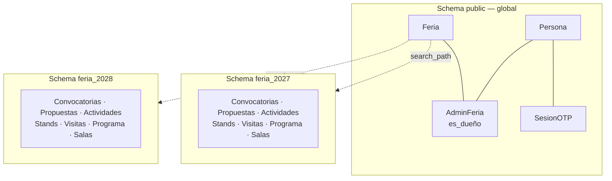

# Modelo de datos — Ferias (FER)

> Modelo conceptual del core `FER`: el registro de las ediciones de la feria (`Feria`) y de
> quién puede administrar cada una (`AdminFeria`). Es, junto con `REG`, una de las dos capas
> globales del sistema: **todo lo demás vive dentro de una feria.**

<!-- -->

> [!important] Este modelo se apoya en dos decisiones de arquitectura, no al revés
> [ADR-0003](<../../adr/0003-una-feria-por-schema.md>) decide que cada feria vive en su propio
> schema de PostgreSQL; [ADR-0004](<../../adr/0004-acceso-administrativo-por-feria.md>) decide
> que el acceso administrativo se otorga por feria y que cada feria tiene un dueño. Si algo de
> aquí contradice a esos ADR, mandan ellos.

---

## 1. Las dos capas del sistema

La distinción que organiza todo el modelo:

| Capa | Dónde vive | Qué contiene |
| --- | --- | --- |
| **Global** | Schema `public` | `Persona` y `SesionOTP` (de `REG`), `Feria` y `AdminFeria` (de `FER`). Una sola copia para todo el sistema. |
| **Por feria** | Schema `feria_<slug>` | Todo el contenido: convocatorias, propuestas, actividades, stands, reservas, visitas, programa y salas (`EVT`, `TAL`, `STD`, `VIS`, `PRG`, `SAL`). Una copia por edición. |

> [!important] Una cuenta no pertenece a una feria
> `Persona` es global y su correo es único en todo el sistema. Quien expuso en FILEY 2026 y
> propone una actividad en FILEY 2027 es **la misma cuenta**, con el mismo correo y el mismo
> acceso por OTP. Lo que se separa por feria es el contenido, nunca la identidad. Ver
> [`Modelo de datos - Registros`](<../REG/Modelo de datos - Registros.md>) §5.

<!-- -->

> [!note] Ninguna tabla de dominio guarda `feria_id`
> No hace falta: la feria no es una columna, es **el schema en el que la conexión está
> mirando**. Una consulta de `EVT` no puede alcanzar las propuestas de otra edición porque esas
> filas no están en su schema. Es la garantía que ADR-0003 compra, y por eso `feria_id` no debe
> aparecer en ningún modelo de dominio nuevo.

---

## 2. Resumen de entidades

| Entidad | Propósito |
| --- | --- |
| Feria | Una edición de la feria (FILEY 2027, FILEY 2028…), y el schema donde vive su contenido. |
| AdminFeria | Quién administra una feria, y cuál de ellos es su dueño. |

---

## 3. Detalle de entidades y atributos

### 3.1 Feria

> El registro de una edición. Vive en `public`. Crear una fila aquí **no es solo insertar un
> registro**: lleva aparejado crear su schema y aplicarle las migraciones (CU-FER-001).

| Atributo | Descripción |
| --- | --- |
| id | Identificador único. |
| nombre | Nombre visible de la edición (p. ej. "FILEY 2027"). |
| edicion | Número ordinal de la edición (p. ej. XIV). Va aquí y no en un dominio porque cualquiera que imprima el nombre completo de la feria lo necesita: la ficha PDF de `EVT`, las constancias, el programa publicado. |
| slug | Identificador corto, estable y sin acentos (p. ej. `2027`). **Es el prefijo de la URL** (`/f/2027/…`) y determina el nombre del schema (`feria_2027`). No cambia nunca una vez creada la feria: cambiarlo rompería los enlaces ya compartidos y dejaría el schema huérfano. |
| estado | `en_preparacion` / `activa` / `archivada`. Ver la nota de abajo. |
| sede | Recinto donde ocurre la edición (p. ej. Centro de Convenciones Yucatán Siglo XXI). Es de la feria entera: `PRG`, `SAL` y `STD` la necesitan por igual. **No** es el salón concreto donde se monta cada cosa — eso lo decide cada dominio. |
| fecha_inicio | Fecha de arranque de la edición (informativa). |
| fecha_fin | Fecha de cierre de la edición (informativa). |
| creada_en | Alta del registro. |

> [!note] `edicion` y `sede` vienen del `Evento` de `STD`
> `STD` modelaba su propia entidad `Evento` (id, nombre, edición, fechas, sede, salón) para
> representar la edición de la feria. Al extraerla, sus dos atributos que no existían aquí
> —`edicion` y `sede`— se incorporan a `Feria`. El `salon` se quedó en `STD`: es dónde se monta
> el showfloor, no dónde ocurre la feria. Ver
> [`STD/Modelo de datos - Stands`](<../STD/Modelo de datos - Stands.md>) §2.b.

> [!note] Qué significa cada `estado` — y qué no
> `en_preparacion`: existe y sus administradores pueden entrar, pero no se publica a
> participantes. `activa`: en operación normal. `archivada`: edición terminada; se consulta
> pero no se modifica. El estado gobierna **la feria como contenedor**, no sus convocatorias:
> que una feria esté `activa` no dice nada sobre si la convocatoria de eventos está abierta —
> eso lo dicen los parámetros de convocatoria de cada dominio, dentro del schema de la feria.

### 3.2 AdminFeria

> Quién puede entrar al panel de una feria (`CU-FER-003`). Vive en `public`, porque relaciona
> una entidad global (`Persona`) con otra global (`Feria`). Es la tabla que el middleware
> consulta antes de dejar entrar a cualquier pantalla administrativa de una feria.

| Atributo | Descripción |
| --- | --- |
| id | Identificador único. |
| feria_id | FK → Feria. |
| persona_id | FK → Persona (`REG`). |
| es_dueño | Booleano. **Exactamente uno por feria** lo tiene en verdadero. El dueño es el único que puede dar de alta o retirar administradores de esa feria. |
| creado_en | Fecha del alta del acceso. |
| creado_por | FK → Persona: quién concedió este acceso. En el caso del dueño, queda nulo — lo designó el operador de la plataforma al crear la feria, desde fuera de cualquier feria. |

**Restricciones:**

- Único por (`feria_id`, `persona_id`): una persona no puede tener dos accesos a la misma feria.
- Como máximo una fila con `es_dueño = verdadero` por `feria_id`.
- Toda feria tiene al menos una fila, y es la de su dueño: una feria sin dueño no se puede
  crear (CU-FER-001) y no debe poder quedarse sin él (ver §6).

> [!important] Tener acceso a una feria habilita **todo el contenido de esa feria**
> No hay permiso por módulo ni nivel de solo lectura: un administrador de una feria puede
> operar sus convocatorias, dictaminar, programar, y ver stands y visitas. Lo único reservado
> al dueño es dar de alta y retirar administradores. Es una decisión tomada a sabiendas, con
> sus contras, en [ADR-0004](<../../adr/0004-acceso-administrativo-por-feria.md>).

<!-- -->

> [!warning] `RolPermiso` queda derogado
> El modelo anterior —`RolPermiso(persona, modulo, nivel)`, con `modulo = *` para el
> "administrador general"— lo sustituye esta tabla. Está construido en
> `filey/apps/registros/models.py` y hay que retirarlo, junto con el decorador
> `requiere_modulo`. Mientras la migración no se ejecute, el código y este documento no
> coinciden; manda este documento.

---

## 4. Relaciones principales

- **Feria** 1—N **AdminFeria**; exactamente una de esas filas es la del dueño.
- **Persona** (`REG`) 1—N **AdminFeria**: una persona puede administrar varias ferias, y ser
  dueña de unas y administradora de otras.
- **Feria** 1—1 **schema de base de datos**, y dentro de él todas las entidades de `EVT`,
  `TAL`, `STD`, `VIS`, `PRG` y `SAL`. Esa relación **no se expresa con claves foráneas**: la
  hace el `search_path` de la conexión.

---

## 5. Mapa entidad → caso de uso (trazabilidad)

| Entidad | Casos de uso relacionados |
| --- | --- |
| Feria | CU-FER-001, CU-FER-002 |
| AdminFeria | CU-FER-001, CU-FER-002, CU-FER-003, CU-FER-004 |

---

## 6. Temas abiertos del modelo

- **Qué pasa si el dueño se va.** Con exactamente un dueño por feria, y solo él pudiendo
  administrar accesos, una feria cuyo dueño abandona el proyecto queda sin quien dé de alta a
  nadie. La salida provisional es que el operador de la plataforma reasigne la propiedad por
  comando. Falta decidir si eso basta o si hace falta un caso de uso de **transferencia de
  propiedad** ejecutable por el propio dueño antes de irse — que es lo que evitaría depender
  del equipo técnico. Ver el índice de `FER`.
- **Corrección pendiente en `TAL` y `STD`.** Sus modelos separan la edición de otra forma:
  `TAL` lleva `edicion_id` como FK a `EdicionFeria` en cuatro tablas (una dentro de su clave
  primaria compuesta) y `STD` tiene una entidad `Evento` = "edición de la feria". ADR-0003 las
  deja obsoletas: ninguna tabla de dominio debe guardar identificador de edición. Corregir
  ambos modelos es trabajo pendiente. `EVT` (v3.0) ya está alineado y no requiere cambios.
- **Historial entre ferias.** Preguntas como "¿en cuántas ediciones ha participado esta
  persona?" (la deuda de `es_recurrente` que ya registran `REG` y `EVT`) no se resuelven con un
  `JOIN` bajo este modelo: hay que recorrer schemas o mantener una tabla global explícita en
  `public`. Cuando se implemente `es_recurrente`, esa tabla es parte de `FER`, no de un dominio
  de contenido.
- **Portal público y feria.** Este modelo define quién administra una feria. Falta precisar
  cómo elige **el participante** la feria en la que quiere proponer: si el prefijo de URL basta,
  o si hace falta una portada que liste las ferias con convocatorias abiertas. Hoy el
  participante llega a `/convocatorias` sin feria de por medio (catálogo provisional
  hardcodeado en `filey/apps/registros/catalogo.py`).
