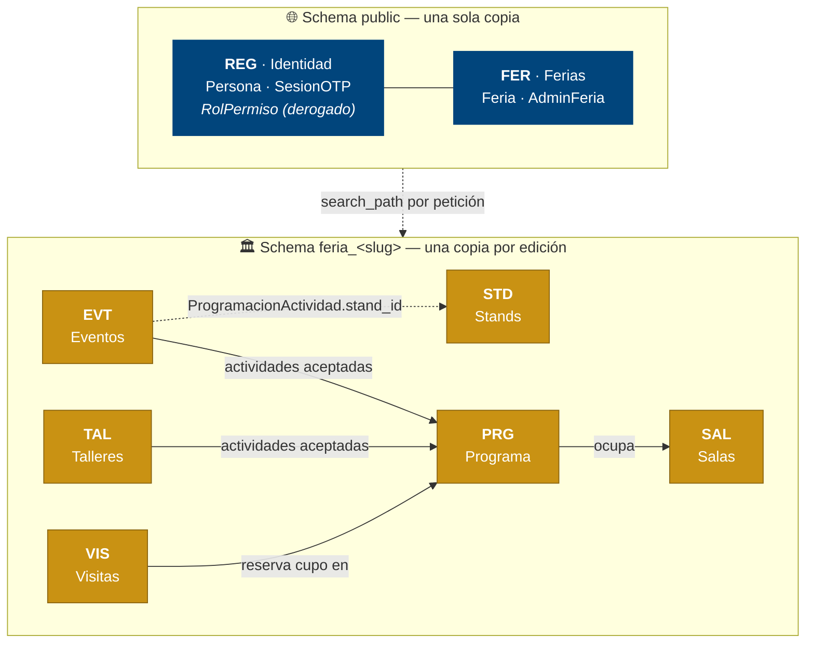
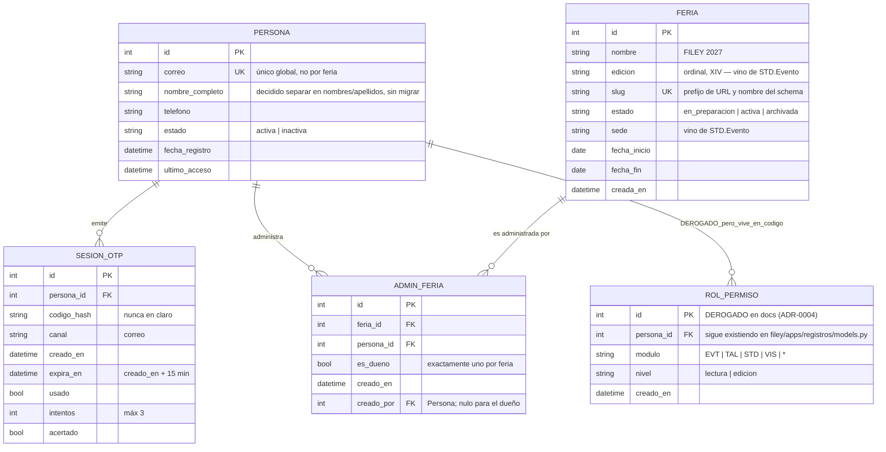
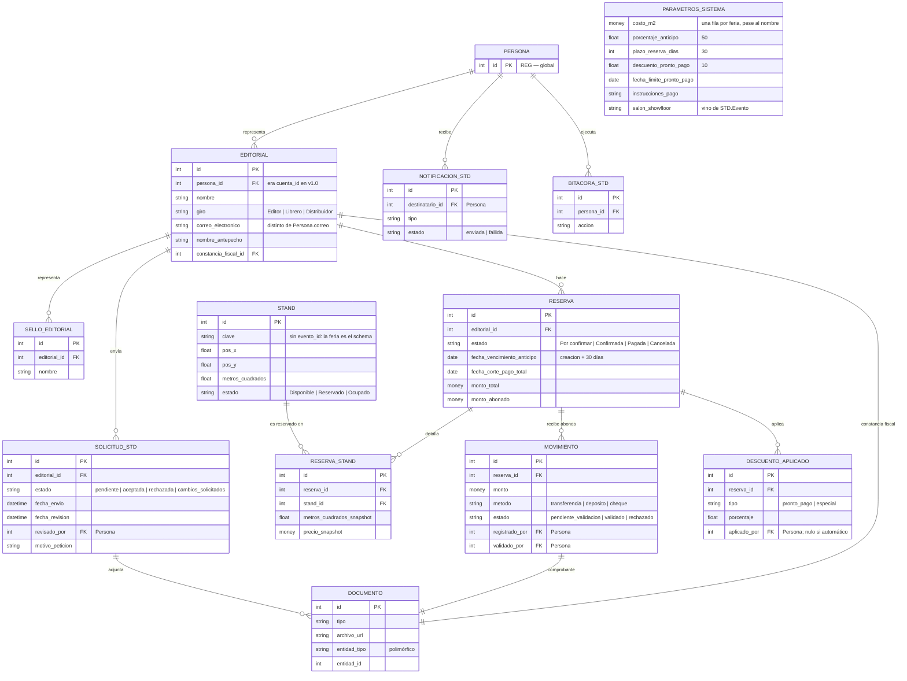
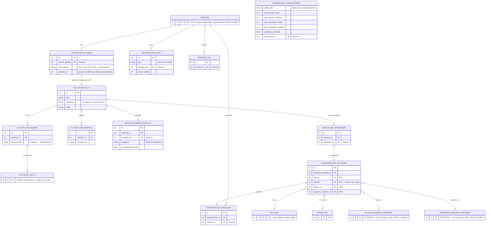
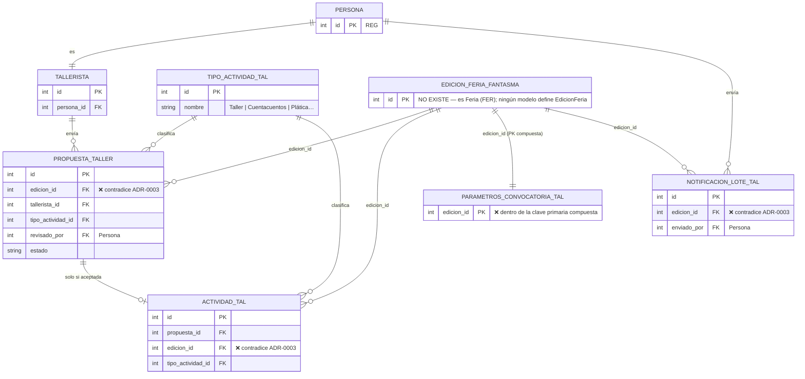
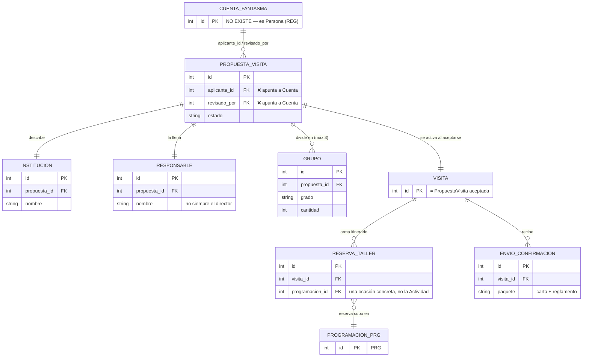
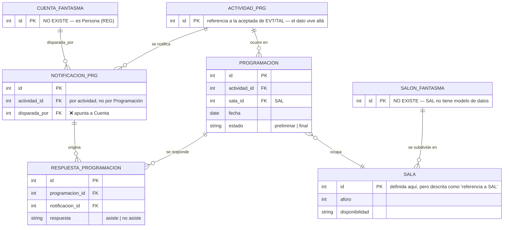

# Modelo de datos del sistema — diagrama ER

Vista única de **todas** las entidades documentadas de FILEY y de cómo se referencian entre
dominios. Es un espejo, no una propuesta.

> [!danger] Este diagrama refleja el estado actual **con sus errores**, a propósito
> No corrige nada. Donde dos dominios se contradicen, se dibujan **las dos versiones**; donde
> un modelo referencia una entidad que nadie define, esa entidad aparece marcada como
> **fantasma** en vez de omitirse.
>
> Un diagrama "limpio" aquí sería una mentira útil para nadie: escondería justo lo que hay que
> decidir. El inventario de lo que está mal está en la [sección final](#inconsistencias-que-este-diagrama-hace-visibles),
> con su origen exacto.

**Fuentes.** Los siete `Modelo de datos - *.md` de `requisitos/`, leídos el 2026-08-21.
`SAL` no tiene modelo de datos (ver I-7).

---

## 0. Las dos capas

Antes de las entidades, la división que lo ordena todo
([ADR-0003](<../adr/0003-una-feria-por-schema.md>)): lo **global** vive una sola vez; lo de
**cada feria** vive una vez por edición, en su propio schema.

> [!note] `EVT` → `STD` es una flecha que sorprende
> `ProgramacionActividad.stand_id` permite programar una actividad **dentro de un stand**
> (presentaciones en el stand de una editorial). Es la única dependencia de un dominio de
> contenido hacia `STD`, y no está reflejada en el modelo de `STD`, que no sabe que sus stands
> se usan para eso.

---

## 1. Capa global — `REG` + `FER`

> [!warning] `ROL_PERMISO` está en el diagrama porque está en el código
> La documentación lo derogó el 2026-08-21; `filey/apps/registros/models.py` todavía lo
> implementa, y el acceso administrativo real sigue funcionando con él. Es la única entidad del
> diagrama que existe **solo** en el código.

---

## 2. `STD` — Stands *(modelo v2.0, el único ya alineado con FER)*

---

## 3. `EVT` — Eventos *(patrón de routers polimórficos)*

---

## 4. `TAL` — Talleres

---

## 5. `VIS` — Visitas escolares

---

## 6. `PRG` + `SAL` — Programa y salas

---

## Inconsistencias que este diagrama hace visibles

Ninguna está corregida. Ordenadas por lo que cuesta arreglarlas.

| # | Qué | Dónde | Estado |
| --- | --- | --- | --- |
| **I-1** | `edicion_id` → `EdicionFeria`, una entidad que **ningún modelo define**. Contradice ADR-0003: ninguna tabla de dominio guarda identificador de edición. En `ParametrosConvocatoriaTAL` está **dentro de la clave primaria compuesta**, que es lo que la vuelve cara de quitar. | `TAL` §2.3, §2.4, §2.5, §2.6 | Ya registrada |
| **I-2** | `aplicante_id` y `revisado_por` → `Cuenta`, entidad extraída a `Persona`. | `VIS` §2.1 | Ya registrada |
| **I-3** | `Notificacion.disparada_por` → `Cuenta`. | `PRG` §2.4 | Ya registrada |
| **I-4** | **Dos modelos de programación coexistiendo.** `EVT` define `ProgramacionActividad` (con `sala_id`, `stand_id`, `bloque_id`, `programa_maestro_id`) y `PRG` define `Programación` (con `actividad_id`, `sala_id`). No es que uno referencie al otro: son dos diseños distintos del mismo hecho. `VIS` reserva contra el de `PRG`. | `EVT` §3.3 vs `PRG` §2.2 | **Nueva** |
| **I-5** | `EVT` referencia `BloqueHorario` y `ProgramaMaestro` **situándolas en `PRG`**, y `PRG` no define ninguna de las dos. | `EVT` §3.3 | **Nueva** |
| **I-6** | `EVT` afirma que `Persona` guarda `pais`, `estado_pais` y `ciudad`. El modelo de `REG` **no define esos atributos**. Un dominio le está poniendo campos a una entidad de otro. | `EVT` §2.1 vs `REG` §2.1 | **Nueva** |
| **I-7** | **`SAL` no tiene modelo de datos.** `Salón` y `Sala` son el catálogo del que depende toda la programación, y la única definición de `Sala` está dentro de `PRG` §2.3 — que a su vez la describe como "referencia al espacio de `SAL`". `Salón` no está definido en ninguna parte. | `SAL` | **Nueva** |
| **I-8** | **Tres nombres para la unidad programable.** `EVT` la llama `SolicitudesAprobadas`, `TAL` la llama `Actividad`, y `PRG` la llama `Actividad` describiéndola como referencia a ambas. `PRG` no puede referenciar dos tablas distintas con una sola FK sin un discriminador, y no lo tiene. | `EVT` §3.2, `TAL` §2.4, `PRG` §2.1 | **Nueva** |
| **I-9** | `EVT.ProgramacionActividad.stand_id` → `Stand` (`STD`). Es legítimo (actividades dentro de un stand), pero el modelo de `STD` no lo menciona: desde `STD`, sus stands solo los usa `ReservaStand`. | `EVT` §3.3 | **Nueva** |
| **I-10** | `RolPermiso` derogado en la documentación, **vivo en el código**. Es la única entidad que existe solo en `filey/`. | `REG` §2.2 vs código | Ya registrada |
| **I-11** | `Persona.nombre_completo` desplegado vs. `nombres`/`apellidos` decididos el 2026-08-19. | `REG` §5 | Ya registrada |
| **I-12** | Tres nombres para la configuración de una convocatoria: `ParametrosSistema` (`STD`), `ParametrosConvocatoria` (`EVT`), `ParametrosConvocatoriaTAL` (`TAL`). Misma figura, tres nombres. | `STD` §3.11, `EVT` §3.6, `TAL` §2.5 | Ya registrada |

> [!important] Las cinco nuevas se concentran en la frontera `EVT` ↔ `PRG` ↔ `SAL`
> I-4, I-5, I-7 y I-8 son **el mismo problema visto desde cuatro ángulos**: nadie ha decidido
> quién es el dueño del modelo de programación. `EVT` se construyó el suyo completo (con
> bloques y programa maestro), `PRG` construyó otro más simple, `SAL` no construyó ninguno, y
> `VIS` ya reserva cupo contra el de `PRG`.
>
> Es la misma clase de contradicción que ADR-0003 resolvió para la edición de la feria, y
> conviene resolverla antes de construir `PRG`: hoy `EVT` es el dominio que se implementa a
> continuación, y su modelo asume entidades que no existen.
