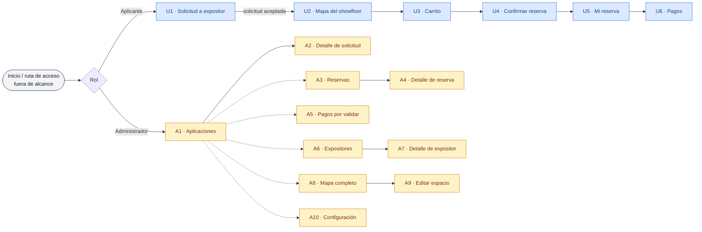

# Estructura de vistas — Stands (reserva, pago y confirmación)

> Propuesta de **arquitectura de ventanas** del componente de Stands, derivada del
> inventario de casos de uso (`CU-STD Índice.md`) y del `Modelo de datos - Stands.md`.
> Define qué pantallas existen, qué contiene cada una y qué casos de uso resuelve.
> No define maquetación visual ni componentes gráficos finales.

---

## 1. Propósito y alcance

Este documento organiza los **36 casos de uso vigentes** del dominio `STD` en una
estructura navegable de dos áreas: el **Portal del Aplicante** (editorial/entidad
expositora) y el **Panel del Administrador** (coordinador del showfloor).

- Se asume **sesión ya iniciada**: la autenticación y la **ruta de acceso** a este
  componente viven en una vista anterior (`E0`), **fuera del alcance** de Stands.
- Los casos de uso del actor **Sistema** (procesos automáticos y temporizados) **no
  tienen ventana**: se manifiestan como correos o como cambios de estado que el aplicante
  y el administrador ven reflejados en sus pantallas (ver §6).

---

## 2. Convenciones

- **Actores:** Aplicante · Administrador · Sistema.
- **Acceso condicionado:** una vista marcada así solo se habilita si se cumple su
  precondición (p. ej. *solicitud aceptada*, RN-16).
- **Vista-contenedor:** pantalla que aloja varias acciones (otros CU) sin navegar fuera
  de ella (p. ej. el detalle de reserva del administrador).
- Cada vista referencia sus **CU involucrados** y las **entidades** del modelo que
  consume o modifica.

---

## 3. Mapa de navegación

> Las líneas punteadas del panel admin representan **navegación lateral** entre secciones
> (menú principal), no un flujo secuencial.

---

## 4. Portal del Aplicante

> Acceso global: todas las vistas U2–U6 requieren **solicitud aceptada** (RN-16). Hasta
> entonces el aplicante solo ve `U1`.

### U1 · Solicitud a expositor
- **Objetivo:** capturar y enviar la solicitud para ser expositor; consultar su estado y,
  si se solicitaron cambios, editarla y reenviarla.
- **Contenido:** formulario con datos de la editorial y sus sellos, carga de documentos
  (constancia de situación fiscal, carta de representación, lista de títulos), estado
  actual (pendiente / aceptada / rechazada / cambios_solicitados) y acción de reenvío.
- **CU involucrados:** CU-STD-001 (aplicar), CU-STD-002 (editar y reenviar tras solicitud de cambios), CU-STD-003 (revisar estado).
- **Resultado de CU-STD-009** (notificación de resultado) se refleja aquí como estado.
- **Entidades:** Editorial, SelloEditorial, Aplicacion, Documento.

### U2 · Mapa del showfloor
- **Objetivo:** explorar los espacios y elegir stands para reservar.
- **Contenido:** mapa con stands en estado **Disponible / No disponible** (el aplicante no
  distingue Reservado de Ocupado, RN-09). Al seleccionar un stand se abre un **panel/modal
  de detalle** con dimensiones, m², precio (m² × costo m²) y qué incluye, con acción
  *Agregar al carrito*.
- **CU involucrados:** CU-STD-009 (visualizar mapa), CU-STD-010 (detalle de stand).
- **Entidades:** Evento, Stand, ParametrosSistema (costo m²).

### U3 · Carrito de stands
- **Objetivo:** gestionar la selección antes de reservar.
- **Contenido:** lista de stands elegidos, m² y precio por línea, subtotal estimado,
  acciones de agregar/quitar.
- **CU involucrados:** CU-STD-011 (agregar/quitar/gestionar el carrito).
- **Entidades:** Stand (selección en memoria; aún no hay Reserva).

### U4 · Confirmar reserva
- **Objetivo:** formalizar la reserva de los stands seleccionados.
- **Contenido:** resumen final, total con descuentos visibles,
  monto del anticipo (50% sobre el total con descuento, RN-02) y confirmación.
- **CU involucrados:** CU-STD-012 (realizar la reserva).
- **Efectos de Sistema asociados:** CU-STD-021 (stands → Reservado), CU-STD-022 (inicia
  plazo de 30 días), CU-STD-023 (descuento de pronto pago si aplica).
- **Entidades:** Reserva, ReservaStand, DescuentoAplicado.

### U5 · Mi reserva
- **Objetivo:** dar seguimiento al estado de la reserva.
- **Contenido:** mapa de mis stands, total / abonado / pendiente, descuento aplicado,
  fecha de vencimiento del anticipo y fecha de corte. Incluye un **banner de alerta** de
  posible cancelación cuando la reserva está vencida con abono parcial.
- **CU involucrados:** CU-STD-013 (consultar estado), CU-STD-014 (atender la notificación
  de posible cancelación).
- **Reflejo de Sistema:** CU-STD-026 (aviso de posible cancelación), CU-STD-029 (confirmada),
  CU-STD-030 (pagada) se ven aquí como cambios de estado.
- **Entidades:** Reserva, ReservaStand, Movimiento, DescuentoAplicado, Notificacion.

### U6 · Pagos
- **Objetivo:** pagar la reserva por abonos y dar seguimiento.
- **Contenido (tres bloques):**
  1. **Instrucciones de pago** (transferencia / depósito / cheque; sin efectivo, RN-08).
  2. **Registrar abono** con comprobante adjunto.
  3. **Historial de movimientos** con su estado de validación.
- **CU involucrados:** CU-STD-015 (instrucciones), CU-STD-016 (registrar pago con
  comprobante), CU-STD-017 (historial).
- **Entidades:** Movimiento, Documento (comprobante), ParametrosSistema (datos bancarios).

---

## 5. Panel del Administrador

Cinco secciones de navegación (más Configuración), con patrón **lista → detalle**.

### A1 · Aplicaciones (lista)
- **Objetivo:** revisar las solicitudes recibidas.
- **Contenido:** lista filtrable por estado (pendientes / aceptadas / rechazadas / cambios_solicitados).
- **CU involucrados:** CU-STD-004.
- **Entidades:** Aplicacion, Editorial.

### A2 · Detalle de solicitud
- **Objetivo:** revisar y resolver una solicitud.
- **Contenido:** información enviada y documentos; acciones **Aceptar**, **Rechazar** (definitivo) y **Solicitar cambios**.
- **CU involucrados:** CU-STD-005 (revisar detalle), CU-STD-006 (aceptar o rechazar), CU-STD-007
  (solicitar cambios). Dispara CU-STD-008 (notificación al aplicante, Sistema).
- **Entidades:** Aplicacion, Editorial, Documento.

### A3 · Reservas (lista)
- **Objetivo:** consultar todas las reservas.
- **Contenido:** lista filtrable (por estado, expositor, saldo, vencimiento). Incluye la
  **cola/alerta de reservas vencidas** que alimenta CU-STD-025.
- **CU involucrados:** CU-STD-031.
- **Entidades:** Reserva, Editorial.

### A4 · Detalle de reserva *(vista-contenedor)*
- **Objetivo:** gestionar una reserva concreta y todas sus acciones.
- **Contenido:** datos de la reserva, contacto, stands, abonos y descuentos; concentra las
  siguientes acciones sin salir de la vista:
  - **Validar un movimiento** y confirmar el abono — CU-STD-018.
  - **Registrar un abono manual** con documento obligatorio — CU-STD-019 (RN-15).
  - **Aplicar un descuento especial** con motivo — CU-STD-020 (RN-07).
  - **Resolver una reserva vencida**: cancelar o prorrogar (nueva fecha) — CU-STD-027.
  - **Modificar la fecha de corte/bloqueo** — CU-STD-028.
- **CU involucrados:** CU-STD-032 (detalle, contenedor) + 018, 019, 020, 027, 028.
- **Nota:** el único cierre posible es **Cancelada**; el sistema no libera reservas.
- **Entidades:** Reserva, ReservaStand, Movimiento, Documento, DescuentoAplicado, Bitacora.

### A5 · Pagos por validar (cola transversal)
- **Objetivo:** validar abonos de forma centralizada, sin entrar reserva por reserva.
- **Contenido:** cola de **todos** los movimientos en `pendiente_validacion`; validar uno
  ejecuta la **misma acción** que en A4.
- **CU involucrados:** CU-STD-018 (segunda ruta de acceso a la misma acción).
- **Entidades:** Movimiento, Documento, Reserva.

### A6 · Expositores (lista)
- **Objetivo:** ver quién está habilitado para reservar.
- **Contenido:** lista de expositores con **solicitud aceptada**.
- **CU involucrados:** CU-STD-033.
- **Entidades:** Editorial, Aplicacion.

### A7 · Detalle de expositor
- **Objetivo:** consultar el perfil completo de un expositor.
- **Contenido:** datos de empresa y contacto, documentos, sellos y sus reservas.
- **CU involucrados:** CU-STD-034.
- **Entidades:** Editorial, SelloEditorial, Documento, Reserva.

### A8 · Mapa completo
- **Objetivo:** ver el showfloor con información de gestión.
- **Contenido:** mapa con **quién reservó cada stand** y el **saldo pendiente**; a
  diferencia del mapa del aplicante, distingue todos los estados.
- **CU involucrados:** CU-STD-035.
- **Entidades:** Stand, Reserva, ReservaStand, Editorial.

### A9 · Editar espacio del mapa
- **Objetivo:** corregir un espacio (p. ej. tras una ampliación gestionada por fuera).
- **Contenido:** edición de dimensiones/atributos del stand; **no** registra el evento de
  ampliación, solo refleja la corrección.
- **CU involucrados:** CU-STD-036.
- **Entidades:** Stand, Bitacora.

### A10 · Configuración
- **Objetivo:** administrar los parámetros globales del sistema.
- **Contenido:** costo por m², porcentaje de anticipo, descuento por pronto pago,
  fechas límite (pronto pago, corte) e instrucciones/datos bancarios de pago.
- **CU involucrados:** CU-STD-037.
- **Entidades:** ParametrosSistema.

---

## 6. Casos de uso de Sistema (sin vista)

Procesos automáticos/temporizados; no tienen pantalla propia y se reflejan en las vistas
indicadas o como correos.

| CU | Proceso | Dónde se refleja |
|----|---------|------------------|
| CU-STD-008 | Notificar el resultado de la solicitud | Correo · estado en U1 |
| CU-STD-021 | Marcar stands como Reservado al confirmar | U2/U5/A8 (estado del stand) |
| CU-STD-022 | Mantener la reserva activa 30 días | U5 (fecha de vencimiento) |
| CU-STD-023 | Aplicar 10% por pronto pago | U4/U5 (descuento) |
| CU-STD-025 | Notificar al admin las reservas vencidas (con o sin abono) | Alerta/cola en A3 → A4 |
| CU-STD-026 | Notificar al aplicante posible cancelación | Correo · banner en U5 |
| CU-STD-029 | Confirmar y bloquear al cubrir el 50% | U5 (estado) · correo |
| CU-STD-030 | Cambiar a Pagada al cubrir el 100% | U5 (estado) · correo |

---

## 7. Trazabilidad vista ↔ caso de uso

| Vista | CU |
|-------|----|
| U1 · Solicitud a expositor | CU-STD-001, CU-STD-002, CU-STD-003 |
| U2 · Mapa del showfloor | CU-STD-009, CU-STD-010 |
| U3 · Carrito | CU-STD-011 |
| U4 · Confirmar reserva | CU-STD-012 |
| U5 · Mi reserva | CU-STD-013, CU-STD-014 |
| U6 · Pagos | CU-STD-015, CU-STD-016, CU-STD-017 |
| A1 · Aplicaciones (lista) | CU-STD-004 |
| A2 · Detalle de solicitud | CU-STD-005, CU-STD-006, CU-STD-007 |
| A3 · Reservas (lista) | CU-STD-031 |
| A4 · Detalle de reserva | CU-STD-032, CU-STD-018, CU-STD-019, CU-STD-020, CU-STD-027, CU-STD-028 |
| A5 · Pagos por validar | CU-STD-018 |
| A6 · Expositores (lista) | CU-STD-033 |
| A7 · Detalle de expositor | CU-STD-034 |
| A8 · Mapa completo | CU-STD-035 |
| A9 · Editar espacio | CU-STD-036 |
| A10 · Configuración | CU-STD-037 |
| *(sin vista — Sistema)* | CU-STD-008, 021, 022, 023, 025, 026, 029, 030 |

Cobertura: los **36 CU vigentes** quedan mapeados (28 con vista; 8 de Sistema sin vista).

---

## 8. Temas abiertos

- **E0 / autenticación:** la ruta de acceso y el control de sesión se asumen resueltos
  fuera de este componente; confirmar con el equipo cómo se enlaza.
- **A5 vs A4:** validar pago existe en dos rutas (cola transversal y detalle de reserva);
  confirmar si ambas se construyen en la primera entrega o solo una.
- **Alerta de vencidas (A3):** definir si es una pestaña/filtro dentro de Reservas o un
  tablero/aviso separado.

---

## Artefactos relacionados

- `CU-STD Índice.md` — inventario de casos de uso.
- `Modelo de datos - Stands.md` — entidades y atributos.
- `Proceso de alto nivel - Stands.md` — flujo de punta a punta.
