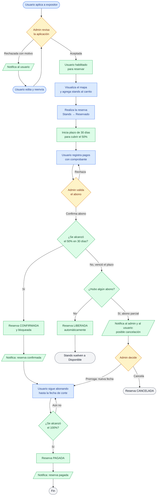

# Proceso de alto nivel — Stands (reserva, pago y confirmación)

Diagrama del flujo de punta a punta para poner en contexto al equipo: desde que el
usuario **aplica a expositor** hasta que su reserva queda **pagada al 100%**, incluyendo
las ramas de vencimiento (liberación automática / decisión del administrador).

El color de cada nodo indica quién interviene: Usuario, Administrador, Sistema y estados
finales. El detalle por paso vive en los casos de uso (`CU-STD Índice.md`).

