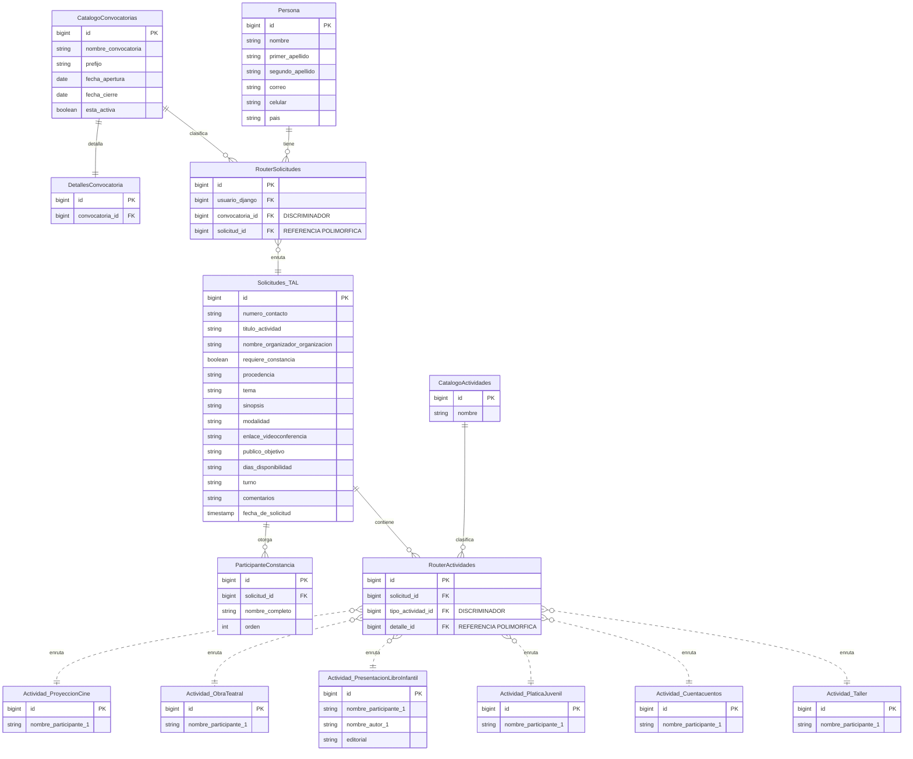
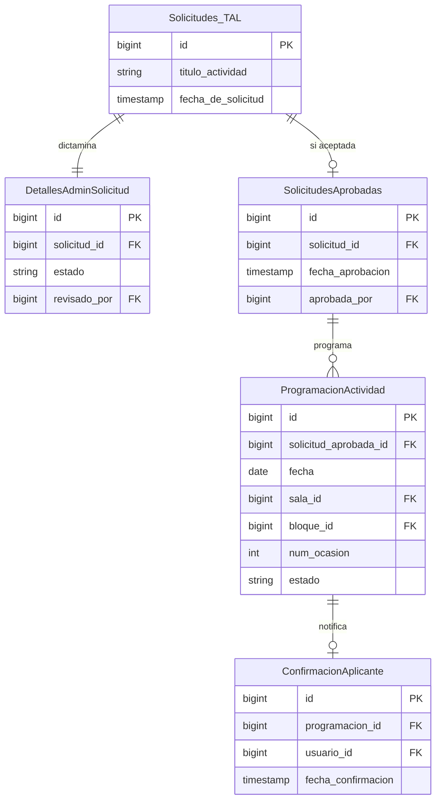

# Modelo de datos — Talleres (actividades infantiles y juveniles)

Modelo conceptual del dominio de Talleres: qué información almacena el sistema para
registrar, dictaminar y programar las actividades infantiles/juveniles de la convocatoria de
Elvira.

El desarrollo se divide en **dos etapas**, igual que en `EVT`:

1. **Captura** (§2) — el tallerista llena y envía su propuesta.
2. **Administración y programación** (§3) — Elvira dictamina las propuestas (aceptar,
   rechazar o solicitar cambios) y programa las aceptadas.

La separación no es solo cronológica: **cada tabla pertenece a una sola etapa según quién la
escribe**. Las de §2 las escribe el tallerista; las de §3, únicamente el administrador. Ningún
dato queda en ambos lados.

> [!warning] Sustituye al modelo anterior, que en realidad era de Visitas escolares
> El archivo anterior (`Modelo de datos - Talleres (Visitas Escolares).md`, eliminado
> 2026-06-29) cubría únicamente entidades de **visitas escolares**, hoy dominio `VIS` (ver
> `VIS/Modelo de datos - Visitas escolares.md`). Este documento cubre el alcance que de verdad
> sigue siendo de `TAL`: el registro, revisión y selección de **propuestas de taller**.

<!-- -->

> [!note] Homologado con la arquitectura de `EVT` (2026-08-28, revisado contra el formulario
> real el mismo día)
> Hasta esta revisión, `TAL` se describía como "espejo de `EVT`" solo en el ciclo de negocio
> (dictamen aceptar/cambios/rechazar). El modelo de datos en sí era una tabla plana propia,
> sin el patrón de routers y catálogos que usa `EVT`. Esta versión adopta **la misma
> arquitectura**, no solo el mismo flujo — ver §1. Las diferencias que siguen siendo reales
> (no de esquema, de negocio) se conservan: sin categorización cruzada (literaria/académica ×
> UADY/externa), sin adjuntos de archivo y sin semblanza de participantes. La diferencia de
> constancia resultó **menor** de lo que se pensó en la primera versión: `TAL` sí tiene el
> mismo booleano `requiere_constancia` que `EVT` (§2.4 de `EVT`), solo que precargado en
> `true` en vez de en blanco — no es una ausencia de campo, es un valor por defecto distinto.
> Cuatro decisiones de homologación se tomaron explícitamente con Isaac; se señalan en cada
> sección que aplica. El detalle campo por campo contra el formulario real vive en
> [`datos de convocatoria.md`](<datos%20de%20convocatoria.md>).

---

## 1. Arquitectura y patrón de enrutamiento

`TAL` usa **la misma infraestructura global** que `EVT` y comparte con `STD`/`VIS`: `Persona`
(`REG`), `CatalogoConvocatorias` y `RouterSolicitudes`. El mecanismo completo —qué es un
discriminador, cómo resuelve un router, por qué no es una FK con restricción— está descrito
una sola vez en
[`EVT/Modelo de datos - Eventos.md`](<../EVT/Modelo%20de%20datos%20-%20Eventos.md>) §1; este
documento no lo repite, solo lo aplica.

Lo que `TAL` **no** comparte con `EVT` son las tablas internas al dominio: `CatalogoActividades`,
`RouterActividades` y las tablas `Actividad_*` de `TAL` son sus propias instancias del mismo
patrón, con sus propios seis tipos — igual que `EVT` tiene las suyas con ocho. Viven en apps de
Django distintas (`apps.talleres` vs. `apps.eventos`), así que reusar los mismos nombres de
tabla entre dominios no colisiona.

`TAL` **no tiene** `RouterDocumentos`: confirmado en `CU-TAL-002` que no hay adjuntos de
archivo en ningún tipo de actividad (ver §2.9). El mecanismo existe y está listo en el patrón
de `EVT` si algún día se necesita, pero no se modela aquí sin un requisito real que lo pida.

| Tabla | Rol en `TAL` |
| --- | --- |
| `RouterSolicitudes` | Global, compartida. `Solicitudes_TAL` es uno de sus cuatro destinos posibles (`Solicitudes_EVT`, `Solicitudes_TAL`, `Solicitudes_STD`, `Solicitudes_VIS`), ya anticipado en `EVT` §1. |
| `CatalogoActividades` | Propia de `TAL`. Seis filas fijas: `taller`, `cuentacuentos`, `platica_juvenil`, `presentacion_libro_infantil`, `obra_teatral`, `proyeccion_cine`. |
| `RouterActividades` | Propia de `TAL`. Mismo mecanismo que en `EVT`: discrimina con `tipo_actividad_id` (FK a `CatalogoActividades` de `TAL`) y apunta a una de las seis tablas `Actividad_*`. |

---

## 2. Etapa 1 — Captura de propuestas

### 2.1 Persona

Igual que en `EVT` §2.1: entidad del core de Registros (`REG`), no se define aquí. Ver
[`REG/Modelo de datos - Registros.md`](<../REG/Modelo%20de%20datos%20-%20Registros.md>).

> El número de contacto del responsable puede diferir del registrado en `Persona` — por eso
> `numero_contacto` se captura por solicitud (§2.5), no se asume el de perfil. Mismo criterio
> que `institucion`/`cargo` en `EVT`.

### 2.2 CatalogoConvocatorias

Tabla global, compartida con `EVT`/`STD`/`VIS` — ver `EVT` §2.2. Para `TAL`, la fila relevante
es la de `prefijo = TAL`.

### 2.3 DetallesConvocatoria

Es la tabla `detalles` que cuelga de `CatalogoConvocatorias` (§2.2) para el dominio `TAL`,
igual que en `EVT` §3.6 — parámetros comunes a cualquier convocatoria (nombre, fechas,
`esta_activa`) viven en el catálogo; lo específico de `TAL` vive aquí. Definición completa en
§3.6, porque la escribe el administrador.

Reemplaza a `ParametrosConvocatoriaTAL`, que antes definía sus propias
`fecha_apertura_convocatoria`/`fecha_cierre_convocatoria` en vez de heredarlas del catálogo
compartido, y no tenía FK a él —asumía una convocatoria implícita, igual que `EVT` asumía antes
de esta homologación.

### 2.4 RouterSolicitudes

Global, compartida — ver `EVT` §2.3. `TAL` es uno de los cuatro dominios que enruta.

### 2.5 Solicitudes_TAL

Los datos que el tallerista captura y que son **comunes a los seis tipos de actividad**. Lo
que distingue a cada tipo vive en las tablas `Actividad_*` (§2.9); lo que decide el
administrador vive en la etapa 2 (§3). Equivalente directo de `Solicitudes_EVT`.

> [!note] Revisado contra el formulario real (`docs/requisitos/TAL/datos de convocatoria.md`,
> 2026-08-28)
> Esta sección se corrigió sobre la primera versión de la homologación (que se apoyaba en
> `CU-TAL-002`, más extrapolado) al tener el formulario curado a mano. Los cambios de fondo:
> `requiere_constancia` sí existe como booleano (`EVT` y `TAL` son iguales en esto, no
> diferentes como se pensó); los participantes que reciben constancia son una lista sin límite
> fijo, no un solo campo de texto (§2.6); `autores`/`editorial` sí son exclusivos de
> "Presentación de libros" y se movieron a `Actividad_PresentacionLibroInfantil` (§2.9); y
> aparecieron dos campos que no estaban documentados en ningún lado (`dias_disponibilidad`,
> `turno` obligatorio y multivalor en vez de opcional).

| Atributo | Descripción |
| --- | --- |
| id | Identificador único, `bigint`. Como en `EVT`, es la base del folio: **no se almacena**, se compone `{prefijo_folio}-{id}` con el prefijo de `DetallesConvocatoria` (§3.6). Antes `PropuestaTaller.folio` se guardaba directo; se homologa a folio derivado. |
| numero_contacto | Teléfono de contacto del responsable. Puede diferir del registrado en `Persona`. |
| titulo_actividad | Nombre oficial del evento/taller ("saldrá en el programa como se registre"). Renombrado de `nombre_evento` para usar el mismo campo que `EVT`. Obligatorio. |
| nombre_organizador_organizacion | Institución, dependencia o grupo responsable que organiza. Renombrado de `organiza`. Obligatorio. |
| requiere_constancia | Indica si la actividad requiere constancia de participación. **Booleano, por defecto `true`** — a diferencia de lo que se documentó en la primera versión de esta homologación, `TAL` sí tiene el mismo campo que `EVT` (§2.4 de `EVT`); la única diferencia real es el valor por defecto (`EVT` no lo precarga, `TAL` sí lo precarga en `true`). |
| procedencia | `local` / `nacional` / `internacional`. Obligatorio. Sin equivalente en `EVT`. |
| tema | Texto. Obligatorio. Sin equivalente en `EVT`. |
| sinopsis | Reseña breve de la actividad, para mostrar al público. Renombrado de `resena` para usar el mismo campo que `EVT`. Obligatorio. |
| modalidad | `presencial` / `virtual`. Obligatorio. Sin equivalente en `EVT`. |
| enlace_videoconferencia | Obligatorio solo si `modalidad = virtual`. |
| publico_objetivo | Multivalor: `preescolar` / `primaria_baja` / `primaria_alta` / `secundaria` / `preparatoria` / `adultos_mayores` (mínimo uno). Renombrado de `publico_meta`. El conjunto de valores es propio de `TAL`, no se homologa con el de `EVT` (escalas distintas: nivel escolar vs. tipo de público). `adultos_mayores` no estaba en la versión anterior de este documento —viene del formulario real, no del `CU`—; el texto introductorio de la convocatoria menciona "universidad" en cambio, así que hay una inconsistencia menor en la fuente misma que vale la pena confirmar con Elvira. |
| dias_disponibilidad | Multivalor, sobre los días en que se realiza la feria (13 al 21 de marzo en la edición 2027). Obligatorio, mínimo uno. **Nuevo campo**: no estaba documentado en ningún `CU-TAL` ni en la versión anterior de este modelo; sale del formulario real. Sin equivalente en `EVT`, que no le pregunta al aplicante disponibilidad por día. |
| turno | Multivalor: `matutino` (9:00–13:00) / `vespertino` (15:00–18:00), puede ser ambos. Obligatorio, mínimo uno. Renombrado de `sugerencia_dia_turno`, que se documentaba opcional y de un solo valor; el formulario real lo pide obligatorio y permite marcar los dos turnos. |
| comentarios | Observaciones libres, opcional. Renombrado de `observaciones`. |
| fecha_de_solicitud | Marca de tiempo del envío. Renombrado de `fecha_registro`. |

No hay `es_uady` ni ningún campo de categorización: confirmado en `CU-TAL-002` que no existe
paso de categorización en `TAL` ("A diferencia de CU-EVT-002, no existe paso de categorización
ni carga de archivos adjuntos"). No se modela.

`Tallerista` deja de existir como entidad propia: su único campo adicional (`numero_contacto`)
se incorpora directo aquí, igual que `EVT` mantiene `institucion`/`cargo` en `Solicitudes_EVT`
en vez de una entidad `Aplicante` aparte.

### 2.6 ParticipanteConstancia

Una fila por cada persona que recibirá constancia de participación. **Corrección sobre la
primera versión de esta homologación**: se había modelado `participantes_constancia` como un
solo campo de texto en `Solicitudes_TAL` (equivalente conceptual, no estructural, de
`participantes_constancia` en el documento anterior). El formulario real muestra que es una
lista sin tope fijo —"al menos 1", y una regla de negocio explícita para cuando hay más de
seis: *"En el programa oficial solo se incluirá el primer nombre y primer apellido de cada
participante. En caso de que haya más de seis personas, únicamente se mostrará lo que se haya
colocado en la casilla 'Organizado por'"*—. Un campo de texto no puede sostener esa regla con
limpieza (no hay forma de contar ni truncar una lista dentro de un string); una tabla hija sí.

No es un patrón que exista todavía en `EVT` —sus listas de participantes tienen tope fijo
(`nombre_participante_1…3` como máximo) y viven como columnas en `Actividad_*`—, pero no
rompe la arquitectura: es una tabla 1—N normal colgando de `Solicitudes_TAL`, del mismo tipo
de relación que ya usan `RouterActividades` o `RouterDocumentos` en `EVT`.

| Atributo | Descripción |
| --- | --- |
| id | Identificador único. |
| solicitud_id | FK → Solicitudes_TAL. |
| nombre_completo | Nombre completo de la persona. En el programa impreso solo se muestra el primer nombre y primer apellido; ese recorte es una regla de **presentación**, no algo que se guarde por separado. |
| orden | Posición en la lista, para poder aplicar la regla de "más de seis" de forma determinista (las primeras seis se imprimen, el resto no). |

> [!warning] Regla de "más de seis" no tiene dueño claro todavía
> ¿Se trunca a las primeras seis por `orden` de captura, o el tallerista elige cuáles seis
> destacar? El formulario real no lo aclara. Mientras no se confirme, `orden` asume que es por
> captura.

### 2.7 CatalogoActividades

Catálogo de los seis tipos de actividad de `TAL`. Mismo patrón que `EVT` §2.5, con su propia
tabla y sus propias filas — no comparte tabla con el catálogo de `EVT`, son taxonomías
distintas.

| Atributo | Descripción |
| --- | --- |
| id | Identificador único. |
| nombre | `taller`, `cuentacuentos`, `platica_juvenil`, `presentacion_libro_infantil`, `obra_teatral` o `proyeccion_cine`. El campo que resuelve a qué tabla `Actividad_*` apunta `RouterActividades.detalle_id`. |

A diferencia del catálogo de `EVT`, que el propio documento anterior describía como "cerrado" y
el de `EVT` es "extensible con tipos internos": con la homologación esa distinción desaparece
—ambos son la misma clase de tabla (catálogo con FK), y agregar un séptimo tipo a `TAL` es
exactamente tan fácil como agregar un noveno a `EVT`: una fila nueva, no un cambio de esquema.

### 2.8 RouterActividades

Conecta la propuesta con su actividad específica. Mismo mecanismo que `EVT` §2.6.

| Atributo | Descripción |
| --- | --- |
| id | Identificador único. |
| solicitud_id | FK → Solicitudes_TAL. |
| tipo_actividad_id | Discriminador. FK → CatalogoActividades (§2.7) de `TAL`. |
| detalle_id | Referencia polimórfica a la fila de la tabla `Actividad_*` que corresponda. |

### 2.9 Tablas `Actividad_*`

Seis tablas, una por tipo. **Decisión de homologación (2026-08-28), confirmada tras revisar el
formulario real:** cada tipo tiene su propia tabla y su propio `nombre_participante_1`, igual
que `EVT` — quien presenta/imparte se documenta por tipo, no en `Solicitudes_TAL`, aunque hoy
cinco de las seis tablas terminen con la misma estructura (mismo patrón que ya usa `EVT` con
`Conferencia`/`Charla`/`LecturaObra`/`Encuentro`).

#### Actividad_Taller · Actividad_Cuentacuentos · Actividad_PlaticaJuvenil · Actividad_ObraTeatral · Actividad_ProyeccionCine

Cinco tablas, hoy estructuralmente idénticas — un solo campo cada una:

| Atributo | Descripción |
| --- | --- |
| id | Identificador único. |
| nombre_participante_1 | Nombre de quien presenta/participa. Obligatorio. El formulario real no menciona más de un presentador para estos cinco tipos —a diferencia de `EVT`, donde varios tipos permiten hasta 2 o 3—, así que no se agregan `_2`/`_3` sin evidencia. |

#### Actividad_PresentacionLibroInfantil

El único de los seis tipos donde el formulario real muestra una sección propia ("Detalles
Presentación de libros para niños o jóvenes"), con roles distintos — mismo patrón que
`Actividad_PresentacionLibro` en `EVT` (autor, presentador y editorial son tres cosas
distintas).

| Atributo | Descripción |
| --- | --- |
| id | Identificador único. |
| nombre_participante_1 | Presentador. Obligatorio — "parece ser solo 1 presentador permitido" según el formulario real. |
| nombre_autor_1 | Autor(a). Obligatorio, al menos uno. El formulario real no especifica un tope de autores como sí lo hace `EVT` (hasta 5) ni muestra casillas numeradas — se modela como un solo campo por ahora; si en la práctica el formulario permite varios autores en cajas separadas, esto debe expandirse a `nombre_autor_1…N`. |
| editorial | Obligatorio. |

Sin semblanza en ninguna de las seis: **decisión de homologación (2026-08-28)**, no modelar
`semblanza_participante_1`/`semblanza_autor_1`. Es una decisión de negocio confirmada (ningún
`CU-TAL` ni el formulario real la piden), no un hueco de documentación — a diferencia de `EVT`,
donde la semblanza sí es un requisito capturado (`CU-EVT-002`).

---

## 3. Etapa 2 — Administración y programación

Esta etapa agrupa los datos que **solo el administrador escribe**. Mismo patrón que `EVT` §3:
al aceptarse una propuesta se crea una fila en `SolicitudesAprobadas`; únicamente lo registrado
ahí puede programarse.

**Decisión de homologación (2026-08-28):** adoptar el patrón de `EVT` en vez de la entidad
`Actividad` propia que tenía este documento. `EVT` ya señalaba esto como pendiente en su propio
§3.1: *"`PRG` y `TAL` sí modelan una entidad `Actividad` propia; queda pendiente homologar cómo
referencian desde ahí lo que en `EVT` es una solicitud aprobada."* Esta revisión lo resuelve del
lado de `TAL`: la entidad `Actividad` desaparece, y su rol se reparte entre
`DetallesAdminSolicitud` (dictamen, igual que en `EVT`) y `SolicitudesAprobadas` (marca de
aprobación, sin duplicar estado). `ProgramacionActividad` y `ConfirmacionAplicante` —que este
documento delegaba enteros a `PRG`— entran también al modelo de `TAL`, igual que ya viven en el
de `EVT`.

### 3.1 DetallesAdminSolicitud

El estado de la propuesta y su dictamen. Mismo patrón que `EVT` §3.1: la fila se crea al
enviarse la propuesta, con `estado = pendiente`.

| Atributo | Descripción |
| --- | --- |
| id | Identificador único. |
| solicitud_id | FK → Solicitudes_TAL. |
| estado | `pendiente`, `cambios_solicitados`, `aceptada`, `rechazada` o `cancelada`. `cancelada` solo aplica después de `aceptada` — se agrega respecto al modelo anterior de `TAL` (que no la tenía) porque es consecuencia directa de adoptar `SolicitudesAprobadas` (§3.2): sin ese estado, no hay forma de expresar que una propuesta aprobada se cancela después. |
| fecha_revision | Fecha en que el administrador emitió el dictamen. |
| revisado_por | FK → Persona (Elvira o su equipo). |
| motivo_rechazo | Motivo registrado cuando `estado = rechazada`. |
| mensaje_cambios_solicitados | Obligatorio cuando `estado = cambios_solicitados`. |
| resultado_notificado | Indica si el resultado vigente ya se comunicó en un lote (§3.5). |
| fecha_resultado_notificado | Fecha del último envío de resultado; nulo si nunca se ha notificado. |

Sin `categoria` ni `is_participante_uady`: confirmado que `TAL` no tiene categorización
cruzada. Sin `titulo_final`/`organizador_final`/`es_apta_juvenil`/`en_cartelera_informal`: sin
evidencia en ningún `CU-TAL` de que Elvira tenga esas capacidades; no se modelan por simetría
con `EVT`, se modelarían si algún caso de uso las pidiera.

### 3.2 SolicitudesAprobadas

Registro de las propuestas que pasaron el dictamen. Mismo patrón que `EVT` §3.2: **existir aquí
equivale a estar aprobada**, y `ProgramacionActividad` referencia esta tabla y no
`Solicitudes_TAL`.

| Atributo | Descripción |
| --- | --- |
| id | Identificador único. |
| solicitud_id | FK → Solicitudes_TAL. |
| fecha_aprobacion | Marca de tiempo de la aprobación. |
| aprobada_por | FK → Persona (administrador que aceptó). |

Si una propuesta aprobada se cancela, se eliminan sus filas de `ProgramacionActividad` pero
esta fila se conserva, igual que en `EVT`.

### 3.3 ProgramacionActividad

Una fila por cada ocasión concreta en que una actividad ocupa fecha, sala y bloque. Mismo
patrón que `EVT` §3.3, sin `stand_id`: no hay evidencia de que las actividades de `TAL` ocurran
en un stand — `ParametrosConvocatoriaTAL` ya establecía que los espacios son responsabilidad
exclusiva del catálogo único de `SAL`.

| Atributo | Descripción |
| --- | --- |
| id | Identificador único. |
| solicitud_aprobada_id | FK → SolicitudesAprobadas (§3.2). |
| fecha | Día de esta ocasión. |
| sala_id | FK → Sala (`SAL`). |
| bloque_id | FK → BloqueHorario (`PRG`). Bloque en que inicia. |
| bloques_extra | Bloques consecutivos adicionales, cuando la actividad dura más de uno. |
| num_ocasion | Número de esta ocasión dentro de la misma actividad. |
| motivo_repeticion | Razón de la repetición. Nulo en la primera ocasión. |
| programa_maestro_id | FK → ProgramaMaestro (`PRG`). |
| estado | `tentativa`, `notificada`, `confirmada_por_aplicante` o `cerrada`. |

### 3.4 ConfirmacionAplicante

Acuse de que el tallerista recibió y confirmó un horario. Idéntico a `EVT` §3.4.

| Atributo | Descripción |
| --- | --- |
| id | Identificador único. |
| programacion_id | FK → ProgramacionActividad. |
| usuario_id | FK → Persona. |
| fecha_notificacion | Fecha en que se envió la notificación del horario. |
| fecha_confirmacion | Fecha en que el tallerista confirmó; nulo mientras no responda. |
| solicito_cambio | Indica si el tallerista solicitó un cambio dentro de la ventana permitida. |
| detalle_cambio | Qué cambio solicitó, cuando aplica. |

### 3.5 NotificacionLote

Los resultados se comunican en un envío masivo, no propuesta por propuesta. Mismo patrón que
`EVT` §3.5 — sin `edicion_id`: `EVT` tampoco lo tiene, bajo la misma premisa de que cada
edición vive en su propia instancia.

| Atributo | Descripción |
| --- | --- |
| id | Identificador único. |
| tipo | `seleccion` para el resultado del dictamen, `horario` para la asignación de sala y hora. |
| fecha_envio | Fecha del envío masivo. |
| enviado_por | FK → Persona (Elvira o su equipo). |
| total_enviadas | Número de notificaciones que incluyó el lote. |
| estado | `enviada` o `fallida_parcial`. |

> [!warning] Sigue siendo tentativo (heredado del modelo anterior)
> No hay evidencia directa de que Elvira notifique en lote en vez de caso por caso —
> `CU-TAL-010` lo extrapola por simetría con `EVT`. La homologación de esquema no cambia esto:
> confirmar con Elvira sigue pendiente.

### 3.6 DetallesConvocatoria

Es la tabla `detalles` que cuelga de `CatalogoConvocatorias` (§2.2) para el dominio `TAL`.
Reemplaza a `ParametrosConvocatoriaTAL`. Mismo patrón que `EVT` §3.6.

| Atributo | Descripción |
| --- | --- |
| id | Identificador único. |
| convocatoria_id | FK → CatalogoConvocatorias (§2.2), fila con `prefijo = TAL`. |
| prefijo_folio | Prefijo del folio visible de una propuesta (§2.5). |
| duracion_minima_actividad | Duración mínima por actividad. **Confirmado en el formulario real** (2026-08-28): "entre 45 y 50 minutos" — a diferencia de `EVT`, que solo tiene un máximo, `TAL` tiene un rango con piso y techo. |
| duracion_maxima_actividad | Duración máxima por actividad. Confirmado en el formulario real: 50 minutos. |
| fecha_notificacion_seleccion | Fecha en que se enviará el lote con los resultados del dictamen. |
| fecha_cierre_ajustes_aplicante | Fecha límite para que el tallerista solicite cambios de horario. Resuelve, a nivel de esquema, el tema abierto que el modelo anterior de `TAL` señalaba ("confirmar si existe una ventana de edición posterior a la aceptación") — el campo ya existe si se necesita; confirmar con Elvira si aplica sigue pendiente, esto no es una confirmación de negocio. |
| fecha_asignacion_horario | Fecha a partir de la cual los talleristas ven su sala y hora asignadas. |
| fecha_constancias | Fecha a partir de la cual pueden descargarse las constancias. |
| modalidades_admitidas | Multivalor: `presencial` / `virtual` (mínimo una). Propio de `TAL`, sin equivalente en `EVT`. |
| programa_archivado | Indica si el programa se cerró definitivamente. |
| fecha_archivado | Fecha y hora del cierre definitivo. |
| archivado_por | FK → Persona (administrador que ejecutó el cierre). |
| motivo_archivado | Motivo registrado al archivar. Obligatorio. |

Sin `cupo_*`: confirmado que `TAL` no tiene categorización cruzada, así que no hay nada que
contar por categoría.

Sin `BitacoraTAL`: `EVT` tiene `BitacoraEVT` para auditar acciones excepcionales del
administrador, pero ningún `CU-TAL` describe esa necesidad. No se modela sin evidencia; se
agregaría si surge un caso de uso que la requiera.

---

## 4. Relaciones principales

### Etapa 1 — captura

- **CatalogoConvocatorias** 1—N **RouterSolicitudes**. Cada propuesta enruta a través de una convocatoria vigente.
- **Persona** (`REG`) 1—N **RouterSolicitudes** 1—1 **Solicitudes_TAL**. Único camino entre una persona y sus propuestas.
- **CatalogoActividades** 1—N **RouterActividades**. Cada fila de enrutamiento clasifica contra un tipo del catálogo de `TAL`.
- **Solicitudes_TAL** 1—1 **RouterActividades** →(polimórfica) **Actividad_\***. Una de las seis, según `tipo_actividad_id`.
- **Solicitudes_TAL** 1—N **ParticipanteConstancia**. Al menos uno por propuesta.

### Etapa 2 — administración y programación

- **CatalogoConvocatorias** 1—1 **DetallesConvocatoria**. Los parámetros específicos de la convocatoria `TAL`.
- **Solicitudes_TAL** 1—1 **DetallesAdminSolicitud**. Se crea al enviarse la propuesta.
- **Solicitudes_TAL** 0/1—1 **SolicitudesAprobadas**. Solo si el dictamen fue `aceptada`.
- **SolicitudesAprobadas** 1—N **ProgramacionActividad**. Más de una cuando la actividad se repite.
- **ProgramacionActividad** 1—1 **ConfirmacionAplicante**. Una por cada ocasión notificada.
- **ProgramacionActividad** N—1 **Sala** (`SAL`).
- **ProgramacionActividad** N—1 **BloqueHorario** (`PRG`) y N—1 **ProgramaMaestro** (`PRG`).

---

## 5. Trazabilidad: entidad → caso de uso

| Entidad | Casos de uso relacionados |
| --- | --- |
| RouterSolicitudes | CU-REG-001, CU-TAL-002 |
| Solicitudes_TAL · CatalogoActividades · RouterActividades · Actividad_* | CU-TAL-002 a CU-TAL-004, CU-TAL-006 |
| ParticipanteConstancia | CU-TAL-002, CU-TAL-006 |
| DetallesAdminSolicitud | CU-TAL-003, CU-TAL-007 a CU-TAL-009 |
| SolicitudesAprobadas | CU-TAL-005, CU-TAL-009 |
| ProgramacionActividad | CU-TAL-006; CU-PRG-002 a CU-PRG-004 en `PRG` |
| ConfirmacionAplicante | CU-TAL-005 |
| NotificacionLote | CU-TAL-010 |
| DetallesConvocatoria | CU-TAL-001 |

---

## 6. Temas abiertos del modelo

- Confirmar si Elvira notifica resultados en **lote** (como Hipólito) o **caso por caso** —
  `NotificacionLote` y CU-TAL-010 siguen siendo una extrapolación por simetría, no una
  necesidad confirmada. La homologación de esquema no cambia esto.
- Confirmar con Elvira si de verdad existe una ventana de edición **posterior a la
  aceptación** — el campo `fecha_cierre_ajustes_aplicante` (§3.6) ya está listo por
  paralelismo con `EVT`, pero su necesidad real sigue sin confirmarse.
- Confirmar si el tipo `presentacion_libro_infantil` necesita una constancia de ejemplar físico
  entregado, como su equivalente en `EVT` (`ejemplar_fisico_entregado`) — no se modeló por
  falta de evidencia en los `CU-TAL` ni en el formulario real.
- **Nuevo, del formulario real (2026-08-28):** la regla de truncar a seis nombres en el
  programa impreso (`ParticipanteConstancia`, §2.6) no aclara si el corte es por orden de
  captura o por selección del tallerista. Se asumió por orden de captura; confirmar con Elvira.
- **Nuevo, del formulario real:** el texto de elegibilidad ética/legal (RENOA, sanciones por
  violencia de género, etc.) menciona que "las personas postulantes deberán firmar una
  declaración bajo protesta de decir verdad". No está claro si eso es un campo capturado
  (p. ej. una casilla de aceptación) o solo texto legal mostrado sin dato asociado — si es lo
  primero, faltaría un campo booleano tipo `declaracion_elegibilidad_aceptada` en
  `Solicitudes_TAL`. No se agregó sin confirmar cuál de las dos es.
- **Nuevo, del formulario real:** el texto introductorio dice "Escolaridad: Preescolar,
  primaria, secundaria, preparatoria y universidad", pero el campo real de `publico_objetivo`
  (§2.5) no tiene `universidad` — tiene `adultos_mayores` en su lugar. Es una inconsistencia de
  la fuente, no del modelo; se modeló lo que el campo del formulario realmente ofrece.
- `CatalogoConvocatorias.fecha_cierre` (tabla global, compartida con `EVT`/`STD`/`VIS`) está
  tipado como `date` en el diagrama, pero el formulario real da la fecha límite con hora exacta
  ("viernes 2 de octubre de 2026, a las 15:00 horas"). Si ese nivel de precisión importa para
  el cierre automático, el tipo debería ser `timestamp` — pero esa tabla es compartida, así que
  el cambio no es solo de `TAL`; se señala aquí y se deja pendiente de decidir en `EVT`.
- El mecanismo de "horario final" que gatilla la publicación a `VIS` vive conceptualmente en
  `PRG` (ver "Temas abiertos" en `PRG/Modelo de datos - Programación.md`), no en este modelo.

**Resuelto con el formulario real (2026-08-28):** `autores`/`editorial` sí son exclusivos de
`presentacion_libro_infantil` (§2.9) — el formulario muestra una sección propia para ese tipo,
a diferencia de lo que sugería `CU-TAL-002` al listarlos sin condicionar por tipo.
`duracion_minima_actividad`/`duracion_maxima_actividad` (§3.6) también se confirmaron: 45–50
minutos.

---

## Reglas de negocio relacionadas

El ciclo de dictamen (pendiente/cambios_solicitados/aceptada/rechazada/cancelada),
`requiere_constancia` con valor por defecto `true` (§2.5) y la cifra real de selección (~250 de
~300 propuestas) están documentados en `CU-TAL Índice.md` y en cada CU referenciado arriba.
