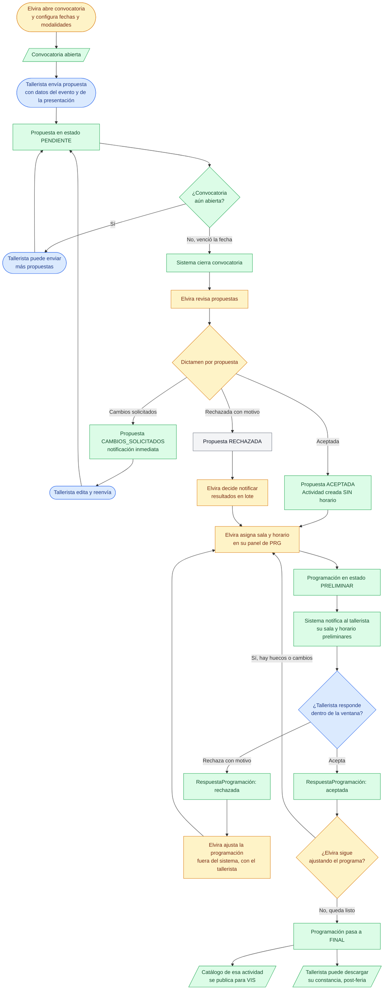

# Proceso de alto nivel — Talleres (actividades infantiles y juveniles)

Diagrama del flujo de punta a punta: desde que **abre la convocatoria** de Elvira hasta que
el catálogo de talleres queda **publicado para `VIS`**, incluyendo la rama de dictamen, la
programación delegada a `PRG` y las constancias.

> [!warning] Corrección directa del cliente (2026-06-29)
> Una versión anterior de este proceso asumía selección manual fuera del sistema, sin
> dictamen. El cliente confirmó que Elvira **sí dictamina cada propuesta en el sistema**, igual
> que Hipólito en `EVT`. Este diagrama refleja esa corrección.

El color de cada nodo indica quién interviene: Tallerista, Administradora (Elvira), Sistema y estados finales.

---

## Notas del proceso

### Dictamen idéntico a EVT, programación delegada a PRG

A diferencia de `EVT`, `TAL` no asigna categoría (literaria/académica × UADY/externa) al
aceptar — el resto del ciclo de dictamen es igual. La asignación de sala y horario **no es un
proceso propio de `TAL`**: ocurre en el panel de Elvira dentro de `PRG` (ver
`PRG/Proceso de alto nivel...` — pendiente de escribir un documento equivalente en `PRG` — y
`PRG/CU-PRG Índice.md`).

### Preliminar → final → publicación a VIS

El programa de talleres pasa por un estado preliminar (recién asignado, notificado, sujeto a
ajustes) antes de quedar final. **`VIS` solo consume el catálogo una vez que el horario es
final** (precisión directa del cliente, 2026-06-29): mientras sea preliminar, esa actividad no
aparece en el catálogo de talleres disponibles para visitas escolares (CU-VIS-010), aunque ya
tenga sala y bloque asignados. El mecanismo exacto para marcar un horario como "final" queda
pendiente de definir (ver "Temas abiertos" en `PRG/Modelo de datos - Programación.md`).

### Constancias obligatorias

A diferencia de `EVT` (constancia opcional, declarada por el proponente), en `TAL` el
tallerista declara desde el registro (CU-TAL-002) los nombres de quienes recibirán constancia,
sin opción de omitirlo — la generación es siempre automática (ver CU-TAL-005).

### Artefactos relacionados

- [`Modelo de datos - Talleres.md`](<Modelo de datos - Talleres.md>) — entidades y datos que el sistema almacena.
- [`CU-TAL Índice.md`](<CU-TAL Índice.md>) — inventario de casos de uso por sección.
- [`PRG/Modelo de datos - Programación.md`](<../PRG/Modelo de datos - Programación.md>) — entidades de la programación delegada.
