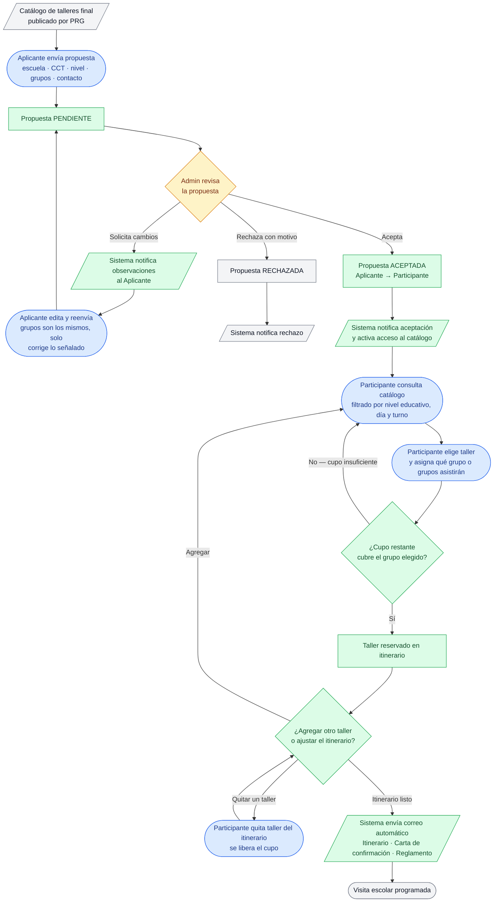
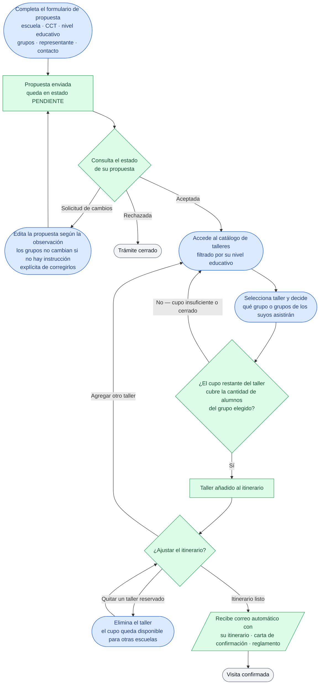
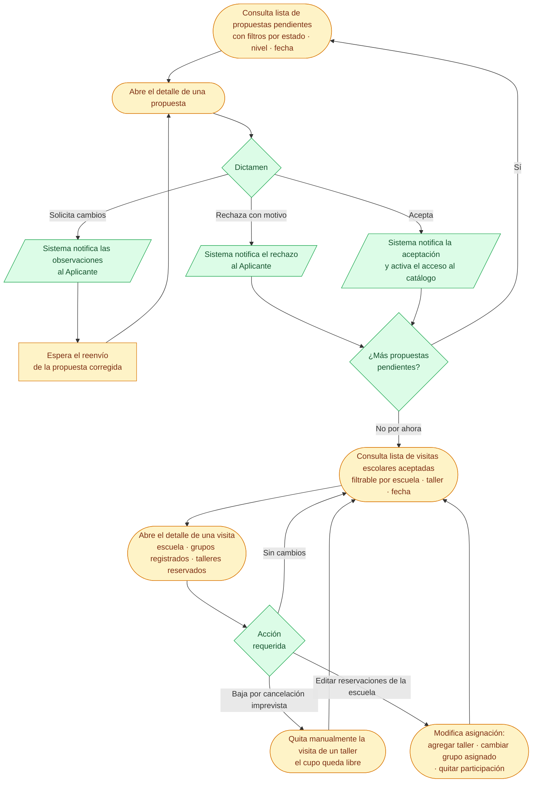

# Proceso de alto nivel — Visitas escolares (VIS)

El dominio **VIS** cubre el ciclo completo de una visita escolar: desde que una institución
registra su propuesta hasta que recibe por correo su itinerario confirmado con talleres
reservados. El proceso se divide en dos etapas: **A. Propuesta y dictamen** (quien aplica ↔ admin)
y **C. Catálogo y reserva de talleres** (el Participante arma su itinerario autónomamente una
vez aceptado).

Los grupos de una escuela **no son editables una vez registrada la propuesta**; la institución
sólo puede modificarlos si el Admin emite una *Solicitud de cambios*. Cada propuesta registra
entre 1 y 3 grupos de hasta 35 alumnos cada uno (máximo 105 por visita).

---

## Proceso general (punta a punta)

---

## Vista del Participante (institución / escuela)

Solo las acciones e interacciones que realiza la institución, desde que envía la propuesta
hasta que recibe el correo con su itinerario.

---

## Vista del Administrador

Solo las acciones que realiza la coordinación: dictar propuestas, consultar visitas aceptadas
y gestionar las reservaciones de cada escuela.

---

## Notas del proceso

### Grupos fijos desde el registro

La institución registra sus grupos al momento de enviar la propuesta (mínimo 1, máximo 3,
de hasta 35 alumnos cada uno). Esos grupos **no pueden modificarse unilateralmente** una vez
enviada la propuesta; solo cambian si el Admin emite una *Solicitud de cambios* que
explícitamente lo indique.

### Selección de talleres por grupo

Al reservar un taller, el Participante elige **cuál o cuáles de sus grupos asistirán**. Un grupo
puede estar en un taller y otro en otro de forma simultánea. El sistema valida que el cupo
restante del taller cubra la cantidad de alumnos del grupo elegido antes de confirmar la reserva.

### Vista del catálogo (layout lateral)

El catálogo de talleres se presenta como una columna lateral de salas disponibles; cada sala
muestra una página por día y dentro de la página los talleres ordenados por columna horaria
(matutino / vespertino). Filtros activos: nivel educativo, día y turno.

### Edición administrativa de reservaciones (CU-VIS-017)

El Admin no solo puede dar de baja una visita de un taller (baja por cancelación); también
puede **editar las reservaciones activas** de una escuela ya aceptada: agregar un taller
nuevo, cambiar qué grupo asiste a uno existente, o quitar completamente su participación
en un taller para liberar el cupo.

### Pendiente: ludoteca sin taller programado

Queda por confirmar cuáles son las condiciones para que una escuela pueda reservar la
ludoteca cuando esta no tenga un taller programado en el período de la visita.

### Pendiente: validación previa al acceso al catálogo

Se asume que existe alguna forma de validación o aprobación (la aceptación de la propuesta)
antes de que la escuela pueda reservar talleres, pero el mecanismo exacto de cómo una
Programación de `PRG` pasa de preliminar a **final** (y por tanto visible en el catálogo VIS)
está pendiente de definir.

### Artefactos relacionados

- [`CU-VIS Índice.md`](CU-VIS%20Índice.md) — inventario de casos de uso por módulo.
- [`Modelo de datos - Visitas escolares.md`](Modelo%20de%20datos%20-%20Visitas%20escolares.md) — entidades y datos que el sistema almacena.
