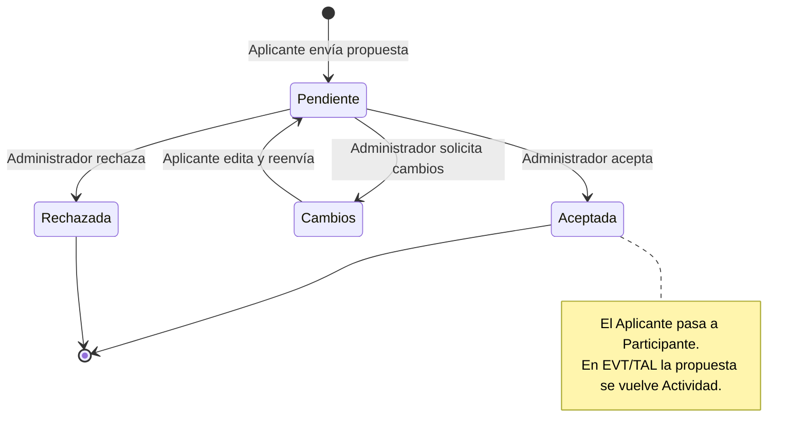
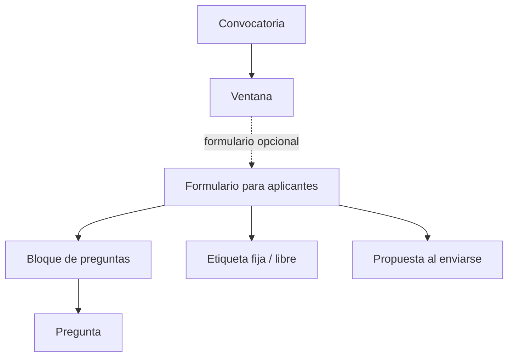
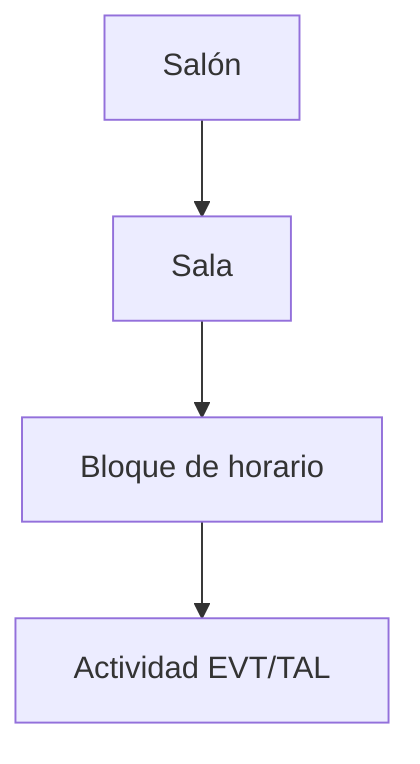

---
tags:
  - tipo/junta-resumen
  - tema/equipo-desarrollo
  - tema/alcance
  - dom/reg
  - dom/evt
  - dom/tal
  - tema/arquitectura
version: 0.7
fecha: 2026-06-22
Asistentes:
  - "Desarrollador: Hugo Janssen (STD)"
  - "Desarrollador: Isaac Ortiz (PRG | SAL | VIS)"
  - "Desarrollador: Juan Manuel Miranda (REG | EVT | TAL)"
  - "Equipo de desarrollo: Profesor Edgar Cambranes"
---

# RSM — Junta 3 con Equipo de desarrollo

Segunda ronda de revisión de casos de uso con el equipo de desarrollo. Este documento consolida los acuerdos de la sesión en cuatro capas: el **glosario de dominio**, el **diseño de los sistemas** nuevos o modificados, las **acciones por actor** y los **ajustes a los casos de uso** existentes. Las decisiones que quedaron abiertas se agrupan al final en *Decisiones pendientes*.

## Índice

1. [Contexto y alcance](#1-contexto-y-alcance)
2. [Glosario de dominio](#2-glosario-de-dominio)
3. [Diseño de sistemas (nuevos o modificados)](#3-diseño-de-sistemas-nuevos-o-modificados)
4. [Acciones por actor](#4-acciones-por-actor)
5. [Ajustes a casos de uso existentes](#5-ajustes-a-casos-de-uso-existentes)
6. [Decisiones pendientes](#6-decisiones-pendientes)

---

## 1. Contexto y alcance

A partir de la propuesta del Profesor Edgar Cambranes de construir un **sistema de convocatorias** que reduzca la dependencia entre desarrollador y cliente, la sesión produjo cuatro líneas de trabajo:

1. **Core Registros — sistema de Convocatorias `[REG]`.** Isaac Ortiz diseñó un CRUD de convocatorias / armador de formularios que unifica el registro de propuestas de los cuatro dominios de captura (`STD`, `EVT`, `TAL`, `VIS`): convocatorias con ventanas de fechas, formularios armados con bloques de preguntas reutilizables y preguntas tipadas, condicionalidad para `EVT`/`TAL` y generación de PDF de la propuesta.
2. **Modelo de actores y conceptos.** Se consolidaron los actores (Administrador, Aplicante, Participante, Todos) y la transición Aplicante → Participante, y se formalizó el glosario de dominio.
3. **Programación `[PRG]`.** Bloques de horario de duración fija (1:15 hrs para este evento), repetición de actividades con trazabilidad, ocupación de bloques completos con reprogramación de afectados ante un choque, modificaciones una a una, visualización pública de solo lectura por URL estática (con exportación PDF) y exportación interna Excel/Word del administrador.
4. **Salas y salones `[SAL]`.** Se mantiene la distinción Salón (contenedor) / Sala (espacio donde ocurren los eventos), administrada desde un CRUD en una sola pantalla.

### Dominios

| Código | Dominio | Ámbito | Responsable |
| --- | --- | --- | --- |
| `REG` | Registros / Convocatorias | Transversal: captura y revisión de propuestas | Juan Manuel Miranda |
| `STD` | Stands / Expositores | Renta de espacios en el showfloor | Hugo Janssen |
| `EVT` | Eventos | Actividades de público general | Juan Manuel Miranda |
| `TAL` | Talleres | Actividades de aforo reducido | Juan Manuel Miranda |
| `VIS` | Visitas escolares | Itinerarios de instituciones | Isaac Ortiz |
| `PRG` | Programa General | Organización espacio-temporal de actividades | Isaac Ortiz |
| `SAL` | Salas y salones | Catálogo de espacios | Isaac Ortiz |

> [!note] Alcance de esta junta
> El flujo de **pago** (de stands u otros) no se trató en esta sesión y se aborda por separado.

---

## 2. Glosario de dominio

### 2.1 Actores

- **Usuario `[REG]`:** Persona registrada en el sistema de FILEY con los campos de registro comunes. El registro se hace una sola vez; el inicio de sesión posterior es por OTP. Los usuarios administrativos se generan de forma especial y, por ahora, no tienen roles diferenciados: todos comparten los mismos permisos.
- **Administrador:** Actor que administra salones y salas, convocatorias y formularios, y que consulta, revisa y resuelve propuestas.
- **Aplicante:** Actor que rellena un formulario para participar en una convocatoria específica. *"Registrante"* es sinónimo de Aplicante. Un actor sigue siendo Aplicante mientras su propuesta esté en *Pendiente a revisión* o en *Solicitud de cambios* (una propuesta a la que se le solicitan cambios sigue siendo una propuesta).
- **Participante:** Actor cuya propuesta fue **Aceptada**. Solo el estado *Aceptada* convierte a un Aplicante en Participante. Según el tipo de propuesta puede —si se lo solicitan— editar su actividad, confirmar su asistencia o su incomparecencia, comprar stands o armar el itinerario de su visita escolar.

> [!info] Alcance de los roles
> Aplicante y Participante son roles **por propuesta/convocatoria**, no una identidad global del usuario. Un mismo usuario puede ser Aplicante en una convocatoria y Participante en otra al mismo tiempo.

### 2.2 Registros `[REG]`

- **Convocatoria:** Conjunto de formularios para aplicantes que se abre en una o varias ventanas de fechas para recibir aplicantes. Una convocatoria puede tener varias ventanas con distintos rangos de fecha, en las que pueden relacionarse distintos formularios o acciones.
- **Ventana:** Rango de fechas con inicio y cierre dentro de una convocatoria. Puede tener un formulario asociado o existir **sin formulario**, en cuyo caso marca en qué etapa está la convocatoria. Las ventanas se guardan como información de estado mostrable a los actores.
- **Formulario para aplicantes:** Conjunto de bloques de preguntas presentado a los aplicantes para que lo rellenen y participen en una convocatoria.
- **Bloque de preguntas:** Conjunto de preguntas que puede guardarse y reutilizarse cuantas veces el administrador considere conveniente.
- **Pregunta:** Campo con el que interactúa el aplicante, configurado por el administrador con un tipo de respuesta esperado para normalizar respuestas y facilitar la curaduría.
- **Bloque añadible / repetible:** Opción activable sobre un bloque de preguntas que permite al aplicante añadir duplicados del bloque (p. ej. agregar un integrante más). La cantidad de repeticiones se limita con un **máximo** definido por el administrador.
- **Condicionalidad:** Reglas establecidas sobre un bloque de preguntas. Se prevén reglas básicas del tipo `si checklist = "opción" entonces mostrar bloque2`. Las condiciones fuera del formulario quedan por evaluar (ver [Decisiones pendientes](#6-decisiones-pendientes)).
- **Propuesta:** Formulario de aplicante rellenado y enviado a revisión. Tiene cuatro estados: *Pendiente a revisión*, *Aceptada*, *Solicitud de cambios* y *Rechazada*.
- **Tipo de propuesta:** Depende de la convocatoria a la que se aplique. Por ahora existen propuestas para: comprar un stand (`STD`), realizar una actividad —evento o taller— (`EVT`/`TAL`), o representar a una escuela o institución para armar una visita escolar (`VIS`).
- **Etiqueta:** Clasificador aplicable a los formularios y, por extensión, a sus propuestas. Hay dos tipos:
  - **Fijas:** dependen de la convocatoria y son las que usa el sistema para **enrutar** la propuesta a su dominio destino (`STD`, `EVT`, `TAL`, `VIS`). El enrutamiento se hace únicamente por etiqueta fija.
  - **Libres:** etiquetas adicionales que el administrador aplica para **clasificar y filtrar**, sin efecto en el enrutamiento.
  - Las propuestas pueden filtrarse tanto por etiquetas fijas como libres.
- **Notificación:** Su contenido varía según la convocatoria y la ventana activa. Los aplicantes reciben notificaciones del resultado de revisión (aceptada, rechazada o solicitud de cambios). En ventana de programación, una notificación puede pedir al participante confirmar su asistencia a la hora, fecha y lugar asignados de su actividad. El modelo de presentación de notificaciones queda abierto (ver [Decisiones pendientes](#6-decisiones-pendientes)).

### 2.3 Stands `[STD]`

- **Stand:** Espacio rentable por un participante. Son bloques seleccionables con medidas preestablecidas.
- **Showfloor:** Espacio donde habitan los stands; es la sala de exhibición.

### 2.4 Eventos `[EVT]`

Un evento es una actividad con distintos tipos. Se diferencia de los talleres en que su público es más general y los espacios donde se realiza tienen mayor aforo. Categorías:

- Conversatorio
- Conferencia
- Charla
- Mesa redonda
- Presentación de libro
- Presentación de revista
- Lectura de obra
- Encuentro

### 2.5 Talleres `[TAL]`

Un taller es una actividad normalmente destinada a público infantil o juvenil, aunque también existen talleres para adultos mayores. Ocurren en salas de aforo reducido y suelen tener duraciones más cortas que los eventos. Categorías:

- Taller
- Cuentacuentos
- Plática para jóvenes
- Presentación de libros para niños/jóvenes
- Obra / Presentación teatral
- Proyección en cines

> [!info] Presentación de libros en dos dominios
> La presentación de libros existe tanto en `EVT` como en `TAL`. No es un único formulario compartido entre dominios: son **dos formularios duplicados** (mismo contenido), uno en la convocatoria de talleres y otro en la de eventos. Cada duplicado tiene su propia **etiqueta fija**, que enruta la propuesta a su dominio y, mediante condicionalidad, define qué campos específicos muestra cuando difieren.

### 2.6 Salas y salones `[SAL]`

- **Salón:** Contenedor en el que puede existir una o varias salas; en los salones se organizan las actividades de las propuestas. Un salón puede tener tantas salas como el administrador considere necesario.
- **Sala:** Subdivisión de un salón identificada por un nombre, con un aforo definido por el administrador. Puede tener un horario de disponibilidad (qué días y a qué hora se puede utilizar).
- **Bloque de horario:** Bloque que inicia a una hora fija, con duración uniforme configurada por el administrador al armar la programación (1:15 hrs para este evento); esa duración es la misma para todos los bloques y no se define bloque por bloque. Puede tener un nombre opcional para facilitar su búsqueda. Los bloques se gestionan únicamente desde su CRUD y luego se colocan en el horario de una sala; no se modifican de forma individual para acomodar una actividad. Una actividad ocupa uno o varios bloques completos: si necesita más tiempo del que abarca un bloque, ocupa también el siguiente bloque disponible en su totalidad, aunque no use todo ese tiempo. Un bloque no puede contener dos actividades al mismo tiempo, aunque sus horas de inicio o cierre no se solapen exactamente.

### 2.7 Programación `[PRG]`

- **Actividad:** Propuesta de participación aceptada por un administrador, aplicable únicamente a `EVT` y `TAL` (tipos contenido | taller); `STD` y `VIS` no generan Actividad por ahora. *Propuesta* y *Actividad* son dos etapas del mismo formulario llenado: mientras está enviado sin aceptar es una propuesta; una vez Aceptada, esa misma instancia es una actividad (por eso el armador habla de "tipo de actividad": es lo que el aplicante propone ser). Las actividades se organizan en una programación según su tipo.
- **Programa:** Conjunto de actividades organizadas espacial y temporalmente. Se divide en días y los días en bloques de horario.
- **Programa preliminar:** Programa armado por los administradores que aún no ha recibido confirmación de asistencia o incomparecencia de los participantes. Se vuelve programa **final** cuando logra acomodar a todos los participantes de modo que todos puedan asistir en tiempo y forma a sus actividades. La distinción preliminar/final **no afecta la visibilidad**: al guardarse —en cualquier estado— queda visible vía su URL estática.
- **Visualización de programa:** Vista de solo lectura del estado actual de un programa, presentada en lista con distintas vistas por salón por defecto. Se consulta por una URL estática y refleja siempre lo último guardado, sin importar si el programa es preliminar o final.

### 2.8 Visitas escolares `[VIS]`

- **Visita escolar:** Itinerario (distíngase de *Actividad* en `PRG`) armado por un representante de una institución, que selecciona actividades infantiles/juveniles y reserva lugares para asistir con las personas que representa, definiendo los días y horas que estará en la feria.
- **Cupo:** Capacidad de aforo restante de una actividad. Conforme las escuelas reservan lugares, la actividad va restando su cupo.
- **Itinerario:** Conjunto de actividades seleccionadas por un representante de una visita escolar. Puede incluir actividades simultáneas y/o consecutivas; el resultado es un listado de actividades a las que asistirá, con hora, fecha y lugar de cada una.

---

## 3. Diseño de sistemas (nuevos o modificados)

Esta sección describe **estructuralmente** los sistemas. Las acciones concretas del administrador sobre ellos están en [Acciones por actor](#4-acciones-por-actor).

### 3.1 Armador de convocatorias y formularios `[REG]`

> [!question] Decisión pendiente — alcance del armador
> Aún no se decide si este armador de formularios entra en el alcance del proyecto. De entrar, hay dos variantes (ver [Decisiones pendientes](#6-decisiones-pendientes)).

Una **convocatoria** se compone de:

- **Propiedades:** nombre, formulario(s) para aplicantes y ventanas.
- **Ventanas:** rangos de fechas configurables con inicio y fin. Pueden asociar (opcionalmente) un formulario para aplicantes; una ventana sin formulario es válida y marca la etapa de la convocatoria. Una convocatoria tiene como mínimo una ventana.
- **Formulario para aplicantes:** conjunto de bloques de preguntas. Características:
  - Una instancia del lado del aplicante puede estar respondida o no; al enviarse, una instancia respondida se convierte en **Propuesta**.
  - El resultado mínimo es un formulario con un bloque de preguntas.
  - Puede tener una o varias etiquetas (creadas escribiéndolas; reutilizables si ya existen; se eliminan al quitarlas de todos los formularios).
  - Puede armarse a partir de bloques de preguntas guardados previamente, y guardarse con nombre, etiqueta y su conjunto de bloques para reutilizarlo.
  - Al terminar de llenarlo, el sistema genera por defecto un **PDF** de la propuesta.
- **Condicionalidad `[EVT, TAL]`:** un bloque o pregunta puede mostrarse u ocultarse según la respuesta de otra pregunta del mismo formulario.
  - Regla del tipo: *mostrar el bloque X solo si la pregunta Y = valor Z* (p. ej. mostrar "Datos de la publicación" solo si el tipo de evento = "Presentación de libros").
  - Una pregunta de tipo lista puede usarse como **selector** que enciende/apaga bloques completos (sustituye al selector de tipo de actividad).
- **Bloque de preguntas:** conjunto reutilizable de preguntas con nombre, uso y su conjunto de preguntas. El mínimo es una pregunta. Puede marcarse como **añadible** al incrustarlo, configurando un máximo de repeticiones.
  - Ejemplo — bloque "Integrante" añadible con `max = 3`:
    - Nombre del integrante → string libre
    - Tipo de integrante → lista (single o multicheck)
    - Semblanza → string libre o subida de PDF (lo define el administrador)
- **Pregunta:** campo configurable con descripción/ayuda opcional y marca de obligatoria. Tipos de respuesta:
  - String libre (con límite de caracteres configurable).
  - String con formato esperado (regex; p. ej. 10 dígitos o correo electrónico).
  - Date picker.
  - Lista de opciones (single o multicheck).
  - Booleano / on-off.
  - Subida de archivo (PDF, PNG, JPEG, JPG).

### 3.2 Sistema de programación `[PRG]`

> [!warning] Decisión pendiente — dominio del CRUD de bloques de horario
> Aún no se decide si el CRUD de bloques de horario vive en `[SAL]` o en `[PRG]` (ver [Decisiones pendientes](#6-decisiones-pendientes)).

- **Dos programas / paneles.** La programación se divide en dos programas independientes: **talleres** y **eventos**. Se representan como dos botones (programación de talleres / programación de eventos). Todos los administradores pueden entrar a cualquiera de los dos; quién edita cuál se decide de manera interna, no por permisos del sistema.
- **Bloques de horario.** Unidad temporal del programa (ver *Bloque de horario* en el glosario): duración uniforme, hora de inicio y nombre opcional. Se gestionan desde su propio CRUD y no se redimensionan individualmente para acomodar una actividad puntual.
- **Colocación en salas.** Por defecto el sistema coloca bloques consecutivos de la duración fija a lo largo de todo el rango horario disponible de cada sala. La disposición se ajusta a nivel de la sala (p. ej. extender el horario del día), nunca a nivel de una actividad específica.
- **Ocupación por actividades.** La asignación de actividades a bloques es por sala. Dos o más actividades no pueden ocupar el mismo bloque de una misma sala al mismo tiempo, aunque sus horas de inicio o cierre no se solapen exactamente. Una actividad ocupa uno o varios bloques completos.
- **Estados y visibilidad.** Un programa puede ser preliminar o final. Al guardarse —en cualquiera de los dos estados— queda visible en modo solo lectura a través de su URL estática.

---

## 4. Acciones por actor

| Actor | Resumen | Dominios |
| --- | --- | --- |
| Administrador | Convocatorias y formularios, salas y salones, revisión de propuestas, programación | `REG`, `SAL`, `PRG` |
| Aplicante | Enviar y consultar sus propuestas; editar en solicitud de cambios | `STD`, `EVT`, `TAL`, `VIS` |
| Participante | Editar actividad, confirmar/declinar, comprar stand, armar itinerario | `EVT`, `TAL`, `STD`, `VIS` |
| Todos | Consultar el programa publicado (solo lectura) | `PRG` |

### 4.1 Administrador

**Convocatorias y formularios `[REG]`**

1. Crear, editar y eliminar convocatorias, definiendo nombre, ventanas y formularios asociados.
2. Agregar, editar o eliminar ventanas de una convocatoria, cada una con fecha de inicio, fecha de fin y el formulario que le corresponde.
3. Crear, editar y eliminar bloques de preguntas reutilizables, nombrarlos y definir su conjunto de preguntas.
4. Marcar un bloque como añadible al incrustarlo, configurando el máximo de repeticiones permitidas al aplicante.
5. Armar un formulario a partir de uno o varios bloques, asignarle nombre y etiquetas, y guardarlo para reutilizarlo en otras convocatorias.
6. Crear etiquetas de formularios escribiéndolas (reutilizables si ya existen) y eliminarlas quitándolas de todos los formularios que las usan.
7. Crear, editar y eliminar preguntas dentro de un bloque, configurando su tipo de respuesta, descripción/ayuda y si es obligatoria.
8. Configurar condicionalidad `[EVT, TAL]` entre preguntas y bloques de un formulario.

**Salas y salones `[SAL]`**

1. Crear salones y salas (ver ajustes de CU en la sección 5).

**Revisar y resolver propuestas `[REG]`**

1. Consultar la lista de propuestas, filtrando por *Pendiente a revisión*, *Aceptada*, *Solicitud de cambios* o *Rechazada*.
2. Revisar el detalle de una propuesta.
3. Establecer el estado de una propuesta:
   - **Aceptada:** el Aplicante pasa a Participante; si es de tipo evento/taller, la propuesta se convierte en Actividad.
   - **Solicitud de cambios:** la propuesta sigue siendo propuesta y el actor permanece como Aplicante; se reabre la edición.
   - **Rechazada:** el actor permanece como Aplicante.

**Programar actividades `[PRG]`**

> [!question] Decisión pendiente — ubicación de las acciones de bloques
> Las operaciones sobre bloques de horario (puntos 1–2) podrían ubicarse en "Salas y salones `[SAL]`" si se resuelve que los bloques se definen al crear la sala. Depende de la [decisión de dominio del sistema de programación](#6-decisiones-pendientes).

1. Configurar la duración fija de los bloques de horario (1:15 hrs en este evento).
2. Crear, editar, eliminar y buscar por nombre los bloques de horario, y colocarlos en el horario de una sala.
3. Consultar la lista de actividades y filtrarla por tipo (evento | taller).
4. Asignar una actividad a una sala y a uno o varios bloques de horario disponibles.
5. Programar una misma actividad en más de una ocasión (repetición, programa de talleres) y consultar cuántas veces, cuándo y dónde fue programada cada una.
6. Reprogramar las actividades afectadas (moviéndolas a otros bloques o salas) cuando una asignación genera un choque de horario.
7. Mover una actividad entre bloques.
8. Quitar una actividad del programa para reprogramarla más tarde (la actividad regresa a estado pendiente).
9. Modificar la programación de una actividad a la vez (sin edición masiva).
10. Guardar el programa preliminar y disparar la notificación a los participantes.
11. Exportar la programación guardada a Word o Excel (docx/xlsx), para control interno.

### 4.2 Aplicante `[STD, EVT, TAL, VIS]`

1. Enviar su propuesta (formulario de actividad `EVT`/`TAL`, visita escolar o stand) para participar en una convocatoria.
2. Consultar la lista de sus propuestas enviadas.
3. Guardar las respuestas de un formulario como borrador antes de enviarlo.
4. Editar y reenviar su propuesta cuando el administrador establece *Solicitud de cambios* (la propuesta sigue siendo propuesta y el actor sigue siendo Aplicante).

### 4.3 Participante

El actor es Participante únicamente cuando su propuesta fue **Aceptada**. Las acciones disponibles dependen del tipo de propuesta.

- **Tipo actividad `[EVT, TAL]`:**
  1. Si se lo solicitan, editar su actividad.
  2. Confirmar su asistencia o su incomparecencia ante el horario asignado. La confirmación es **por actividad**; si se le solicitó realizar la misma actividad más de una vez, confirma por cada fecha asignada (no en bloque).
     - Si marca incomparecencia, elige un motivo: **por fecha** (el administrador puede modificar su programación) o **definitivo** (la actividad queda inhabilitada y ya no puede programarse).
     - En ambos casos se notifica al administrador.
- **Tipo compra de stand `[STD]`:**
  1. Elegir y comprar uno o varios espacios de stand en el showfloor.
- **Tipo visita `[VIS]`:**
  1. Consultar el catálogo de talleres y actividades infantiles/juveniles disponibles, y reservar cupo para armar el itinerario de su visita escolar.

### 4.4 Todos `[PRG]`

1. Cualquier actor (incluido el panel de administración que no es propietario del programa) puede consultar el programa publicado en modo solo lectura, mediante la Visualización de programa.

---

## 5. Ajustes a casos de uso existentes

### 5.1 PRG

<!-- markdownlint-disable MD033 -->
| CU | Título actual | Ajuste acordado |
| --- | --- | --- |
| CU-PRG-001 | Consultar las actividades aprobadas de mi panel pendientes de programar | Renombrar a *"Consultar lista de actividades de mi panel"*: se consultan las actividades (propuestas ya Aceptadas) sin importar su estado de programación (*pendiente* / *programada*). La lista es filtrable por salones y salas. |
| CU-PRG-002 | Asignar una actividad aprobada a una sala y un bloque horario | Renombrar para enfatizar que lo que se programa hacia la sala/salón es la **actividad**, no al revés. Las actividades se programan una a una desde la lista de CU-PRG-001. |
| CU-PRG-003 | Editar la asignación (sala u horario) de una actividad ya programada | Nota de énfasis: *editar = mover* entre los bloques fijos de horario. |
| CU-PRG-004 | Quitar una actividad del programa (liberar su asignación) | Quitar regresa la actividad a estado *pendiente* y le elimina los campos de hora de inicio y fin. |
| CU-PRG-005 | Programar una misma actividad en varias ocasiones para llenar huecos | Se absorbe en CU-PRG-002: asignar es el caso único; poder hacerlo varias veces es una capacidad de ese caso de uso. |
| CU-PRG-006 | Validar que el aforo del grupo no supere el aforo de la sala al asignar | Pertenece al dominio `VIS`: la validación de aforo de un grupo de visitantes es responsabilidad del core de visitas. |
| CU-PRG-007 | Validar que la sala esté disponible en el día y turno de asignación | Pertenece a CU-PRG-002 como regla de la asignación. La alerta de empalme no bloquea la asignación, pero **sí** el guardado: deben resolverse todos los solapamientos antes de guardar el programa y notificar a los participantes. |
| CU-PRG-008 | Notificar al registrante su fecha, sala y horario asignados (segunda notificación) | La notificación es por correo y dentro del sistema, y se dispara solo cuando el administrador guarda el programa preliminar. Reemplazar *"registrante"* por **Participante** (la notificación es post-aceptación; la propuesta ya es Actividad). |
| CU-PRG-009 | Confirmar mi disponibilidad para el horario asignado | Reestructurar el título para enfatizar al actor (**Participante**). Implica un método de visualización de notificaciones de sus actividades. La confirmación es por cada horario programado; no se acepta/rechaza en bloque. Ver decisión pendiente sobre notificaciones. |
| CU-PRG-010 | Consultar en solo lectura el programa del otro panel | Reestructurar: el modo lectura es una **URL estática** alimentada por la programación; cualquiera con la URL ve el estado actual sin importar su estado. Vista por salas y salones (como el Excel). Recibe la **generación del PDF**, que es la exportación pública/compartible (a diferencia de Excel/Word, privados; separación intencional). |
| CU-PRG-011 | Exportar el programa a Excel, Word o PDF para la pulida final | Se reduce a exportación **Excel** (hojas por salón con sus horarios) o **Word** (un documento por salón). Se elimina la generación de PDF. La exportación se hace desde la herramienta de programación (uso interno). |
| CU-PRG-012 | Consultar el programa publicado en la web app | Se unifica con CU-PRG-010 (la consulta del programa publicado es la Visualización de programa estática, no una exportación). Los roles con permisos quedan fuera del primer pool de features (out of scope). |
<!-- markdownlint-enable MD033 -->

> [!question] Decisión pendiente — modelo de notificaciones (relacionado con CU-PRG-009)
> Queda abierto si el apartado de notificaciones es un **concentrado único** (una bandeja transversal a todos los dominios) o es **por módulo** (ver [Decisiones pendientes](#6-decisiones-pendientes)).

### 5.2 SAL

<!-- markdownlint-disable MD033 -->
| CU | Título actual | Ajuste acordado |
| --- | --- | --- |
| CU-SAL-001 | Crear un salón (se genera su primera sala automáticamente) | Énfasis en el actor Administrador. |
| CU-SAL-002 | Editar los datos de un salón | Énfasis en el actor Administrador. |
| CU-SAL-003 | Eliminar un salón | Énfasis en el actor Administrador. |
| CU-SAL-004 | Agregar una sala (subdivisión) a un salón | Énfasis en el actor Administrador. |
| CU-SAL-005 | Editar una sala (aforo y disponibilidad) | Énfasis en el actor Administrador. |
| CU-SAL-006 | Eliminar una sala | Énfasis en el actor Administrador. |
| CU-SAL-007 | Consultar el catálogo compartido de salas y salones | Solo administradores ven la lista de salones y salas, con la opción de agregar salones, agregar salas a un salón y editar sus propiedades. Todo el CRUD de salas y salones vive en **una sola pantalla** (no se redirige al usuario a pantallas distintas). |
| CU-SAL-008 | Consultar el detalle de una sala (aforo y disponibilidad) | Se une a CU-SAL-007: todo en una sola pantalla. |
<!-- markdownlint-enable MD033 -->

### 5.3 VIS

Implementar los casos de uso con los campos mínimos *hasta objetivo* para que el profesor los revise posteriormente.

---

## 6. Decisiones pendientes

Decisiones que quedaron abiertas en esta sesión. **No se resuelven aquí**; se listan para retomarlas en la siguiente junta.

### D1 — Alcance del armador de formularios `[REG]`

> [!question]
> Aún no se decide si el armador de formularios entra en el alcance del proyecto. De entrar, hay dos variantes:
>
> - Herramienta **dev-side**: el equipo de desarrollo la usa para armar/configurar la herramienta client-side; el aplicante nunca la ve directamente.
> - La misma herramienta **embebida en el programa**: el administrador la usa directamente, sin pasar por desarrollo.

### D2 — Dominio del CRUD de bloques de horario `[PRG]` / `[SAL]`

> [!warning]
> Aún no se decide en qué dominio vive el CRUD de bloques de horario:
>
> - **Dentro de `[SAL]`**, como parte del CRUD de salas y salones (al crear una sala se le asignan sus bloques).
>   - Ventaja: un solo flujo; la sala queda lista en cuanto se crea; coherente con que la asignación de bloques es por sala.
>   - Desventaja: mezcla en una pantalla el espacio físico (aforo, disponibilidad) con su calendario; si quien programa no administra salas, depende de otro panel para ajustar bloques.
> - **Dentro de `[PRG]`**, como creación de bloques previa a la asignación de actividades.
>   - Ventaja: mantiene la separación de responsabilidades (`SAL` = espacio, `PRG` = tiempo) y da control total del calendario a quien programa.
>   - Desventaja: agrega un paso obligatorio antes de programar (sala sin bloques = nada que asignar) y puede duplicar el concepto de disponibilidad ya definido en Sala.
>
> **Consecuencia abierta:** de esta decisión depende si las acciones de bloques (Administrador → Programar actividades, puntos 1–2) se mueven a "Salas y salones".

### D3 — Modelo de notificaciones `[REG]` / `[PRG]`

> [!warning]
> No está establecido si las notificaciones serán **granuladas por dominio** o una **función transversal** que concentre las notificaciones de todos los dominios en una barra lateral del lado Aplicante/Participante. Si terminan siendo por módulo, esos módulos podrían ser consumidos por un panel de notificaciones del Participante que los agregue. Afecta a la definición de *Notificación* y a CU-PRG-009.

### D4 — Condiciones fuera del formulario `[REG]`

> [!question]
> Queda por evaluar la factibilidad de reglas de condicionalidad que dependan de información **fuera del formulario** (las reglas internas al formulario sí están contempladas).
