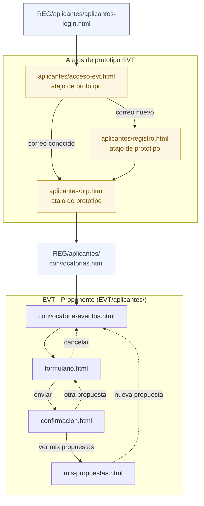
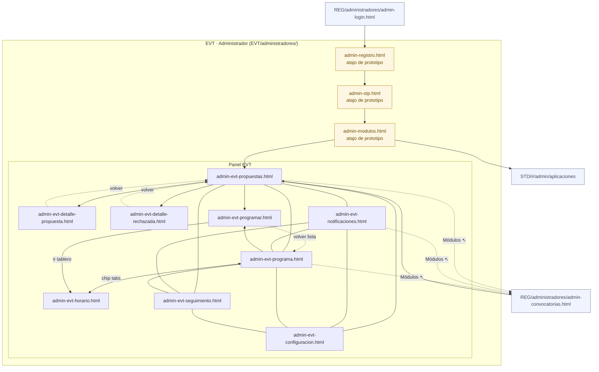

# Mapa de flujo — EVT (Eventos)

## Diagrama — Proponente (aplicantes/)

> El flujo real entra por REG. Los pasos 1–4 (acceso, registro, OTP, convocatorias) ocurren en REG.
> Los atajos de prototipo (`acceso-evt.html`, `registro.html`, `otp.html`) permiten navegar EVT directamente.

---

## Diagrama — Administrador (administradores/)

> El sidebar conecta: propuestas ↔ notificaciones ↔ programa ↔ seguimiento ↔ configuracion (malla completa — flechas grises).
> `admin-evt-horario.html` no está en el sidebar; se accede desde programa o programar.
> Atajos de prototipo (amarillo): EVT/administradores/{admin-registro, admin-otp, admin-modulos} permiten navegar el panel sin pasar por REG.

**Líneas sin flecha (`---`):** sidebar de navegación lateral — todos los nodos enlazados en ambas direcciones.
**Flechas punteadas al techo (`-.->`):** acceso rápido desde topbar o proto-bar.

---

## Hallazgos

| Severidad | Archivo | Situación |
| --------- | ------- | --------- |
| ✅ Resuelto | `EVT/index.html` → `selector-rol.html` | Renombrado a nombre descriptivo. Actualizado admin-link → REG/admin-login. |
| ✅ Resuelto | `EVT/aplicantes/index.html` → `acceso-evt.html` | Renombrado. Auth-foot admin → REG/admin-login. Proto-bar marca atajo de prototipo. |
| ✅ Resuelto | `REG/aplicantes/index.html` → `aplicantes-login.html` | Renombrado. 37 HTML y 6 md actualizados. |
| ✅ Resuelto | Proto-bar en panel EVT | Todos los 9 archivos del panel tienen proto-bar A1→A2→A3…A7 (todas las secciones siempre visibles; sección activa en `<b>`). CU incluidos en la sección activa. |
| ✅ Resuelto | Topbar panel EVT | Topbar muestra solo "Configuración". El escape hacia REG está en la proto-bar como "Módulos ↗". |
| ℹ️ Atajo prototipo | `admin-registro.html`, `admin-otp.html`, `admin-modulos.html` | Permiten navegar el panel sin pasar por REG. Auth-foot corregido → REG/aplicantes/aplicantes-login.html. |
| ℹ️ Sin sidebar | `admin-evt-horario.html` | No aparece en el sidebar del panel. Se accede desde `admin-evt-programa.html` (chip tab) o `admin-evt-programar.html` (botón). |

---

## Tablas de pantallas

### Proponente

| # | Pantalla | Archivo | CU |
| - | -------- | ------- | -- |
| 1–4 | Acceso + convocatorias | *(ver REG — Participante)* | — |
| — | Acceso EVT (atajo prototipo) | `aplicantes/acceso-evt.html` | — |
| — | Registro (atajo prototipo) | `aplicantes/registro.html` | — |
| — | Código OTP (atajo prototipo) | `aplicantes/otp.html` | — |
| 5 | Info convocatoria Eventos | `aplicantes/convocatoria-eventos.html` | CU-EVE-001 |
| 6 | Formulario de propuesta | `aplicantes/formulario.html` | CU-EVE-002 / 003 |
| 7 | Confirmación con folio | `aplicantes/confirmacion.html` | CU-EVE-002 |
| + | Mis propuestas (seguimiento) | `aplicantes/mis-propuestas.html` | CU-EVE-036 |

### Administrador

| # | Pantalla | Archivo | CU |
| - | -------- | ------- | -- |
| A1–A2 | Acceso + módulos | *(ver REG — Administrador)* | — |
| — | Acceso admin (atajo prototipo) | `administradores/admin-registro.html` | — |
| — | OTP admin (atajo prototipo) | `administradores/admin-otp.html` | — |
| — | Módulos EVT (atajo prototipo) | `administradores/admin-modulos.html` | — |
| A3 | Propuestas — lista y dictamen | `administradores/admin-evt-propuestas.html` | CU-EVT-007 / 011 |
| A3a | Detalle de propuesta + dictamen | `administradores/admin-evt-detalle-propuesta.html` | CU-EVT-008 / 009 / 012 |
| A3b | Detalle propuesta rechazada (lectura) | `administradores/admin-evt-detalle-rechazada.html` | CU-EVT-008 |
| A4 | Notificaciones en lote | `administradores/admin-evt-notificaciones.html` | CU-EVT-010 |
| A5 | Lista del programa | `administradores/admin-evt-programa.html` | — |
| A5a | Tablero de programación | `administradores/admin-evt-horario.html` | CU-PRG-001 / 002 / 008 |
| A5b | Asignar sala / bloque | `administradores/admin-evt-programar.html` | CU-PRG-002 / 003 / 004 |
| A6 | Seguimiento (contadores) | `administradores/admin-evt-seguimiento.html` | CU-EVT-011 |
| A7 | Configuración (fechas + cupos) | `administradores/admin-evt-configuracion.html` | CU-EVT-001 |

---

## CSS

| Capa | Archivo |
| ---- | ------- |
| Base | `../common/styles-base.css` |
| Dominio | `EVT/styles.css` — base + panel admin completo (sidebar, modales, rejilla, tablero) |

Todas las pantallas de `EVT/` cargan únicamente `../styles.css`.
