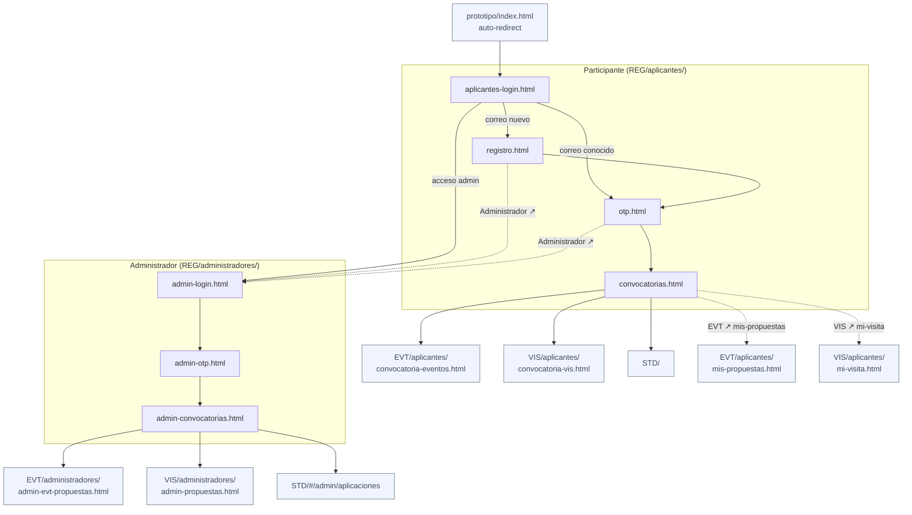

# Mapa de flujo — REG (Acceso y módulos)

REG es el punto de entrada compartido: gestiona el acceso de participantes y administradores
y los dirige a su dominio de contenido (EVT, VIS, TAL).

## Diagrama de navegación

> Solo se muestran rutas de navegación reales entre archivos HTML.
> Nodos sombreados = destinos fuera de REG.

**Flujo punteado (`-.->`):** escape de proto-bar / acceso rápido, no es el flujo principal.
`registro.html` y `otp.html` tienen `Administrador ↗` en su proto-bar (mismo destino que el link de `aplicantes-login.html`).
`convocatorias.html` tiene `EVT ↗ · VIS ↗ · STD ↗` como escapes de proto-bar (además de los botones de tarjeta).

---

## Hallazgos

| Situación | Archivo | Detalle |
| --------- | ------- | ------- |
| ✅ OK | Flujo participante | Lineal: index → registro/otp → convocatorias → dominio |
| ✅ OK | Flujo admin | Lineal: login → otp → módulos → dominio |
| ℹ️ Nota | `convocatorias.html` | Actúa como hub: enlaza a EVT y VIS participante, incluyendo páginas de seguimiento (`mis-propuestas`, `mi-visita`) sin pasar por el flujo de esos módulos |

---

## Tablas de pantallas

### Participante

| # | Pantalla | Archivo | CU |
| - | -------- | ------- | -- |
| 1 | Acceso (ingresa correo) | `aplicantes/aplicantes-login.html` | CU-REG-002 |
| 2 | Crear cuenta — solo primera vez | `aplicantes/registro.html` | CU-REG-001 |
| 3 | Código OTP | `aplicantes/otp.html` | CU-REG-002 |
| 4 | Convocatorias abiertas → sale a EVT / VIS / TAL | `aplicantes/convocatorias.html` | — |

### Administrador

| # | Pantalla | Archivo | CU |
| - | -------- | ------- | -- |
| 1 | Acceso admin (ingresa correo) | `administradores/admin-login.html` | CU-REG-003 |
| 2 | Código OTP admin | `administradores/admin-otp.html` | CU-REG-003 |
| 3 | Selección de módulo → EVT admin / VIS admin / STD / TAL admin | `administradores/admin-convocatorias.html` | CU-REG-006 |

---

## CSS

| Capa | Archivo |
| ---- | ------- |
| Base | `../common/styles-base.css` |
| Dominio | `REG/styles.css` — solo `@import`, sin sobrescrituras |
