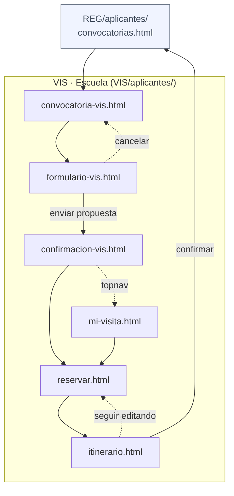
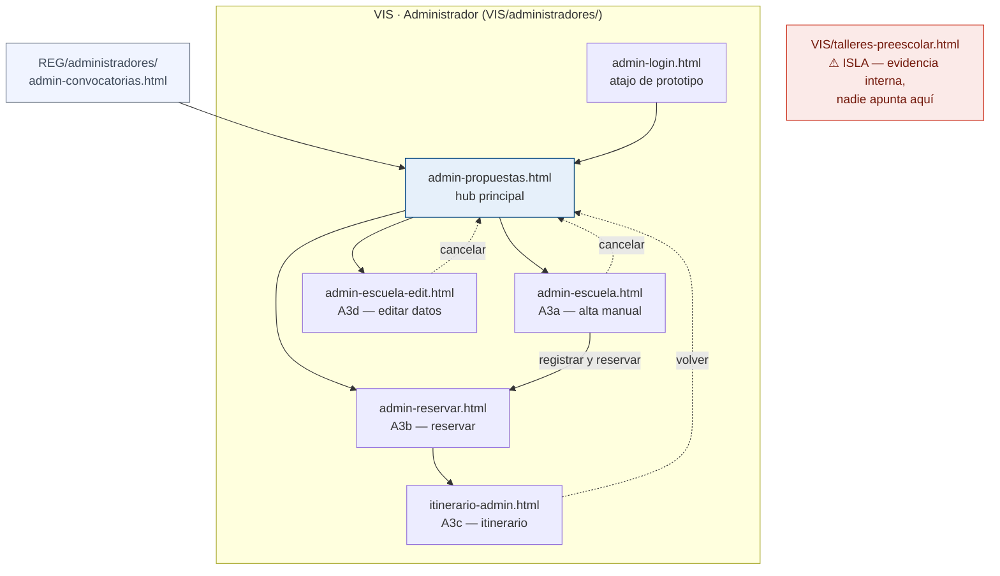

# Mapa de flujo — VIS (Visitas Escolares)

## Diagrama — Escuela / Participante (aplicantes/)

**Nota:** al confirmar el itinerario, el participante regresa a `REG/aplicantes/convocatorias.html` (hub compartido).

---

## Diagrama — Administrador (administradores/)

**`admin-login.html`:** es un atajo de prototipo para navegar VIS directamente; el flujo real siempre llega vía `REG/administradores/admin-convocatorias.html`.

---

## Hallazgos

| Severidad | Archivo | Problema |
| --------- | ------- | -------- |
| 🔴 Isla | `VIS/talleres-preescolar.html` | Ningún archivo del prototipo apunta a él. Sin salidas de navegación. Es un archivo de evidencia interna (Acción A2 del análisis de desalineación). |
| ℹ️ Nota | `VIS/administradores/admin-login.html` | Atajo de prototipo: proto-bar muestra A1 (activo) + A2. Módulos + A3/A3a/A3b como links. El flujo real siempre entra vía `REG/administradores/admin-convocatorias.html → admin-propuestas.html`. |
| ℹ️ Nota | `VIS/aplicantes/itinerario.html` | Al confirmar, redirige a `REG/aplicantes/convocatorias.html` (sale de VIS al hub compartido). Esperado. |
| ℹ️ Nota | `VIS/aplicantes/mi-visita.html` | Accesible desde `REG/aplicantes/convocatorias.html` (tarjeta de la convocatoria VIS) y desde topnav en formulario/confirmacion — no solo desde el flujo secuencial. |

---

## Tablas de pantallas

### Escuela (Participante)

| # | Pantalla | Archivo | CU |
| - | -------- | ------- | -- |
| 1–4 | Acceso + convocatorias | *(ver REG — Participante)* | — |
| 5 | Info convocatoria VIS | `aplicantes/convocatoria-vis.html` | — |
| 6 | Registrar mi escuela (propuesta) | `aplicantes/formulario-vis.html` | CU-VIS-001 |
| 7 | Confirmación con folio | `aplicantes/confirmacion-vis.html` | — |
| 8 | Mi registro (detalle de la visita) | `aplicantes/mi-visita.html` | CU-VIS-003 |
| 9 | Reservar talleres (catálogo) ⚠ | `aplicantes/reservar.html` | CU-VIS-010 / 011 / 012 |
| 10 | Ver / confirmar itinerario | `aplicantes/itinerario.html` | CU-VIS-013 / 014 |

> **⚠ Brecha C1+C4:** catálogo no filtra por nivel educativo. Ver análisis de desalineación de CUs.

### Administrador

| # | Pantalla | Archivo | CU |
| - | -------- | ------- | -- |
| A1–A2 | Acceso + módulos | *(ver REG — Administrador)* | — |
| — | Acceso directo VIS (atajo prototipo) | `administradores/admin-login.html` | CU-REG-003 |
| A3 | Propuestas — lista + dictamen inline | `administradores/admin-propuestas.html` | CU-VIS-004–009 / 015–017 |
| A3a | Alta manual de escuela | `administradores/admin-escuela.html` | CU-VIS-016 |
| A3b | Reservar talleres (por la escuela) | `administradores/admin-reservar.html` | CU-VIS-010 / 011 / 012 |
| A3c | Itinerario de visita (admin) | `administradores/itinerario-admin.html` | CU-VIS-013 / 014 |
| A3d | Editar datos de escuela | `administradores/admin-escuela-edit.html` | CU-VIS-016 / 017 |

---

## CSS

| Capa | Archivo |
| ---- | ------- |
| Base | `../common/styles-base.css` |
| Dominio | `VIS/styles.css` — base + tokens `--vis-*`, componentes VIS |

Todas las pantallas de `VIS/` cargan únicamente `../styles.css`.
